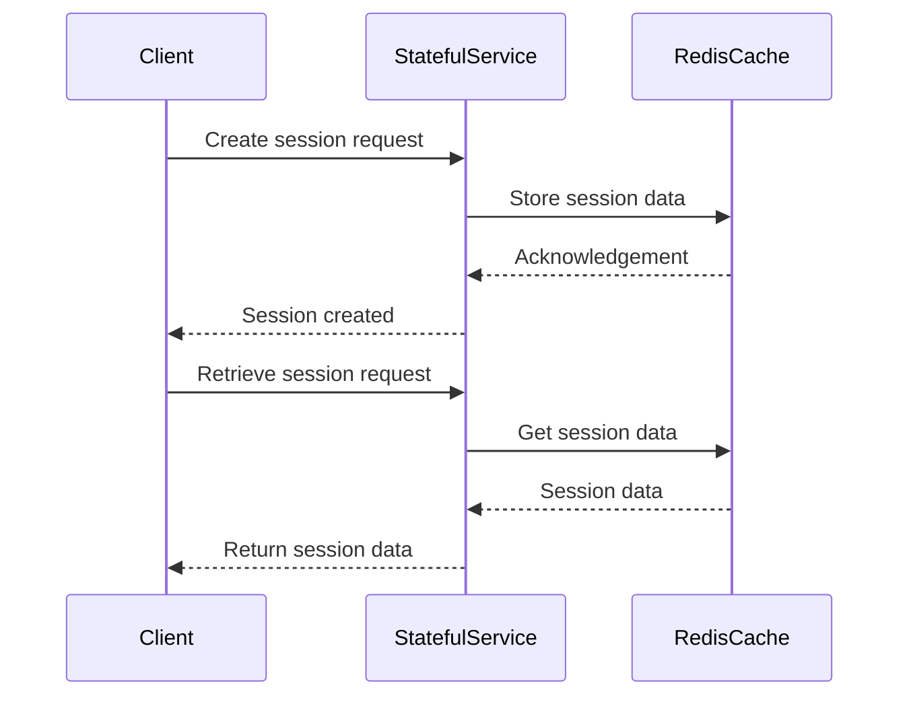

Stateful services in cloud computing manage data that persists across different interactions, requiring careful consideration to ensure application scalability and reliability. Let's dive into the approaches and best practices for handling state in cloud environments.

## Overview

In cloud-based environments, the challenge of managing state in services arises frequently. This pattern addresses how to effectively handle state, ensuring services remain scalable and maintainable.

## Key Concepts of Stateful Services

Stateful services retain data between requests from the same client or across several client interactions. This data can be stored in memory or other persistent storage systems, such as databases or distributed caches. The main concern with stateful services is ensuring the continuity and consistency of state as load and scale demands increase.

## Design Patterns and Approaches

### 1. Session State Pattern
This pattern stores session data on the server side and can encompass various ways of storing data, including:

- **In-memory:** Quick retrieval but limits scalability.
- **Distributed Cache:** More scalability using distributed stores like Redis or Memcached.
- **Database Storage:** Enhanced persistence using a database, but with potential latency increase.

### 2. Client-side State Management
By storing state on the client side using web tokens or cookies, the server can remain stateless, enhancing scalability.

### 3. Stateful Service with Sharded Storage
Use sharding to split state data across different databases or nodes to improve performance and scalability. Each shard holds a subset of the overall data, typically partitioned based on user or session keys.

### 4. Event Sourcing
Event sourcing records state changes as a sequence of events. This not only supports queries about the state but also audit trails and state integrity verifications.

### 5. CQRS (Command Query Responsibility Segregation)
This pattern separates read and write models to optimize querying and state mutations. It's often coupled with event sourcing for greater state traceability.

## Best Practices

- **Decouple state management** from the business logic of the application for more flexible architecture.
- **Automate state replication** to ensure availability and resilience across multiple zones or even regions.
- **Use container orchestration tools** like Kubernetes, which support persistent volumes for stateful data, ensuring data persistence even when containers are rescheduled.
- **Employ data partitioning** strategies using field-level data keys to distribute load evenly and minimize single-node hotspots.

## Example Code

Here’s a simple example of using Redis as a distributed cache to manage session state in a cloud-based application:

```java
import redis.clients.jedis.Jedis;

public class SessionManager {
    private Jedis jedis;

    public SessionManager() {
        this.jedis = new Jedis("redis-server-url");
    }

    public void storeSession(String sessionId, Map<String, String> data) {
        jedis.hmset(sessionId, data);
    }

    public Map<String, String> retrieveSession(String sessionId) {
        return jedis.hgetAll(sessionId);
    }

    public void deleteSession(String sessionId) {
        jedis.del(sessionId);
    }
}
```

## Diagrams

Here's a high-level sequence diagram representing a client interacting with a stateful service:



## Related Patterns

- **Stateless Services**: Contrast to stateful, these services don't retain client state between requests, enhancing scalability.
- **Circuit Breaker**: Protects distributed systems from cascade failure, useful when working with persistent state storage.
- **Retry Pattern**: Handles transient failures impartially, essential for interactions with state storage systems.

## Additional Resources

- **Book**: "Design Patterns: Elements of Reusable Object-Oriented Software" by Erich Gamma et al. - Provides foundational knowledge of design patterns.
- **Documentation**: Redis and Memcached official documentation for implementation details and capabilities.
- **Blog**: Martin Fowler's blog on Event Sourcing for in-depth understanding and practical use cases.

## Summary

State management in cloud environments is crucial for building resilient, scalable applications. By employing patterns such as session state, event sourcing, and client-side state management alongside best practices and appropriate tools, developers can effectively navigate the complexities of stateful services in the cloud.
