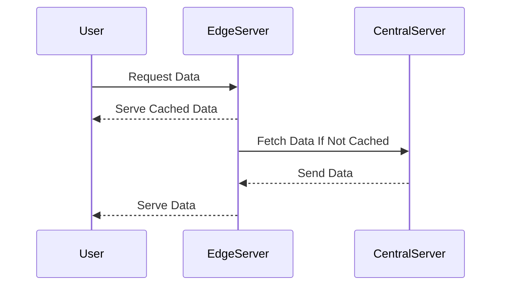

Edge Application Deployment is a transformative design pattern that focuses on deploying applications on edge servers, strategically positioned closer to the end-users or data sources. This approach is integral to enhancing application responsiveness, reducing latency, and optimizing network resource utilization by moving computation near the data being processed.

## Detailed Explanations

### Design Patterns and Architectural Approaches

1. **Deployment Models**: Edge Application Deployment often involves microservices architecture, where services are containerized and deployed across multiple edge locations. This can involve lightweight container runtimes such as Docker or advanced orchestration platforms like Kubernetes.

2. **Caching and Data Distribution**: Edge deployments frequently use distributed caching systems to store content locally, reducing bandwidth usage and accelerating data retrieval times.

3. **Load Balancing**: Dynamic load balancing is crucial to effectively distribute incoming traffic between central and edge servers, ensuring no single node becomes a bottleneck.

4. **Security Measures**: Edge computing necessitates robust security measures, including encryption for data in transit and at rest, to mitigate increased vulnerability at distributed nodes.

### Paradigms and Best Practices

- **Latency Reduction**: By processing requests closer to the users geographically, edge computing significantly reduces the time data needs to travel, minimizing latency.

- **Geo-Distribution**: Deploy applications in multiple geographic locations to enhance availability and reliability while tailoring content delivery to meet regional regulations or customs.

- **Network Optimization**: Edge deployments can offload processing tasks from the central data center, preventing network congestion and optimizing bandwidth usage.

- **Resiliency Building**: Design for failure by implementing replica services and redundancy strategies to ensure that the failure of one node does not disrupt overall service delivery.

### Example Code

Here's a simple example of deploying a containerized service using Kubernetes on GCP's edge infrastructure:

```yaml
apiVersion: apps/v1
kind: Deployment
metadata:
  name: edge-app
spec:
  replicas: 3
  selector:
    matchLabels:
      app: edge-app
  template:
    metadata:
      labels:
        app: edge-app
    spec:
      containers:
        - name: edge-app-container
          image: gcr.io/my-gcp-project/edge-app:latest
          ports:
            - containerPort: 8080
```

### Diagrams

Below is UML Sequence diagram showing typical interactions in an edge application deployment:



### Related Patterns

- **Content Delivery Network (CDN)**: Similar to edge computing, CDNs cache static content at the network's edge, improving load times and server response rates.
- **Service Discovery**: Critical in microservices-based edge deployments, enabling services to discover and communicate with each other efficiently.

### Additional Resources

- [The Benefits of Edge Computing](https://www.ibm.com/cloud/learn/edge-computing)
- [Kubernetes and Edge Computing](https://cloud.google.com/solutions/edge-kubernetes)
- [Edge Computing: An Overview from AWS](https://aws.amazon.com/what-is/edge-computing/)

## Summary

Edge Application Deployment is a pivotal design pattern in modern cloud computing, aimed at optimizing application performance and user experience through strategic deployment at network peripheries. By aligning with best practices in security, data distribution, and network management, organizations can harness the potential of edge computing to deliver high-performance applications globally.
