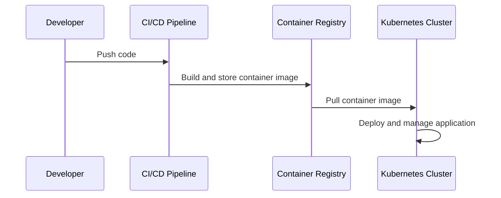
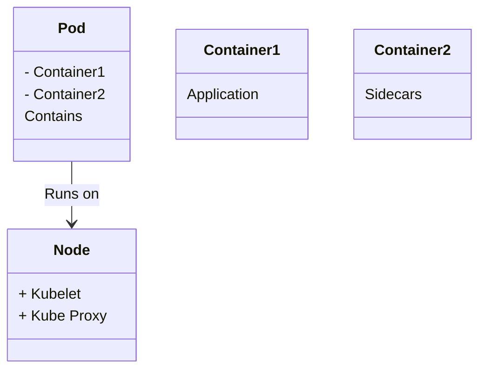

In the world of modern cloud computing, containerized deployments have become a cornerstone for delivering applications in a scalable, efficient, and portable manner. By packaging software and its dependencies into a single, self-sufficient unit known as a container, developers and operations teams can ensure consistency across different environments, from a developer's laptop to testing, staging, and production environments.

## Detailed Explanation

Containerized deployments leverage operating system-level virtualization to run multiple isolated systems on a single host. Unlike traditional virtual machines, containers share the host OS kernel but have their own filesystem, CPU, memory, process space, and more, leading to high efficiency and speed.

### Key Advantages
- **Portability:** Containers encapsulate all components and dependencies, ensuring the code runs consistently regardless of the environment.
- **Scalability:** Containers can be easily reproduced to scale applications horizontally, meeting fluctuating demands.
- **Resource Efficiency:** Containers require less overhead compared to virtual machines, as they utilize shared resources fundamentally more efficiently.
- **Rapid Development and Deployment:** By allowing developers to package applications quickly and deploy them without worrying about execution environment consistency, containers accelerate software development life cycles.

### Core Components
- **Docker:** The most popular containerization platform, enabling developers to build, ship, and run applications consistently across environments.
- **Container Orchestration Services:** Tools like Kubernetes manage the deployment, scaling, and operation of application containers across clusters of hosts, automating many tasks required to manage containers.

## Example Code

Below is a basic `Dockerfile` that describes the setup for a simple Node.js application:

```Dockerfile
FROM node:14

WORKDIR /usr/src/app

COPY package*.json ./

RUN npm install

COPY . .

CMD ["node", "app.js"]

EXPOSE 8080
```

This `Dockerfile` specifies the steps needed to set up an environment for a Node.js application, illustrating the agility and portability ultimate in containerized deployments.

## Diagrams

### Container Workflow in a Deployment Architecture



### Kubernetes Pod Structure



## Related Patterns

- **Microservices Architecture**: Containerization is often used to implement and deploy microservices, individually packaged to promote agility and scalability.
- **Blue-Green Deployment**: Containers make it easier to perform seamless, non-disruptive deployments by shifting traffic between different container versions.
- **Immutable Infrastructure**: Emphasizes the use of immutable, disposable components that are ideal for container-based environments.

## Additional Resources

- [Docker Documentation](https://docs.docker.com/)
- [Kubernetes Documentation](https://kubernetes.io/docs/home/)
- [The Twelve-Factor App](https://12factor.net/): Methodologies that often complement containerized application development.

## Summary

Containerized deployments provide a robust solution for developing, deploying, and managing applications across various environments robustly and efficiently. By leveraging technologies like Docker and orchestration platforms like Kubernetes, organizations can achieve high levels of consistency, scalability, and resource optimization. This pattern not only supports modern microservices architecture but also integrates seamlessly with CI/CD pipelines and cloud-native approaches.
