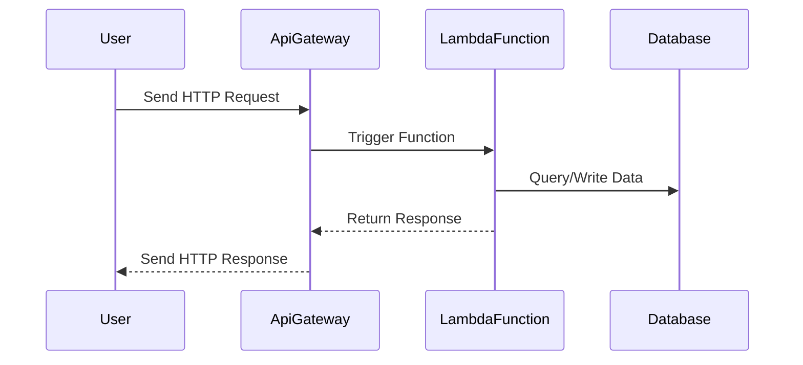

## Introduction

Serverless application models are a transformative approach in cloud computing that abstracts away infrastructure management, enabling developers to focus on writing code while the cloud provider handles the deployment, scaling, and managing of the servers. This paradigm shift allows for rapid development and cost-effective scaling, as running costs are directly proportional to actual usage.

## Key Components

### Event-Driven Execution
Serverless architectures typically operate in an event-driven manner, where code is executed in response to events such as HTTP requests, database changes, or messages added to a queue. This allows applications to be highly responsive and efficient.

### Stateless Operations
Functions in serverless models are generally stateless, meaning they execute independently of any previous invocations. This approach enhances scalability and reliability, eliminating dependency on session persistence.

### Autonomic Scalability
The serverless model offers automatic scaling capabilities without any manual intervention. As demand increases, the cloud provider spins up additional instances of the function seamlessly.

### Pay-per-use Pricing
In serverless computing, you only pay for the compute resources you consume. This model enables a direct correlation between costs and the volume of your application's usage.

## Architectural Approaches

### Microservices Architecture
Serverless often employs a microservices architecture, where applications are broken down into small, independent functions. Each function handles a distinct portion of the application’s logic, facilitating easier updates, debugging, and resource allocation.

### Runtime Management
Unlike traditional models, developers do not need to manage the runtime environment, patches, or hardware failures, as these are wholly managed by the cloud provider.

## Best Practices

1. **Optimize Cold Start**: Minimize cold start latency by reducing function dependencies and minimizing package sizes.
2. **Efficient Resource Allocation**: Set resource limits to prevent performance issues due to over or under-provisioning.
3. **Monitoring and Logging**: Incorporate robust monitoring and logging to track function execution and performance for troubleshooting.
4. **Security Best Practices**: Implement strict IAM policies, secure API endpoints, and use environment variables for secrets management.

## Example Code

### AWS Lambda and Python

```python
import json

def lambda_handler(event, context):
    name = event.get('name', 'world')
    return {
        'statusCode': 200,
        'body': json.dumps(f'Hello, {name}!')
    }
```

## Diagrams

### Serverless Workflow Example



## Related Patterns

- **Function as a Service (FaaS)**: A serverless architecture pattern where developers build and manage applications using functions that cloud providers execute.
- **Backend as a Service (BaaS)**: Provides backend services like database, authentication, and storage without server management, often used in tandem with FaaS.

## Additional Resources

- [AWS Lambda Documentation](https://docs.aws.amazon.com/lambda/latest/dg/welcome.html)
- [Azure Functions Overview](https://learn.microsoft.com/en-us/azure/azure-functions/functions-overview)
- [Google Cloud Functions](https://cloud.google.com/functions)

## Summary

Serverless application models are redefining how applications are deployed and scaled in the cloud by offering event-driven execution, stateless operations, and automatic scalability. By adhering to best practices and leveraging the flexibility of serverless models, developers can create robust applications that optimize both performance and costs, making serverless a compelling choice for modern cloud-native applications.
