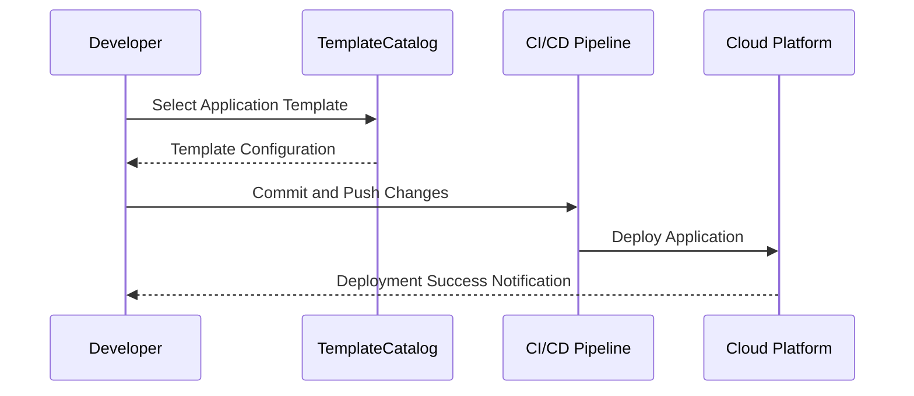

## Introduction

In the dynamic realm of cloud computing, rapid application development and deployment are paramount. Developers often face challenges such as ensuring consistency, maintaining software quality, and accelerating development cycles. The **Application Template Reuse** pattern addresses these challenges by providing a framework for reusing predefined application templates that incorporate established best practices and standardized components.

## Design Pattern: Application Template Reuse

The Application Template Reuse pattern involves utilizing pre-configured templates as blueprints for building new applications. These templates are crafted to embody best practices, architectural efficiencies, security features, and necessary integrations, thereby reducing repetitive coding and development errors.

### Architectural Approaches

1. **Template Catalog**:
   - Maintain a catalog of application templates tailored to various use cases such as microservices, serverless functions, data pipelines, etc.
   - Ensure templates are version-controlled and include detailed documentation.

2. **Configuration Management**:
   - Use infrastructure as code (IaC) tools like Terraform or AWS CloudFormation to manage template configurations.
   - Include parameter-driven configurations to allow customization without altering core template logic.

3. **Automation and CI/CD Integration**:
   - Automate the deployment and provisioning of templates using CI/CD tools.
   - Integrate with platforms like Jenkins, GitLab CI/CD, or GitHub Actions to streamline deployment workflows.

### Best Practices

- **Keep Templates Modular**: Design templates to be as modular as possible, allowing easy composition and extension.
- **Document Extensively**: Provide comprehensive documentation for each template, explaining its structure, usage scenarios, and customization guidelines.
- **Incorporate Security**: Embed security best practices in templates to ensure compliance and protect against basic vulnerabilities.

## Example Code Snippet

Below is a simplified example of using a template for deploying a microservice in AWS using AWS CDK (Cloud Development Kit):

```typescript
import * as cdk from 'aws-cdk-lib';
import * as lambda from 'aws-cdk-lib/aws-lambda';
import * as apigateway from 'aws-cdk-lib/aws-apigateway';

export class MicroserviceTemplateStack extends cdk.Stack {
  constructor(scope: cdk.Construct, id: string, props?: cdk.StackProps) {
    super(scope, id, props);

    const microserviceHandler = new lambda.Function(this, 'MicroserviceHandler', {
      runtime: lambda.Runtime.NODEJS_14_X,
      code: lambda.Code.fromAsset('lambda'),
      handler: 'microservice.handler'
    });

    new apigateway.LambdaRestApi(this, 'MicroserviceAPI', {
      handler: microserviceHandler,
    });
  }
}
```

## Diagrams

### UML Sequence Diagram



## Related Patterns

- **Infrastructure as Code (IaC)**: Employing IaC to manage and provision infrastructure consistently alongside application templates.
- **Microservices Architecture**: Applying a microservices architecture to applications built using reusable templates.
- **Automated Deployment**: Integrating automated deployment strategies to enhance the Application Template Reuse pattern.

## Additional Resources

- [Terraform for IaC](https://www.terraform.io) - Learn more about infrastructure as code.
- [AWS CDK Documentation](https://docs.aws.amazon.com/cdk/latest/guide/home.html) - Explore AWS's Cloud Development Kit for infrastructure management.
- [Designing Microservices](https://martinfowler.com/microservices/) - A guide for adopting microservices architecture with reusable templates.

## Summary

The Application Template Reuse pattern is an invaluable tool in the cloud computing landscape, offering a strategic advantage by facilitating rapid, consistent, and efficient application development and deployment. By leveraging well-crafted templates, organizations can reduce development time, ensure architectural consistency, and embrace continuous improvement through reusable components. Adhering to this pattern not only streamlines development processes but also embeds best practices, ultimately enhancing an organization's agility and innovation capacity.
