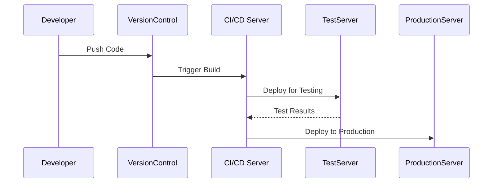

## Introduction

The **DevOps Practices Integration** design pattern emphasizes the fusion of development and operations teams to streamline and enhance the application development and deployment processes within cloud environments. This pattern leverages cloud capabilities and DevOps principles, such as continuous integration and continuous delivery (CI/CD), infrastructure as code, and monitoring, to enable rapid, reliable, and incremental software delivery.

## Detailed Explanation

DevOps Practices Integration involves several fundamental principles and practices:

1. **Continuous Integration/Continuous Delivery (CI/CD):** Automating the integration of code changes, testing, and deployment to ensure quality and speed in delivery cycles.
   
2. **Infrastructure as Code (IaC):** Managing and provisioning cloud infrastructure through machine-readable configuration files, enhancing scalability and repeatability.
   
3. **Monitoring and Logging:** Implementing comprehensive monitoring and logging frameworks to ensure system reliability and to facilitate quick problem resolution.
   
4. **Collaborative Culture:** Promoting a culture of collaboration and shared responsibilities between development and operations teams, often supported by using communication tools and practices.

5. **Agility and Automation:** Employing agile methodologies and extensive automation to shorten development cycles, improve product quality, and facilitate deployment processes.

## Best Practices

- Implement robust CI/CD pipelines to automate testing and deployment tasks.
- Use containerization technologies like Docker and orchestration tools like Kubernetes to ensure environmental consistency.
- Develop an agile culture within teams to support rapid releases and feedback incorporation.
- Ensure thorough monitoring and alerting systems are in place for proactive incident management.

## Example Code

Here's a simple example of a CI/CD pipeline using Jenkins for a Java-based application:

```groovy
pipeline {
    agent any
    stages {
        stage('Build') {
            steps {
                script {
                    sh 'mvn clean install'
                }
            }
        }
        stage('Test') {
            steps {
                script {
                    sh 'mvn test'
                }
            }
        }
        stage('Deploy to Dev') {
            steps {
                script {
                    sh 'scp target/myapp.jar user@devserver:/apps/'
                }
            }
        }
    }
    post {
        always {
            junit 'target/surefire-reports/*.xml'
            archiveArtifacts artifacts: 'target/*.jar', fingerprint: true
        }
    }
}
```

## Diagrams

Below is a UML Sequence Diagram that illustrates a simplified CI/CD process:



## Related Patterns

- **Microservices Architecture:** Often adopted alongside DevOps practices to enable more manageable, scalable, and independently deployable application services.
- **Infrastructure as Code (IaC) Pattern:** Critical for managing cloud resources efficiently, enabling quicker deployment and scaling.
- **Observability Pattern:** Encompasses logging, monitoring, tracing, and alerting to maintain high availability and performance.

## Additional Resources

- [The DevOps Handbook by Gene Kim, Jez Humble, Patrick Debois, and John Willis](https://www.amazon.com/DevOps-Handbook-World-Class-Reliability-Organizations/dp/1942788002)
- [Continuous Delivery: Reliable Software Releases through Build, Test, and Deployment Automation by Jez Humble and David Farley](https://www.amazon.com/Continuous-Delivery-Deployment-Automation-Addison-Wesley/dp/0321601912)
- [AWS DevOps Solutions](https://aws.amazon.com/devops/)

## Summary

Integrating DevOps practices within cloud environments enhances the agility and reliability of application development and deployment. By emphasizing automation, collaboration, and continuous improvement, organizations can respond quickly to market needs while maintaining high-quality software standards. DevOps Practices Integration is critical for maximizing cloud technology benefits and driving efficient, scalable software development.
