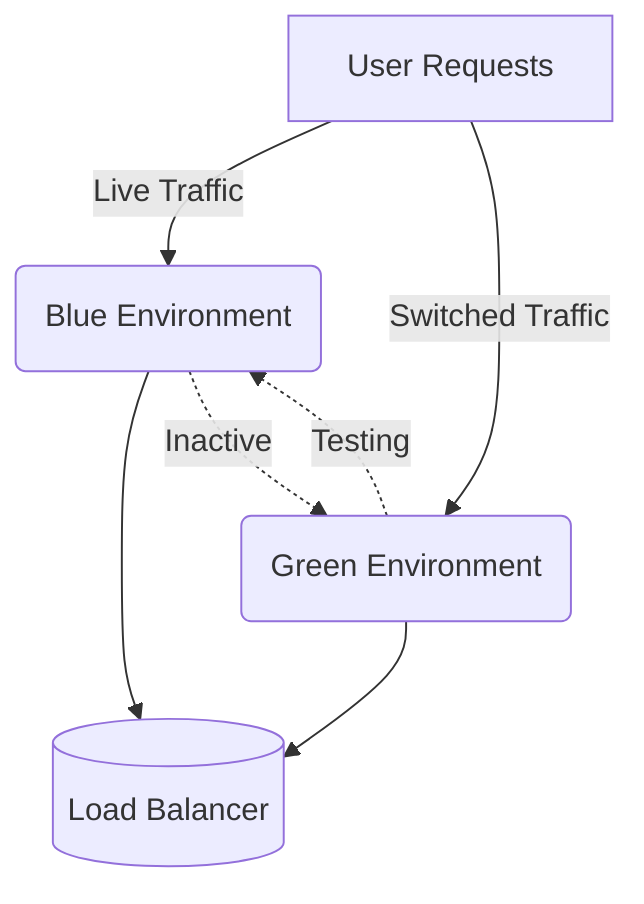

## Overview

Blue-Green Deployments is a strategic pattern utilized in software engineering to ensure seamless application updates with zero downtime. This approach is especially beneficial in cloud environments, where rapid, reliable scaling, and deployment are critical components of successful operations.

## Detailed Explanation

The core idea behind Blue-Green Deployments is the use of two separate environments, termed "blue" and "green." One environment is active at a time, serving all incoming traffic, while the other is idle, used for testing new releases. This pattern ensures uninterrupted service by allowing you to deploy changes to one environment while the other continues to serve production traffic.

### How It Works

1. **Setup Two Identical Environments**: Configure two identical environments—Blue and Green. Initially, the Blue environment is live and serving all requests.

2. **Deploy to Idle Environment**: Deploy new application versions to the idle environment (Green). Comprehensive testing is conducted on this environment to ensure the application works as expected.

3. **Switch Traffic**: Once testing is successful and you're confident in the new deployment, switch the traffic from Blue to Green. This switch can be nearly instantaneous, resulting in minimal to zero downtime.

4. **Monitor and Rollback if Necessary**: Monitor the new environment (Green) closely for any issues. If a problem arises, a quick rollback involves simply reverting traffic back to the Blue environment.

## Architectural Diagrams

Below is a simplified depiction of the Blue-Green Deployment architecture using diagram:



## Benefits

- **Zero Downtime**: Because traffic switching is instantaneous, downtime is effectively eliminated.
- **Reduction in Risk**: With a quick rollback option, risk is minimized compared to traditional deployment strategies.
- **Improved Testing**: The idle environment allows for thorough testing without impacting production traffic.
- **Scalable Deployment**: Easily supports scaled-out applications and systems through cloud services.

## Best Practices

- **Automate Environment Setup**: Use Infrastructure as Code (IaC) tools like Terraform or CloudFormation to automate the creation and management of your environments.
- **Utilize Feature Flags**: Control the release of features through feature flags, allowing for precise control over newly deployed functionality.
- **Monitor Systems Extensively**: Implement comprehensive monitoring and alerting systems to quickly detect and resolve issues post-deployment.
- **Data Synchronization**: Ensure that databases and application states are synchronized across environments to prevent data loss.

## Example Code

An example implementation using Kubernetes and a cloud-based approach might involve services like AWS services or Azure Pipelines. More succinctly, ensure that the Kubernetes services can be quickly switched between Deployment sets.

```yaml
apiVersion: apps/v1
kind: Deployment
metadata:
  name: blue-deployment
spec:
  replicas: 3
  template:
    metadata:
      labels:
        app: myapp
        version: blue
    spec:
      containers:
      - name: myapp
        image: myapp:blue
---
apiVersion: apps/v1
kind: Deployment
metadata:
  name: green-deployment
spec:
  replicas: 3
  template:
    metadata:
      labels:
        app: myapp
        version: green
    spec:
      containers:
      - name: myapp
        image: myapp:green
```

## Related Patterns

- **Canary Releases**: Aiming for a gradual rollout of updates by sending a small fraction of traffic to new changes initially.
- **Rolling Updates**: Gradually replacing the version of the application with the new version while the application is still running.

## Additional Resources

- [Continuous Delivery: Reliable Software Releases through Build, Test, and Deployment Automation](https://www.amazon.com/Continuous-Delivery-Deployment-Automation-Addison-Wesley/dp/0321601912)
- [Kubernetes Blue-Green Deployment](https://kubernetes.io/docs/concepts/workloads/controllers/deployment/)

## Summary

Blue-Green Deployments provide a robust methodology for enhancing the reliability and speed of application deployments by leveraging multiple identical environments to ensure that updates are seamlessly transitioned without end-user disruption. By switching user traffic between environments, organizations can reduce downtime and risks associated with updates, making it an integral pattern in modern cloud-centric DevOps practices.
