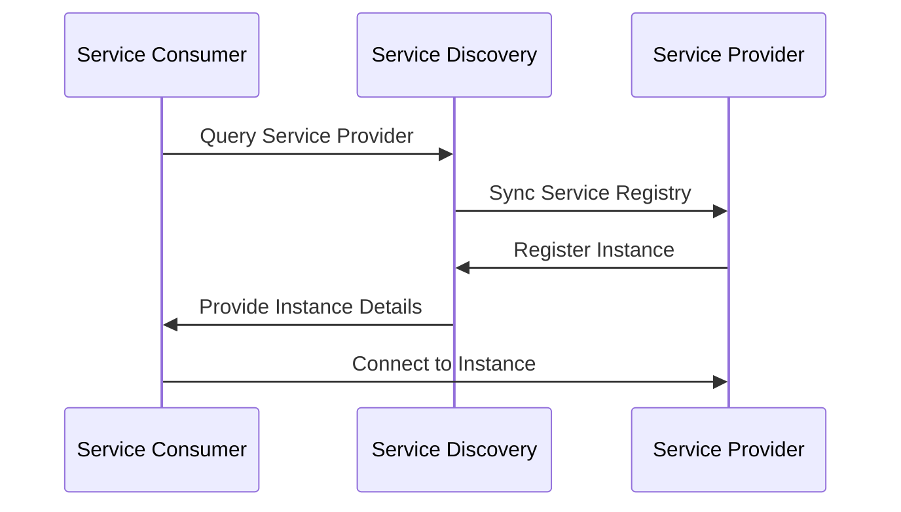

## Overview

In modern cloud environments, especially where microservices and containerized applications are prevalent, Service Discovery is a fundamental pattern. It facilitates dynamic detection and connection management between different services. This document outlines the principles, architecture, and practical implementation of Service Discovery in orchestration platforms like Kubernetes and Docker Swarm.

## Key Concepts

### What is Service Discovery?

Service Discovery refers to the process by which services can automatically detect and communicate with each other. It eliminates the need to hard-code IP addresses or hostnames of services, allowing for more robust and scalable systems.

### Importance in Orchestration

In orchestration environments, applications are dynamic, with instances appearing and disappearing regularly. Service Discovery enables seamless communication across these dynamic instances, vital for resilience and fault tolerance.

## Architectural Approaches

### Types of Service Discovery

1. **Client-Side Discovery**:
   - **How it works**: Clients query a service registry to find the service instances and then perform load balancing.
   - **Benefits**: Simplifies load balancer configuration and improves performance by distributing load efficiently.
   - **Challenges**: Increases client complexity and can lead to tight coupling.

2. **Server-Side Discovery**:
   - **How it works**: Clients contact a load balancer, which uses a service registry to route requests.
   - **Benefits**: Offloads complexity to the load balancer, simplifies client logic.
   - **Challenges**: May introduce a single point of failure and requires infrastructure support for the load balancer.

### Components of Service Discovery

- **Service Registry**: A database of available service instances. Examples include Consul, etcd, and ZooKeeper.
- **Service Provider**: Announces its availability and registers with the service registry.
- **Service Consumer**: Queries the service registry to discover service instances.

## Best Practices

- **Use reliable and distributed service registries** to prevent single points of failure.
- **Implement health checks** for services to ensure that only healthy instances are discovered.
- **Consider security implications** by enforcing authentication and encryption in service discovery communication.

## Example Code

### Kubernetes Service Discovery

In Kubernetes, Service Discovery is natively supported. Here's a basic implementation via a `Service`:

```yaml
apiVersion: v1
kind: Service
metadata:
  name: my-service
spec:
  selector:
    app: MyApp
  ports:
    - protocol: TCP
      port: 80
      targetPort: 9376
```

This configuration allows microservices to discover `my-service` via the DNS name `my-service.default.svc.cluster.local`.

## Diagrams

### Service Discovery Sequence Diagram



## Related Patterns

- **Circuit Breaker Pattern**: Enhance fault tolerance when discovered services become unreachable.
- **Sidecar Pattern**: Deploy proxy containers to intercept and manage network traffic to microservices.

## Additional Resources

- [Kubernetes Documentation on Services](https://kubernetes.io/docs/concepts/services-networking/service/)
- [Consul by HashiCorp](https://www.consul.io/intro)
- [Understanding Microservices by Martin Fowler](https://martinfowler.com/articles/microservices.html)

## Summary

Service Discovery is a critical component of orchestrated and containerized environments, enabling dynamic and resilient inter-service communication. By choosing the right service discovery approach and implementing best practices, organizations can ensure robust and flexible deployment architectures that easily adapt to changes within the cloud ecosystem.
