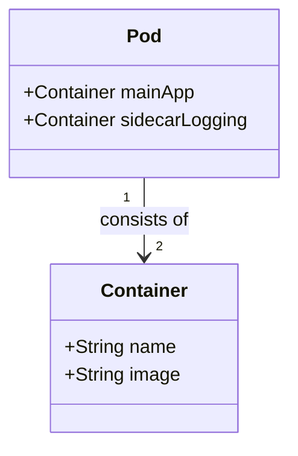

## Introduction

The **Sidecar Containers** pattern is a foundational element of cloud-native architecture, particularly within Kubernetes environments. This design pattern allows for auxiliary features to be added to a primary application by running additional containers (sidecars) in the same Pod. This setup enables seamless integration and operation of supplementary tasks, such as logging, monitoring, and configuration updates, without altering the primary application.

## Detailed Explanation

A sidecar container runs alongside a main container within the same Pod, sharing resources such as networking and storage. This architecture supports a wide range of use cases by extending the capabilities of the primary application without increasing its complexity. The separation of concerns is a key benefit, as it allows for independent development, deployment, and scaling of sidecar and primary application functionalities.

### Core Characteristics

1. **Modularity**: The sidecar pattern decouples ancillary functionalities from the main application, fostering a modular application design. This modularity facilitates independent lifecycle management of these components.

2. **Reusable Components**: Sidecar containers can be reused across different services and applications, promoting consistency and reducing redundancy within the cloud infrastructure.

3. **Enhanced Maintainability**: By isolating supplemental processes into separate containers, the complexity of the primary application is minimized, improving maintainability and reducing the potential for bugs.

4. **Dynamic Scalability**: Sidecar and main containers can be scaled independently, optimizing resource utilization and enabling agile responses to workload changes.

## Example Code

Here's a simple example of a Kubernetes Pod definition using the sidecar pattern:

```yaml
apiVersion: v1
kind: Pod
metadata:
  name: myapp-pod
spec:
  containers:
  - name: main-app
    image: myapp:latest
    ports:
    - containerPort: 8080
  - name: sidecar-logging
    image: logger:latest
    # Configure any volume mounts if needed for shared resources
    volumeMounts:
      - name: shared-logs
        mountPath: /var/log/myapp
  volumes:
  - name: shared-logs
    emptyDir: {}
```

In this example, the `myapp-pod` runs two containers: `main-app` for the primary application and `sidecar-logging` for managing logs. These containers share a volume to store logs.

## Diagrams

### UML Class Diagram



## Related Patterns

- **Adapter Pattern**: Like the adapter pattern, the sidecar container adapts external services for the main application, providing a layer of abstraction or conversion as needed.

- **Ambassador Pattern**: Acts as a proxy, handling network interactions for the main application, complementing the sidecar pattern that adds functionalities such as policy enforcement or logging.

- **Init Container Pattern**: Used for setup tasks that must complete before the Pod can begin its normal operations, setting up conditions for the sidecar and primary container.

## Additional Resources

- [Kubernetes Documentation on Sidecars](https://kubernetes.io/docs/concepts/workloads/pods/)
- [Cloud Native Patterns Book](https://www.oreilly.com/library/view/cloud-native-patterns/9781617294297/)
- [Microservices in Kubernetes](https://www.infoq.com/articles/microservices-kubernetes-product-development/)

## Summary

The Sidecar Containers design pattern is a versatile solution within cloud-native architectures, allowing developers to enhance functionality without modifying the core application. By leveraging the modularity and independent lifecycle management offered by sidecars, organizations can build scalable, maintainable, and reusable microservices-based systems. This pattern is essential for teams adopting containerization and Kubernetes, enabling advanced capabilities such as logging, monitoring, and configuration management directly into their infrastructure.
