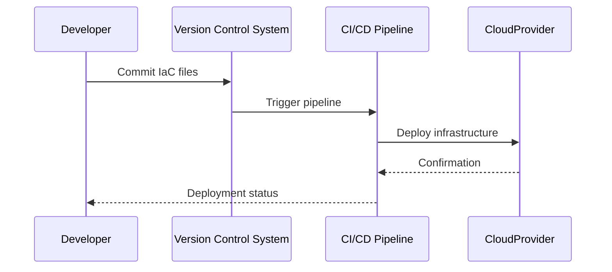

## Introduction to Infrastructure as Code for Orchestration

Infrastructure as Code (IaC) is a transformational approach in cloud computing, enabling the management and provisioning of infrastructure through machine-readable definition files rather than physical hardware configurations or interactive configuration tools. This pattern, when applied to orchestration, brings automation, version control, and consistency to cloud deployments.

### Key Concepts

1. **Declarative Configuration**: IaC utilizes declarative configuration files to specify the desired state of infrastructure, enabling repeatable and predictable deployments.
2. **Version Control**: Allows tracking infrastructure changes over time, making rollbacks and audits straightforward.
3. **Automation**: Automates provisioning and management tasks, reducing human errors and increasing deployment speeds.
4. **Scalability**: Facilitates the scaling of environments with ease, maintaining consistency across multiple cloud providers and services.

## Best Practices for IaC in Cloud Orchestration

- **Use Code Repositories**: Leverage Git for storing and versioning configuration files to facilitate collaboration and change tracking.
- **Adopt Modular Designs**: Break down your infrastructure into reusable modules, promoting reusability and simplifying updates.
- **Implement Continuous Integration/Continuous Deployment (CI/CD)**: Integrate IaC into CI/CD pipelines for automated testing and deployment of infrastructure changes.
- **Ensure Security**: Use tools such as HashiCorp Vault to manage sensitive information like environment variables and API keys securely.
- **Regular Testing**: Utilize infrastructure testing tools like Terraform Validate or AWS CloudFormation Linter to validate changes before deployment.

## Example Code

Here's a basic example using Terraform to provision resources in AWS:

```hcl
provider "aws" {
  region = "us-east-1"
}

resource "aws_instance" "example" {
  ami           = "ami-0c55b159cbfafe1f0"
  instance_type = "t2.micro"

  tags = {
    Name = "ExampleInstance"
  }
}
```

## UML Sequence Diagram



## Related Patterns and Paradigms

- **Microservices Architecture**: IaC complements microservices by enabling automated deployments of each microservice.
- **Immutable Infrastructure**: Both patterns advocate for replacing rather than modifying infrastructure, ensuring consistency.
- **Configuration Management**: Tools such as Ansible or Puppet help manage configuration in conjunction with IaC tools like Terraform.

## Additional Resources

- [Terraform Documentation](https://www.terraform.io/docs)
- [AWS CloudFormation User Guide](https://docs.aws.amazon.com/AWSCloudFormation/latest/UserGuide/Welcome.html)
- [Kubernetes Documentation for Orchestration](https://kubernetes.io/docs/home/)

## Summary

Infrastructure as Code for Orchestration is an essential pattern in modern cloud environments, driving agility and consistency in deployments. By automating infrastructure management, organizations can achieve faster delivery, scalability, and improved collaboration across development teams. Embracing IaC alongside other practices such as CI/CD and microservices ensures a robust, scalable, and maintainable infrastructure setup.
