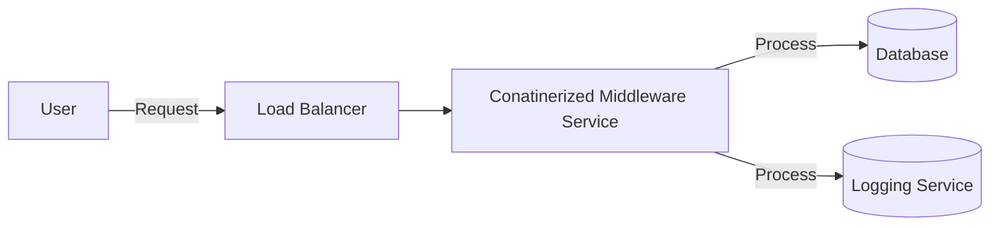

## Introduction

As enterprises increasingly move towards cloud-native architectures, containerized middleware has emerged as a pivotal solution for enhancing flexibility, portability, and consistency in application deployment and management. This pattern leverages container technology to encapsulate middleware services such as message brokers, application servers, and data processing engines, enabling seamless integration and orchestration across diverse environments.

## Problem

Traditional middleware solutions often face challenges with deployment complexity, environment inconsistencies, and scalability issues. Management of dependencies and configurations across different environments can lead to errors, increased maintenance overhead, and slow deployment processes. Additionally, scalability is limited when middleware components are bound to specific hardware configurations or architectures.

## Solution

Containerized middleware utilizes container technologies, such as Docker and Kubernetes, to encapsulate middleware services into isolated, portable units. By containerizing middleware, the services can be easily deployed, scaled, and managed across a variety of environments, from on-premises data centers to multiple cloud providers.

**Key Benefits**:
1. **Portability**: Containers ensure that middleware services run consistently across different environments without modification.
2. **Scalability**: Container orchestration tools enable horizontal scaling of middleware services based on demand.
3. **Isolation**: Encapsulation in containers provides environment isolation, reducing conflicts and dependencies.
4. **Ease of Deployment**: Simplified deployment processes with container images, reducing the complexity of managing middleware dependencies.

## Example Code

Here is a basic example of a Dockerfile for containerizing an Apache Kafka service, a popular middleware application for messaging:

```dockerfile
FROM confluentinc/cp-kafka:latest

ENV KAFKA_ADVERTISED_LISTENERS=PLAINTEXT://localhost:9092
ENV KAFKA_ZOOKEEPER_CONNECT=zookeeper:2181

EXPOSE 9092

CMD ["start-kafka"]
```

This Dockerfile creates a Kafka service image that can be deployed across any Docker-compatible environment with minimal setup requirements.

## Diagram



## Best Practices

- **Use Official Images**: Whenever possible, use official or well-maintained images from trusted sources to ensure security and performance.
- **Version Control**: Keep track of middleware versions in container images. This eases rollback instances in case of failures.
- **Resource Management**: Configure resource limits and requests in container orchestration platforms to prevent resource contention.
- **Automated Monitoring and Logging**: Implement centralized logging and monitoring solutions to track the performance and availability of middleware services.

## Related Patterns

- **Service Mesh**: Extend containerized middleware with service mesh to manage service-to-service communication with dynamic routing, authentication, and more.
- **Sidecar Pattern**: Use the Sidecar pattern to manage concerns such as logging, monitoring, and configuration external to the middleware container.

## Additional Resources

- [Docker: Introduction to Containers](https://docs.docker.com/get-started/overview/)
- [Kubernetes: Orchestrating Containers](https://kubernetes.io/docs/concepts/overview/)
- [Apache Kafka for Beginners: What, Why & How](https://kafka.apache.org/intro)

## Summary

Containerized middleware simplifies the deployment, management, and scaling of middleware services by leveraging containerization technologies like Docker and Kubernetes. It offers significant enhancements in environment consistency, scalability, and operational efficiency, enabling enterprises to rapidly adapt to changing demands and technological landscapes. Embracing containerized middleware is a fundamental step towards agile, cloud-native architectures.
