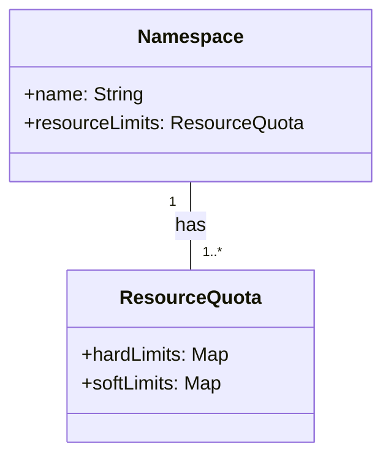

## Introduction to Resource Quotas

Resource Quotas are a critical design pattern in containerization and orchestration that manage the allocation and consumption of cloud resources among various tenants. This pattern ensures that no single application, tenant, or group can monopolize the shared resources, thereby promoting equitable resource distribution and preventing system overloading.

## Architectural Approach

Resource Quotas are implemented at the orchestration level, typically using platforms like Kubernetes. They allow administrators to define limits on the amount of compute (CPU and memory), storage, and network resources that can be consumed by applications or users within a namespace.

### Key Features:
- **Limits**: Specifies the maximum amount of resources a project or namespace can request and consume.
- **Requests**: Represents the minimum amount of resources guaranteed for a particular container.
- **Enforcement**: Ensures that the total resource requests and limits within the namespace do not exceed the defined quotas.

## Best Practices

1. **Define Appropriate Quotas**: Tailor resource quotas based on historical usage patterns and future projections to prevent resource starvation or wastage.
2. **Monitor and Adjust**: Continuously monitor resource usage and adjust quotas as necessary to accommodate changes in application demand or business priorities.
3. **Educate Users**: Ensure that development teams are aware of the quotas and understand how to request resources appropriately.
4. **Automated Alerts**: Set up alerts for quota breaches to enable timely interventions.

## Example Code

Below is a sample configuration of resource quotas using Kubernetes:

```yaml
apiVersion: v1
kind: ResourceQuota
metadata:
  name: compute-resources
  namespace: my-app-namespace
spec:
  hard:
    requests.cpu: "10"
    requests.memory: "64Gi"
    limits.cpu: "20"
    limits.memory: "128Gi"
```

In this example, the namespace is restricted to using a maximum of 20 cores and 128 GiB of memory.

## Diagrams



## Related Patterns

- **Multi-Tenancy**: Resource Quotas complement this pattern by managing resources across multiple tenants on the shared infrastructure.
- **Auto-scaling**: Works with quotas to dynamically adjust the number of instances based on predefined metrics.
- **Circuit Breaker**: Helps manage workload limitations and prevent the exhaustion of quotas through failure handling mechanisms.

## Additional Resources

- [Kubernetes Documentation on Resource Quotas](https://kubernetes.io/docs/concepts/policy/resource-quotas/)
- [Cloud Resource Management: Best Practices](https://cloud.google.com/architecture/best-practices-for-enterprise-organizations)
- [AWS Resource Quota Documentation](https://docs.aws.amazon.com/servicequotas/latest/userguide/sq-getting-started.html)

## Summary

Resource Quotas play an indispensable role in the management of cloud resources within containerized environments. By providing clear limits on resource consumption, they safeguard against resource monopolization, ensuring every application operates within its fair share of resources. This pattern is integral to maintaining robust, scalable, and efficient cloud infrastructure.
