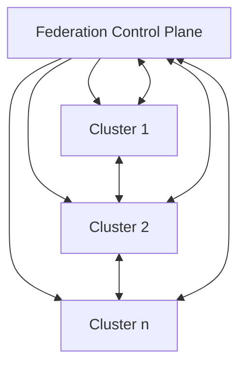

## Introduction

In modern cloud environments, organizations often deploy multiple clusters for scalability, reliability, and geographical distribution. **Cluster Federation** (also known as multi-cluster management or hybrid cloud orchestration) is a design pattern that addresses the challenge of managing these multiple clusters as a unified system. This pattern enables seamless collaboration between clusters, distributed across different regions or cloud providers.

## Detailed Explanation

### Purpose

The main goal of Cluster Federation is to provide a single control plane that orchestrates workloads across multiple clusters. This facilitates resource sharing, unified policy application, and cross-cluster service discovery. By federating clusters, organizations can enhance application resilience, optimize resource utilization, and maintain consistent operational policies across different environments.

### Key Components

1. **Federation Control Plane**: 
   - Acts as the central orchestrator for managing multiple clusters.
   - Provides APIs and user interfaces for interacting with federated resources.

2. **Member Clusters**:
   - Individual clusters that are part of the federation, each retaining its independence while following the directives set by the Federation Control Plane.

3. **Federated Resource Management**:
   - Deployment of resources (pods, configurations, services) uniformly across all member clusters via templating and policy controls.

4. **Cross-Cluster Communication**:
   - Mechanisms to enable clusters to communicate, share data, and failover as needed.

### Architectural Diagram



### Example Implementation

For a practical implementation, let's consider the use of Kubernetes' Federation v2, which provides capabilities to federate multiple Kubernetes clusters:

```yaml
apiVersion: types.kubefed.io/v1beta1
kind: FederatedNamespace
metadata:
  name: my-namespace
spec:
  template:
    metadata:
      labels:
        purpose: federated
  placement:
    clusters:
      - name: cluster1
      - name: cluster2
```

This YAML defines a federated namespace that applies to both cluster1 and cluster2, allowing resources within this namespace to be managed across the clusters.

## Best Practices

1. **Decentralized Control**: While the Federation Control Plane centralizes management, it’s crucial to maintain some decentralized controls to ensure clusters can function independently if the federation experiences outages.

2. **Consistent Policies**: Implement consistent resource and security policies across all federated clusters to prevent configuration drift.

3. **Monitoring and Logging**: Use centralized monitoring and logging solutions to gain visibility into the performance and health of federated clusters.

4. **Scalability Planning**: Design federated architectures to scale horizontally to accommodate an increasing number of clusters and workloads.

5. **Interoperability Testing**: Regular testing of cross-cluster capabilities to ensure smooth data flow and service availability.

## Related Patterns

- **Multi-Cloud Strategy**: Distributing workloads across different cloud providers to avoid vendor lock-in and enhance resilience.

- **Service Mesh**: Layering service mesh capabilities over federated clusters for improved traffic management between microservices.

- **Infrastructure as Code (IaC)**: Automating infrastructure management across federated clusters for consistent and repeatable deployments.

## Additional Resources

- [Kubernetes Federation Documentation](https://kubernetes.io/docs/concepts/cluster-administration/federation/)
- [Multi-Cluster Management Strategies](https://cloud.google.com/solutions/managing-multi-cluster-kubernetes-environments)
- [CNCF: The Landscape of Multi-Cluster Tools](https://landscape.cncf.io/)

## Summary

Cluster Federation is a powerful design pattern essential for managing complex, distributed cloud environments. By connecting multiple clusters into a coherent system, organizations can optimize resource allocation, enhance resilience, and maintain consistent operational standards across various geographies or cloud providers. Embracing this pattern is vital as enterprises seek greater scalability and flexibility in modern cloud architectures.
