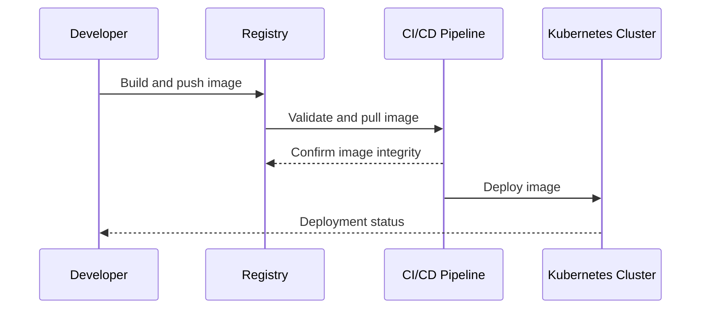

## Container Registry Management

### Introduction

In modern cloud computing architectures, containers have become essential building blocks for deploying scalable, agile, and portable applications. The **Container Registry Management** pattern provides guidelines for managing and deploying container images efficiently. By leveraging registries, organizations can ensure that their container images are securely stored, version-controlled, and easily distributed across different environments.

### Problem Statement

Managing containers involves several challenges, including storage, versioning, authentication, and efficient distribution of container images. Without a robust system in place, teams may face difficulties in accessing the correct images, compromising both security and efficiency.

### Solution

The Container Registry Management pattern proposes the use of container registries as central repositories for storing and managing container images. Registries facilitate:

- **Secure Image Storage**: Ensure that container images are stored securely with appropriate encryption and access controls.
- **Version Control**: Maintain multiple versions of container images to support rollback capabilities and manage dependencies.
- **Efficient Distribution**: Enable fast and reliable access to container images for deployment across multiple environments.
- **Authentication and Authorization**: Implement strict authentication and authorization policies to control who can access or push images to the registry.

### Implementation

Container registries can be privately hosted or provided by cloud service vendors. Popular options include Docker Hub, Google Container Registry (GCR), Amazon Elastic Container Registry (ECR), and Azure Container Registry.

Here's an example of how you can use Docker to push an image to a container registry:

```bash
docker tag myapp:latest myregistry.com/myapp:latest

docker login myregistry.com

docker push myregistry.com/myapp:latest
```

### Diagram



### Best Practices

1. **Use Automated Builds**: Integrate image building with CI/CD pipelines to automate testing and deployment.
2. **Implement Image Scanning**: Continuously scan images for vulnerabilities to enhance security.
3. **Adopt Immutable Tags**: Avoid using mutable tags for deployment to ensure consistent image versions.
4. **Monitor Registry Usage**: Track metrics such as image pulls, size, and access patterns to optimize performance and scalability.

### Related Patterns

- **Continuous Integration/Continuous Deployment (CI/CD)**: Works in conjunction with container registries to automate application delivery.
- **Service Mesh**: Provides security and monitoring capabilities for microservices using containers.

### Additional Resources

- [Docker Registry Documentation](https://docs.docker.com/registry/)
- [Google Container Registry (GCR)](https://cloud.google.com/container-registry)
- [Amazon Elastic Container Registry (ECR)](https://aws.amazon.com/ecr/)

### Conclusion

The Container Registry Management pattern offers an essential approach to managing container images efficiently in cloud environments. By centralizing image storage, implementing security measures, and facilitating easy distribution, this pattern addresses key challenges in container management, thus supporting the adoption of containerized applications across various cloud platforms.
