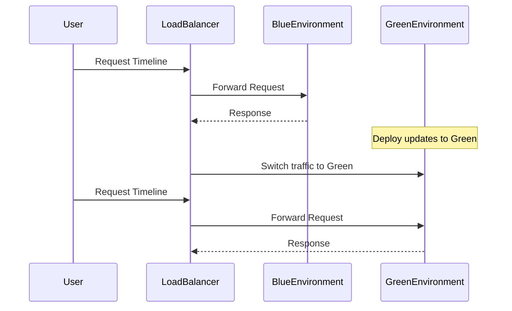

## Introduction

The Zero-Downtime Deployments pattern is crucial in modern cloud environments where application updates need to occur seamlessly without disrupting the user experience. As businesses demand 24/7 service availability, minimizing downtime has become essential. This pattern leverages containerization and orchestration tools to achieve continuous delivery, thus enabling organizations to deploy updates frequently and reliably.

## Architectural Approaches

Zero-Downtime Deployments can be achieved through various architectural strategies:

1. **Blue-Green Deployment**: This approach involves maintaining two identical environments (blue and green). The current live environment runs as the blue environment, and the new release is deployed in the green environment. Once the green environment is ready and tested, traffic is switched from blue to green.

2. **Canary Releases**: Updates are rolled out incrementally to a small subset of users before full deployment. This approach allows real-world testing and validation, enabling teams to quickly rollback if issues are detected.

3. **Rolling Updates**: In this pattern, the update process replaces old versions of components with new versions incrementally across servers or instances, thus reducing risk by distributing the update over time.

4. **Feature Toggles**: Deployment is decoupled from feature release by implementing toggles. The new code is deployed but only activated for users when deemed ready, allowing for back-end changes without immediate user impact.

## Best Practices

- **Automated Testing**: Employ comprehensive automated tests to ensure that new deployments do not introduce regressions or break existing functionality.

- **CI/CD Pipelines**: Use continuous integration and continuous deployment (CI/CD) pipelines for streamlined, automated deployments.

- **Monitoring and Logging**: Implement robust monitoring to catch errors early and gather performance metrics. Logging can assist in diagnosing issues in real time.

- **Immutable Infrastructure**: Deploy infrastructure as immutable entities to minimize configuration drift and ensure consistency across environments.

## Example Code

Here is an example of a Kubernetes deployment YAML for a rolling update:

```yaml
apiVersion: apps/v1
kind: Deployment
metadata:
  name: my-application
spec:
  replicas: 3
  strategy:
    type: RollingUpdate
    rollingUpdate:
      maxUnavailable: 1
      maxSurge: 1
  selector:
    matchLabels:
      app: my-application
  template:
    metadata:
      labels:
        app: my-application
    spec:
      containers:
      - name: my-application-container
        image: my-application:latest
        ports:
        - containerPort: 80
```

## Diagrams

### Sequence Diagram for Blue-Green Deployment



## Related Patterns

- **Circuit Breaker**: This pattern can accompany zero-downtime deployments by providing fault tolerance during unpredictable deployment failures.

- **Service Mesh**: Enhances zero-downtime deployments with functionalities like traffic routing and observability for microservices.

## Additional Resources

- [Kubernetes Rolling Updates](https://kubernetes.io/docs/tutorials/kubernetes-basics/update/update-intro/)
- [Martin Fowler's Blue-Green Deployment](https://martinfowler.com/bliki/BlueGreenDeployment.html)
- [Feature Toggles in Microservices](https://microservices.io/patterns/deployment/feature-toggle.html)

## Summary

Zero-Downtime Deployments are essential for businesses seeking uninterrupted service availability, especially in cloud-native environments leveraging containers and orchestration platforms like Kubernetes. By employing strategies such as blue-green deployments, canary releases, rolling updates, and feature toggles, organizations can deploy changes seamlessly. Adopting best practices such as robust automated testing, CI/CD pipelines, and effective monitoring ensures the stability and reliability of deployments.
