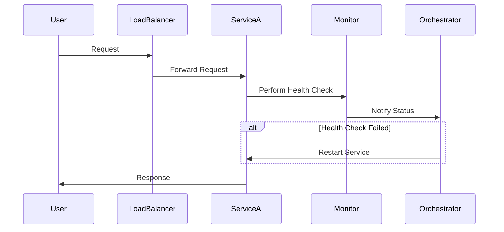

## Introduction

In today's dynamic cloud environments, maintaining system resilience is paramount. Health checks and self-healing mechanisms are foundational patterns that bolster the reliability and robustness of applications running on modern cloud infrastructures. These design patterns enable systems to automatically monitor their health status and recover from failures, minimizing downtime and ensuring continuous service availability.

## Design Pattern Details

### Health Checks

Health checks are periodic diagnostic tests running within your application or orchestrated by an external system. They validate the integrity and availability of applications by checking entry points like HTTP endpoints, database connections, message brokers, etc. There are two main types of health checks:

- **Liveness Checks:** Verify if an application is up and running. If a liveness check fails, it indicates that the application is stuck and needs a restart.
  
- **Readiness Checks:** Determine if an application is ready to handle requests. Even if an application is live, it may not be prepared to serve traffic due to various initialization tasks or dependencies.

### Self-Healing

Self-healing refers to the automatic recovery and remediation actions taken when health checks indicate issues. This includes restarting application instances, re-provisioning resources, and scaling operations as required by dynamic workloads.

Key self-healing techniques include:

- **Restart Mechanism:** Automatically restarting unhealthy instances.
- **Redirection & Rerouting:** Directing traffic away from failing components.
- **Dynamic Resource Scaling:** Scaling resources up or down in response to detected trends or anomalies.

## Best Practices

- **Centralized Monitoring:** Use platforms like Prometheus, Grafana, or centralized cloud-native solutions to monitor and aggregate health data from distributed resources.
- **Graceful Shutdowns:** Ensure your applications can handle termination signals gracefully, allowing them to free resources without disrupting ongoing operations.
- **Timeouts and Circuit Breakers:** Implement timeouts to avoid hanging processes and circuit breakers to halt repetitive failures automatically.

## Example Code

Here's a basic illustration of how you might implement a readiness and liveness probe in a Kubernetes environment using YAML configuration:

```yaml
apiVersion: v1
kind: Pod
metadata:
  name: example-pod
spec:
  containers:
  - name: example-container
    image: example-image
    livenessProbe:
      httpGet:
        path: /healthz
        port: 8080
      initialDelaySeconds: 30
      periodSeconds: 10
    readinessProbe:
      httpGet:
        path: /ready
        port: 8080
      initialDelaySeconds: 5
      periodSeconds: 5
```

## Diagram



## Related Patterns

- **Circuit Breaker Pattern:** Prevents system failures from cascading by breaking the service call circuit.
- **Bulkhead Pattern:** Isolates resources to limit failures within a single module.
  
## Additional Resources

- [Site Reliability Engineering Book](https://sre.google/sre-book/table-of-contents/) - Comprehensive guide by Google
- [Kubernetes Health Checks Documentation](https://kubernetes.io/docs/tasks/configure-pod-container/configure-liveness-readiness-startup-probes/)

## Summary

Health checks and self-healing patterns are vital for maintaining system resilience in cloud-native applications. By continuously monitoring and automatically addressing failures, these patterns help ensure high availability and reliability. Their implementation promotes a robust and dynamic cloud environment capable of addressing failures without human intervention, enhancing system uptime and performance.
