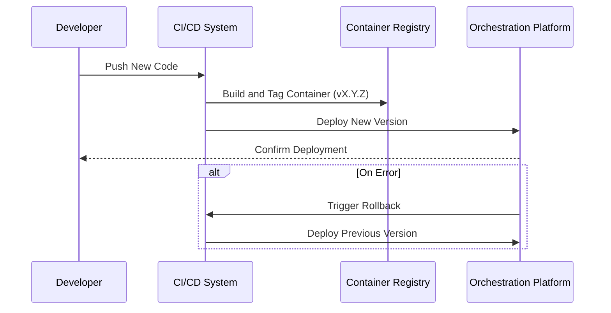

In today's fast-paced software development environment, the ability to roll out updates quickly and efficiently is crucial. However, with rapid deployment comes the risk of introducing faulty changes. The **Container Versioning and Rollbacks** design pattern addresses this challenge, providing a robust framework for managing container versions and ensuring that application rollouts can be safely rolled back if necessary.

## Pattern Overview

### Intent

The primary goal of the Container Versioning and Rollbacks pattern is to manage application lifecycles in containerized environments effectively. This pattern enables seamless versioning of containers so that previous versions of services or applications can be quickly restored in case of failures in newer deployments.

### Applicability

Use this pattern when:
- You want to implement a CI/CD pipeline that requires reliable versioning.
- Rolling back to a previous stable version is crucial to maintaining service uptime.
- Managing multiple releases of the same application in separate environments is necessary.

## Structural Elements

### Design Components

1. **Version Tags**: Each container image is tagged with a version number, enabling systematic tracking of releases.
2. **Immutable Images**: Containers are treated as immutable entities to ensure consistency across environments.
3. **Registry Management**: A container registry manages storing, organizing, and accessing container images.
4. **Rollback Strategy**: Automated scripts or workflows that facilitate rollback to a previous version if something goes wrong.

### Sequence of Operations

Below is a sequence diagram demonstrating the versioning and rollback process:

## Implementation Strategies

- **Semantic Versioning (SemVer)**: Adopt a clear convention for versioning, such as major.minor.patch.
- **Automated Rollbacks**: Use orchestration tools like Kubernetes to automate rollback processes through deployment configuration.
- **Health Checks and Monitoring**: Incorporate health checks to quickly detect issues in new deployments and trigger rollbacks.
- **Hybrid Storage Solutions**: Use both local and cloud-based registries to ensure redundancy and improve access speed.

## Best Practices

- **Keep deployment scripts versioned** alongside your application code to ensure compatibility.
- **Test rollback procedures regularly** to ensure they're effective and seamless.
- **Document every version change** thoroughly for improved traceability and accountability.
- **Limit version proliferation** by regularly cleaning up old or unused images in your registry.

## Related Patterns

- **Blue-Green Deployments**: Alternate live environments between two identical setups to reduce downtime.
- **Canary Releases**: Introduce new versions to a small subset of users first to detect issues early.
- **Microservices Architecture**: Facilitate independent versioning of application components for granular rollbacks.

## Additional Resources

- [Docker Documentation on Versioning](https://docs.docker.com/engine/reference/commandline/tag/)
- [Kubernetes Rollback Processes](https://kubernetes.io/docs/concepts/workloads/controllers/deployment/)
- [Semantic Versioning Specification](https://semver.org/)

## Summary

The Container Versioning and Rollbacks pattern is a critical component of modern application deployment strategies in cloud environments. By implementing systematic version tagging, leveraging orchestration platforms for automation, and maintaining robust rollback plans, organizations can reduce the risks of deployment failures while retaining agility in their release cycles. This pattern not only helps in managing versions but also contributes to overall operational resilience and user satisfaction.
