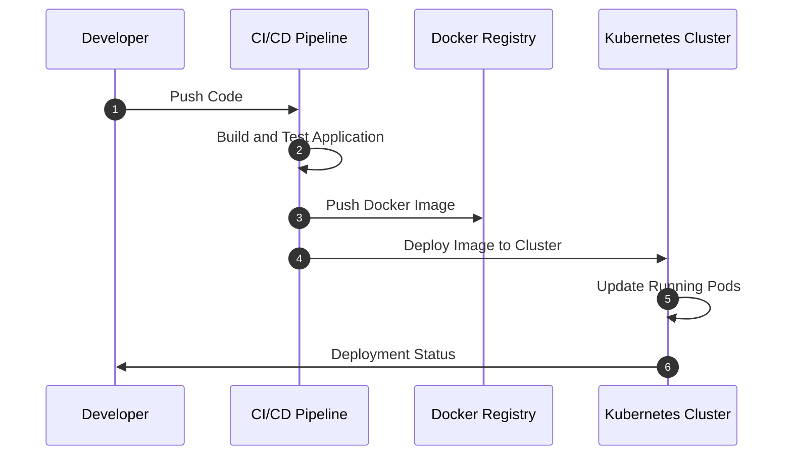

## Continuous Delivery to Containers

The Continuous Delivery to Containers pattern is a set of automated processes used to package and deploy applications into container environments continuously. This pattern ensures that any software changes (such as updates, fixes, or new features) are automatically tested and deployed to production environments in a reliable, incremental, and consistent manner.

### Detailed Explanation

The primary goal of this pattern is to streamline the deployment pipeline by integrating automated testing and CI/CD practices, greatly enhancing the speed and reliability of software releases. By using containers, applications can be more easily moved between different environments, from development to production, without inconsistency in behavior.

Containers provide a lightweight and standardized way to package applications and their dependencies, ensuring that software runs consistently regardless of where it is deployed. When combined with continuous delivery practices, this leads to more efficient and reliable processes, decreasing the time to market while maintaining high-quality software standards.

### Architectural Approaches

1. **Pipeline Automation**: Leveraging CI/CD tools like Jenkins, GitLab CI, or GitHub Actions to automate the build, test, and release processes. This involves setting up workflows that automatically trigger whenever changes are pushed to the code repository.

2. **Containerization**: Using Docker or other containerization technologies to package applications, ensuring that all dependencies are included. This makes scaling and deploying across different environments straightforward.

3. **Container Orchestration**: Orchestrators like Kubernetes or AWS ECS manage the deployment, scaling, and operations of containerized applications. They provide self-healing, load balancing, and auto-scaling features.

4. **Version Control Integration**: Utilizing version control systems (such as Git) to enable atomic and traceable changes, allowing rollbacks or audit trails.

5. **Monitoring and Logging**: Implement comprehensive monitoring and logging using tools like Prometheus, Grafana, or ELK Stack to ensure the deployment and application health status are continuously tracked.

### Best Practices

- **Immutable Infrastructure**: Use infrastructure as code (IaC) tools like Terraform or CloudFormation to create deployment environments, avoiding configuration drift and guaranteeing consistency across all stages.

- **Blue/Green Deployment**: Implement Blue/Green or Canary deployment strategies to minimize downtime and reduce risks during releases.

- **Security Scanning**: Integrate security scanning tools in your pipeline to ensure containers are free from vulnerabilities before being deployed.

- **Environment Parity**: Maintain development, staging, and production environment parity to avoid "it works on my machine" problems.

### Example Code

```yaml
apiVersion: apps/v1
kind: Deployment
metadata:
  name: my-application
spec:
  replicas: 3
  selector:
    matchLabels:
      app: my-application
  template:
    metadata:
      labels:
        app: my-application
    spec:
      containers:
      - name: my-app-container
        image: my-registry/my-app:latest
        ports:
        - containerPort: 80
        readinessProbe:
          httpGet:
            path: /healthz
            port: 80
```

### Diagrams



### Related Patterns

- **Infrastructure as Code (IaC)**: Enables automated provisioning and management of infrastructure through code.
  
- **Blue/Green Deployments**: A method to deploy new changes while minimizing downtime by routing user traffic between two identical environments.

- **Canary Releases**: Gradually rolling out new software updates to a subset of users before full-scale deployment.

### Additional Resources

- Kubernetes Documentation: [https://kubernetes.io/docs](https://kubernetes.io/docs)
- Docker CLI Reference: [https://docs.docker.com/engine/reference/commandline/cli](https://docs.docker.com/engine/reference/commandline/cli)
- Continuous Integration and Continuous Delivery: [https://aws.amazon.com/devops/continuous-integration](https://aws.amazon.com/devops/continuous-integration)

### Summary

Adopting the Continuous Delivery to Containers pattern allows organizations to streamline their software release processes, increase application reliability, and respond rapidly to market demands while reducing the complexity inherent in managing distributed systems. This pattern emphasizes automation, consistency, and robust infrastructure management, vital for maintaining competitive advantage in today’s fast-paced technology environment.
