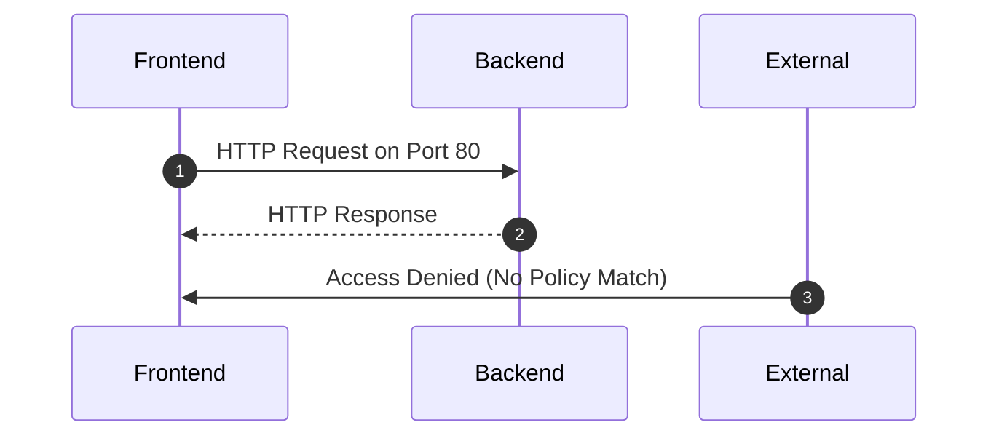

## Introduction

With the growing adoption of containers and orchestration platforms like Kubernetes, managing network security and policies is critical. Network Policies for Containers are essential for defining how containers communicate within a cluster, ensuring secure and restricted data flow.

## Detailed Explanation

Network policies are rules applied to network traffic to control how groups of pods communicate with each other and other network endpoints. In Kubernetes, such policies are enforced at the IP and port level, effectively managing the security and accessibility of services running in clusters.

### Key Components:
- **Pods and Labels**: Pods are the smallest deployable units, and labels are used to identify and group them.
- **Selectors**: Determine which network policies apply to which pods.
- **Ingress and Egress Rules**: Specify which inbound or outbound communications are allowed. 

### Use Cases:
- **Microservices Segmentation**: Isolate services to minimize blast radius in case of a breach.
- **Zero Trust Architecture**: Assume no inherently trusted zones within or outside the cluster.
- **Compliance Requirements**: Enforce data flow restrictions to meet legal or organizational data protection standards.

## Example Code

Here's a basic example of a Kubernetes Network Policy YAML configuration:

```yaml
kind: NetworkPolicy
apiVersion: networking.k8s.io/v1
metadata:
  name: allow-app-namespace
  namespace: my-app
spec:
  podSelector:
    matchLabels:
      role: frontend
  ingress:
  - from:
    - podSelector:
        matchLabels:
          role: backend
    ports:
    - protocol: TCP
      port: 80
  policyTypes:
  - Ingress
```

This policy allows traffic to pods labeled `role: frontend` only from pods labeled `role: backend` on TCP port 80 within the `my-app` namespace.

## Diagrams

### UML Sequence Diagram
A simplified view of how a network policy affects communication between pods.



## Related Patterns

- **Service Mesh**: Provides advanced features like traffic management, security, and observability for inter-service communications.
- **Gateway Security Pattern**: Acts as a bridge between external access and internal microservices, providing additional security layers.

## Additional Resources

- [Kubernetes Network Policies Documentation](https://kubernetes.io/docs/concepts/services-networking/network-policies/)
- [Istio Service Mesh](https://istio.io/)
- [Calico Network Policy Engine](https://projectcalico.docs.tigera.io/getting-started/kubernetes/)

## Summary

Network Policies for Containers are a fundamental feature for securing communication in a cloud-native, containerized world. By understanding and implementing these policies, organizations can enforce fine-grained control over network traffic, reduce the risk of unauthorized access, and align with security best practices.

This design pattern is indispensable in environments striving for high security and efficiency, especially under the microservices architecture paradigm.
