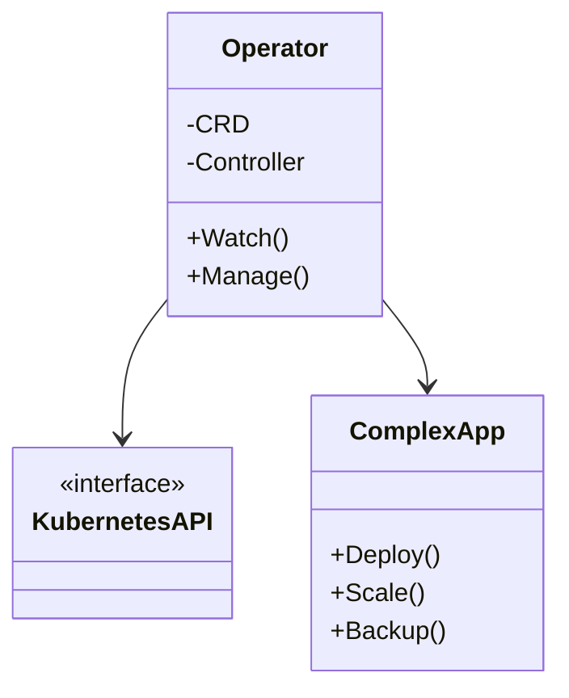

## Introduction

Kubernetes Operators have emerged as a fundamental pattern in Kubernetes for managing complex stateful applications that require deep insights into the operational domain they manage. The Operator Pattern extends the Kubernetes API to encapsulate domain-specific business logic and operational knowledge in managing these applications.

## Detailed Explanation

The **Operator Pattern** in Kubernetes is an extension model that integrates with the Kubernetes control plane. An Operator acts as a controller custom resource, encapsulating all the domain-specific logic necessary for managing a complex application lifecycle. This is particularly useful for applications with intricate management requirements such as databases, message brokers, and big data processing systems.

### Key Components

1. **Custom Resource Definition (CRD):** CRDs allow you to define custom objects and their schemas. Operators leverage these objects to manage stateful applications' configurations, current state, and desired state.

2. **Custom Controller:** The logic that manages the lifecycle of a CRD-defined application. The controller watches for changes to Kubernetes resources and takes necessary actions to reconcile the current state with the desired state.

3. **Domain-Specific Knowledge:** Operators encapsulate operational expertise specific to the application domain, making automated decisions when operating the application under various conditions.

### Architectural Approaches

1. **Kubernetes-Native Management:** By embedding the operator inside the Kubernetes ecosystem, the management operations become inherently resilient, scalable, and consistent with other Kubernetes workloads.

2. **Continuous Reconciliation Loop:** Consistently ensures the application's actual state matches the desired state as defined by the CRD.

3. **Autonomous Runtime Management:** Handles failover, backups, upgrades, and scaling operations without human intervention, based on domain-specific logic.

### Best Practices

- Start with a well-defined CRD that captures all key aspects of the application's configuration and lifecycle.
- Implement robust logging and monitoring within your operators to foresee and address issues.
- Ensure your operator is stateless, with Kubernetes CRD and stateful components maintaining state.
- Regularly update the operator to incorporate new Kubernetes features or changes in the application domain.

### Example Code

Below is a simplified example of deploying a basic Operator:

```yaml
apiVersion: apiextensions.k8s.io/v1
kind: CustomResourceDefinition
metadata:
  name: databases.example.com
spec:
  group: example.com
  names:
    kind: Database
    listKind: DatabaseList
    plural: databases
    singular: database
  scope: Namespaced
  versions:
    - name: v1
      served: true
      storage: true
---
```

Implement a controller in a language like Go or Python to perform operations based on changes to this resource.

### Diagrams

Below is UML diagram illustrating the relationship between the components:



## Related Patterns

- **Sidecar Pattern:** Placing an additional container next to the main application to augment or extend capabilities such as logging or monitoring.
- **Ambassador Pattern:** A similar approach that integrates an application into a third-party API or system.
- **Adapter Pattern:** Used to allow incompatible interfaces to work together, often part of the initial steps of operator development when integrating existing systems.

## Additional Resources

- [Kubernetes Operator Best Practices](https://kubernetes.io/docs/concepts/extend-kubernetes/operator/)
- [CoreOS Operator Framework](https://github.com/operator-framework)
- [Writing Your First Kubernetes Operator](https://operatorhub.io/)

## Summary

The Operator Pattern is integral for effectively managing complex stateful applications on Kubernetes. It embodies domain knowledge via CRDs and coupled controllers to automate application lifecycles, making applications more resilient and easier to manage. By adopting the Operator Pattern, organizations can reduce operational overhead and improve system reliability.
