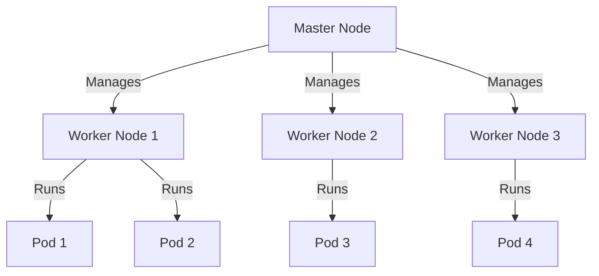

---

linkTitle: "Kubernetes Cluster Management"
title: "Kubernetes Cluster Management: Efficient Container Orchestration"
category: "Containerization and Orchestration in Cloud"
series: "Cloud Computing: Essential Patterns & Practices"
description: "Explore Kubernetes Cluster Management, a design pattern for efficiently orchestrating containers in the cloud, ensuring scalability, resiliency, and optimized resource utilization."
categories:
- containerization
- cloud orchestration
- cloud computing
tags:
- Kubernetes
- cluster management
- containers
- orchestration
- cloud infrastructure
date: 2024-07-07
type: docs

canonical: "https://softwarepatternslexicon.com/18/8/3"
license: "© 2024 Tokenizer Inc. CC BY-NC-SA 4.0"
---


## Introduction

Kubernetes Cluster Management is a pivotal design pattern in the realm of container orchestration in cloud computing. As enterprises shift toward microservices architectures and containerized applications, effectively managing clusters in a distributed environment becomes crucial. Kubernetes, an open-source container orchestration platform, provides the necessary tools to manage workloads and services declaratively, ensuring both scalability and resiliency.

## Design Pattern Explanation

Kubernetes Cluster Management revolves around deploying, scaling, and managing containerized applications across a group of nodes. Kubernetes abstracts the underlying infrastructure, enabling seamless management and orchestration via an API-driven approach. Key components of this pattern include:

- **Nodes**: Basic building blocks that run containerized applications. They could be virtual or physical machines.
- **Clusters**: Collections of nodes that form a single, logical unit for managing workloads.
- **Master Node**: The controlling unit that houses the API server, scheduler, and controller manager to oversee the entire cluster.
- **Worker Nodes**: Execute application workloads; they are managed by the master node.
  
## Architectural Approaches

### Key Features

1. **Declarative Configuration**: Define desired states via YAML files for objects like Deployments, Pods, Services, etc.
2. **Self-Healing**: Automatically restarts failed containers, replaces and reschedules containers when nodes die.
3. **Load Balancing and Service Discovery**: Automatic distribution of network traffic across pods, ensuring efficient service delivery.
4. **Storage Orchestration**: Automatic mount of storage systems, such as local storage, public cloud providers, and more.
5. **Automated Rollouts and Rollbacks**: Monitor application health and automatically manage rollouts and rollbacks.
6. **Batch Execution**: Efficient resource management for batch and CI/CD jobs.

### Best Practices

- **Resource Requests and Limits**: Set appropriate resource quotas for CPU and memory to prevent resource starvation.
- **Namespaces**: Use namespaces to manage and isolate resources logically within clusters.
- **Network Policies**: Implement policies to secure communication between pods.
- **Persistent Storage**: Manage data storage with Persistent Volumes and Persistent Volume Claims.

## Example Code

```yaml
apiVersion: apps/v1
kind: Deployment
metadata:
  name: nginx-deployment
spec:
  replicas: 3
  selector:
    matchLabels:
      app: nginx
  template:
    metadata:
      labels:
        app: nginx
    spec:
      containers:
      - name: nginx
        image: nginx:1.14.2
        ports:
        - containerPort: 80
```

This YAML file defines a Kubernetes Deployment that creates three replicas of an Nginx container, ensuring high availability and load balancing.

## Diagrams

Below is diagram illustrating the high-level architecture of a Kubernetes cluster:



## Related Patterns

- **Service Mesh**: Enhancing Kubernetes with networking functionality for microservices.
- **Blue-Green Deployment**: A deployment strategy to minimize downtime and risk by running two production environments.
- **Sidecar Pattern**: Extending functionality of a containerized application in Kubernetes clusters.

## Additional Resources

- [Official Kubernetes Documentation](https://kubernetes.io/docs/)
- [Kubernetes Patterns Book](https://www.oreilly.com/library/view/kubernetes-patterns/9781492050285/)
- [Kubernetes - The Hard Way](https://github.com/kelseyhightower/kubernetes-the-hard-way)

## Summary

Kubernetes Cluster Management presents a robust solution for orchestrating containerized applications at scale in the cloud. By leveraging Kubernetes' capabilities, organizations can achieve high availability, scalability, and operational efficiency. Adhering to best practices and understanding architectural principles can further maximize the returns on cloud investments and propel application modernization efforts.

---
