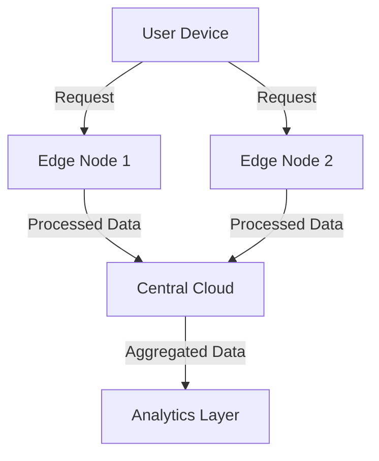

## Overview

The **Edge Deployment of Containers** design pattern describes an architecture where containerized applications are deployed across distributed network nodes, closer to the end-users. This pattern is crucial for applications requiring low-latency responses, such as IoT, AR/VR, real-time analytics, and more. By moving computation closer to the "edge" of the network, this pattern reduces latency and bandwidth usage while improving reliability and performance.

## Design Rationale

Traditionally, cloud services have been hosted in centralized data centers. However, with the increased need for real-time processing and decreased latency, edge computing has become vital. Edge Deployment of Containers:
- Utilizes edge nodes to process data locally, decreasing the round-trip time to a central server.
- Reduces bandwidth costs by processing data at the edge and sending only necessary information to the cloud.
- Enhances fault tolerance, as edge nodes can continue to function independently in case of connectivity issues with the central cloud.

## Architectural Approach

### Key Components

- **Edge Nodes**: Physical or virtual servers located closer to data sources or users, capable of running containers.
- **Centralized Management System**: Orchestrates and manages the deployment of containers on edge nodes. Examples include Kubernetes, AWS Greengrass, or Azure IoT Edge.
- **Service Discovery and Load Balancing**: Ensures that requests are routed to the closest or most appropriate edge node, often using technologies like Envoy or Istio.

### Process Flow

1. **Containerization**: Application services are containerized using tools like Docker, which provides portability across different edge nodes.
2. **Deployment**: Using an orchestrator, containers are deployed to selected edge nodes based on latency, resource availability, and load conditions.
3. **Scaling**: Dynamic scaling of services across the edge nodes based on demand, monitored by metrics like CPU usage, memory, and request throughput.
4. **Monitoring and Management**: Continuous monitoring of application performance and infrastructure health. Implement telemetry and logging to maintain visibility.

### Example Code

```yaml
apiVersion: apps/v1
kind: Deployment
metadata:
  name: edge-service
spec:
  replicas: 3
  selector:
    matchLabels:
      app: edge-service
  template:
    metadata:
      labels:
        app: edge-service
    spec:
      containers:
      - name: edge-container
        image: myorg/edge-service:latest
        resources:
          requests:
            memory: "64Mi"
            cpu: "250m"
          limits:
            memory: "128Mi"
            cpu: "500m"
```

## Diagrams

### Deployment Architecture Diagram



## Related Patterns

- **Service Mesh**: Often paired with edge deployment to provide advanced functionalities like traffic management, load balancing, and security.
- **Multi-Region Deployment**: Utilizes the concept of decentralization to spread applications across different geographical regions for enhanced availability.
- **IoT Architecture**: Edge deployment is extensively used in IoT to process data locally.

## Best Practices

- **Use of Lightweight Containers**: Ensure containers are optimized in size and use minimal resources to fit within the limited capacity of edge nodes.
- **Effective Security Measures**: Implement strict security protocols to safeguard data processed and stored at the edge.
- **Network Optimization**: Tailor network configurations to provide low latency and high reliability while ensuring successful communication with central systems.

## Additional Resources

- [Kubernetes for Edge Computing](https://kubernetes.io/docs/concepts/edge-computing/)
- [AWS Greengrass Documentation](https://docs.aws.amazon.com/greengrass/latest/developerguide/what-is-gg.html)
- [Azure IoT Edge Documentation](https://docs.microsoft.com/en-us/azure/iot-edge/)

## Summary

The **Edge Deployment of Containers** design pattern is pivotal for building decentralized applications catering to latency-sensitive environments. By strategically deploying services across edge nodes, it provides a robust framework that enhances performance, offers cost-effective bandwidth solutions, and heightens the overall user experience. This approach benefits not only the burgeoning field of IoT but any modern cloud-native application that demands proximity to its user base.
