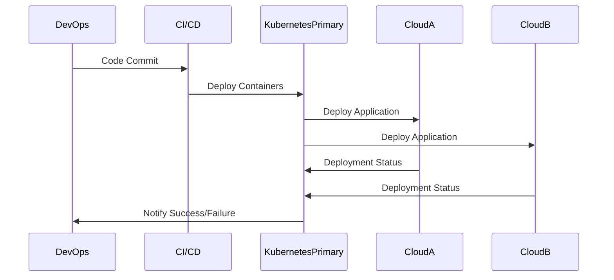

Multi-Cloud Container Orchestration is a design pattern aimed at efficiently managing and orchestrating containerized applications across diverse cloud environments. This pattern maximizes flexibility, availability, and redundancy by leveraging the capabilities of multiple cloud providers, facilitating seamless deployment, scaling, and management of applications.

## Detailed Explanation

In a multi-cloud strategy, organizations utilize services from different cloud providers to avoid vendor lock-in, improve disaster recovery, and capitalize on geographical distribution. The orchestration of containers on multiple clouds aligns with these goals by abstracting infrastructure management and simplifying application deployment across various environments.

### Key Components

- **Container Orchestration Tools**: Kubernetes is the primary tool for automating deployment, scaling, and operations of application containers across clusters. Its open-source and portable nature makes it ideal for multi-cloud environments.
- **Cloud-Native Services**: Using complementary services like GKE (Google Kubernetes Engine), EKS (Amazon Elastic Kubernetes Service), or AKS (Azure Kubernetes Service) helps in seamlessly integrating with the native management tools of respective cloud providers.
- **Networking and Service Meshes**: Tools like Istio or Linkerd help in managing service-to-service communications at scale across hybrid or multi-cloud environments, providing vital insight, observability, and security.
- **CI/CD Pipelines**: Continuous integration and delivery pipelines ensure that all application updates are efficiently propagated across different cloud environments.
- **Monitoring and Logging**: Multi-cloud monitoring tools like Prometheus, Grafana, or Weave Scope ensure comprehensive visibility and control over application performance across clouds.

## Architectural Approach

In multi-cloud container orchestration, the architecture typically includes:

- **Unified Control Plane**: A centralized orchestration layer that manages deployments, scaling, and network policies across cloud environments.
- **Distributed Worker Nodes**: Container workloads are distributed across nodes hosted in various clouds, providing redundancy and resiliency.
- **Centralized Monitoring and Alerts**: Essential for tracking the health and performance of applications spread across multiple environments.

### Sequence Diagram

Here's a simplified sequence diagram using Mermaid syntax to illustrate a deployment flow in multi-cloud orchestration:



## Best Practices

- **Standardize Configurations**: Maintain consistent configurations across environments to simplify management and improve portability.
- **Leverage Infrastructure as Code**: Use IaC tools like Terraform for reproducible infrastructure provisioning across multiple clouds.
- **Implement Robust Security Controls**: Define security protocols to protect data across varying environments, ensuring compliance with organizational and regulatory standards.
- **Consider Cost Management Tools**: Helps in optimizing and managing costs across different cloud services.

### Code Example

Using Kubernetes' cross-cloud capabilities, here's a simple YAML config to start a multi-cloud deployment:

```yaml
apiVersion: apps/v1
kind: Deployment
metadata:
  name: multi-cloud-app
spec:
  replicas: 3
  selector:
    matchLabels:
      app: multi-cloud-app
  template:
    metadata:
      labels:
        app: multi-cloud-app
    spec:
      containers:
      - name: app
        image: your-app-image:latest
        ports:
        - containerPort: 80
```

## Related Patterns and Concepts

- **Hybrid Cloud**: Combines on-premise and cloud environments.
- **Service Mesh**: For inter-service communication management in cloud-native applications.
- **Infrastructure as Code (IaC)**: Manages IT infrastructure through machine-readable scripts.

## Additional Resources

- [Kubernetes Multi-Cloud Tutorial](https://kubernetes.io/docs/tutorials/)
- [AWS EKS Documentation](https://aws.amazon.com/eks/)
- [Azure AKS Guide](https://docs.microsoft.com/en-us/azure/aks/)
- [Google Cloud’s Anthos](https://cloud.google.com/anthos)

## Summary

Implementing a Multi-Cloud Container Orchestration design pattern provides organizations with improved application flexibility, scalability, and resilience. By leveraging the best from multiple cloud providers and sophisticated orchestration tools, enterprises can optimize their cloud strategy, mitigate risks, and drive innovation while maintaining the necessary controls across diverse environments.
