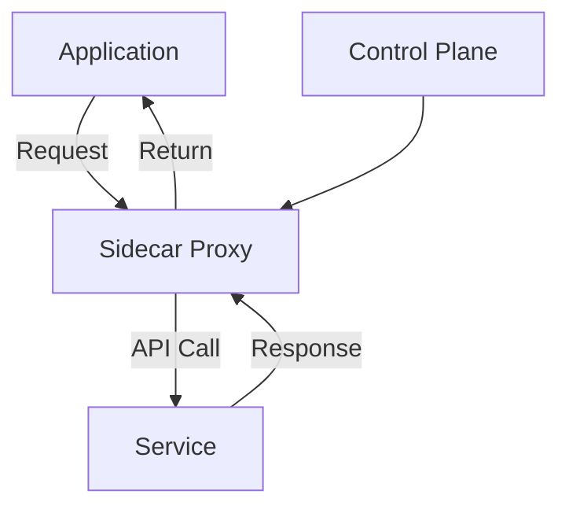

## Introduction

Service Mesh Integration is a pattern used to manage and facilitate communication between microservices in a cloud environment. It provides features such as service discovery, load balancing, failure recovery, metrics, and monitoring, all of which are essential in maintaining the robustness and observability of distributed systems.

### Key Concepts

- **Sidecar Proxy**: A small agent that runs alongside each service instance, intercepting network communication.
- **Control Plane**: Manages configuration and policy distribution for proxies.
- **Data Plane**: Comprises the sidecar proxies that handle the actual data transfer.
- **Traffic Management**: Intelligent routing and control over service requests.
- **Security**: End-to-end encryption, policy management, and automated TLS certificate generation.
- **Observability**: Collection of metrics, tracing data, and logs for monitoring and troubleshooting.

## Architectural Approach

In a typical service mesh architecture, you have multiple microservices running in containers orchestrated by platforms like Kubernetes. Each service instance is associated with a sidecar proxy that handles all inbound and outbound traffic, adding a layer of abstraction and control over communication.



In this diagram:
- The **Application** sends requests to the **Service** through the **Sidecar Proxy**.
- The **Control Plane** configures the proxy settings.

## Example Code

Here's a simple Istio configuration for traffic management:

```yaml
apiVersion: networking.istio.io/v1alpha3
kind: VirtualService
metadata:
  name: my-service
spec:
  hosts:
  - my-service
  http:
  - route:
    - destination:
        host: my-service
        subset: v1
      weight: 80
    - destination:
        host: my-service
        subset: v2
      weight: 20
```

## Best Practices

1. **Gradual Integration**: Start by deploying a mesh on non-critical services before fully integrating.
2. **Automate Everything**: Use CI/CD tools to automate configuration deployment.
3. **Monitor and Alert**: Implement robust monitoring using mesh-provided telemetry.
4. **Custom Policies**: Adjust security policies to fit your specific needs, instead of relying on defaults.
5. **Version Control**: Keep strict version control of service configurations.

## Related Patterns

- **Microservices Architecture**: The foundation for deploying service meshes, focusing on independent, loosely-coupled services.
- **Gateway Routing**: Uses gateways to manage ingress and egress traffic, complementing the service mesh.
- **Circuit Breaker**: A pattern for preventing failure cascades, often seen in conjunction with service mesh traffic management.

## Additional Resources

- [Istio Documentation](https://istio.io/)
- [Linkerd Website](https://linkerd.io/)
- [Consul Service Mesh](https://www.consul.io/)
- [Kubernetes Networking](https://kubernetes.io/docs/concepts/services-networking/)

## Summary

Service Mesh Integration is an essential pattern for managing microservices at scale, ensuring secured, reliable, and observable communication. By adopting a service mesh, cloud-native applications can handle complex networks of services with flexibility and resilience, making it indispensable for modern distributed architectures.
