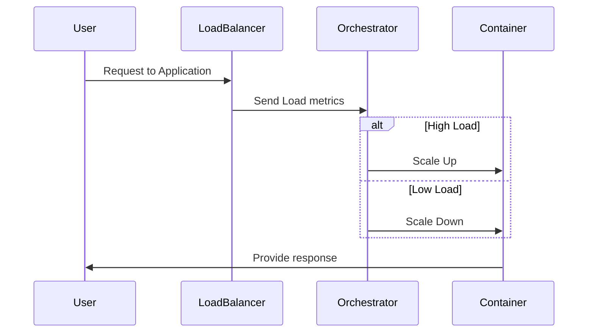

## Introduction

In cloud computing, **Container Scaling Policies** are integral operational strategies that manage the scaling of containerized applications to match resource needs dynamically. These policies ensure that applications maintain performance and availability by automatically adjusting resources in response to fluctuating demands.

Container orchestration platforms such as Kubernetes offer a range of scaling options, allowing businesses to efficiently handle varying workloads. Scaling policies focus on automating resource provisioning, thus reducing operational overhead and optimizing the consumption of cloud resources.

## Design Patterns and Architectural Approaches

### Horizontal Scaling

Horizontal scaling refers to the addition or removal of container instances across the available infrastructure to handle current workloads effectively.

- **Pros**: Offers a straightforward method to scale applications based on load.
- **Cons**: More instances mean more points of management, and this may increase complexity.

### Vertical Scaling

Vertical scaling involves adjusting the resources allocated to an existing container instance, such as CPU or memory.

- **Pros**: Reduces downtime by enhancing the capacity of current containers.
- **Cons**: Limited by the maximum resources that an instance can use, which may not be feasible for very large-scale applications.

### Auto-Scaling

Implementing auto-scaling rules allows the system to monitor load and autonomously adjust scaling policies in response to real-time demands.

- **Managed by metrics**: CPU, memory usage, and custom application metrics.
- **Event-triggered scaling**: Responds to specific thresholds such as increased request rates.

## Example Code: Kubernetes Auto-Scaling

```yaml
apiVersion: autoscaling/v2beta2
kind: HorizontalPodAutoscaler
metadata:
  name: my-app-autoscaler
spec:
  scaleTargetRef:
    apiVersion: apps/v1
    kind: Deployment
    name: my-app
  minReplicas: 1
  maxReplicas: 10
  metrics:
  - type: Resource
    resource:
      name: cpu
      target:
        type: Utilization
        averageUtilization: 50
```

In this example, Kubernetes is configured to automatically scale the number of pods for `my-app` deployment from 1 to 10 based on the CPU utilization, maintaining an average utilization of 50%.

## Diagrams

### Container Scaling Workflow Diagram



## Best Practices

1. **Metrics-Driven Decisions**: Choose and monitor metrics that reflect the actual load and performance requirements of your application.
   
2. **Test Scaling Configurations**: Thoroughly test scaling rules in staging environments to prevent unexpected behaviors in production.
   
3. **Integration with CI/CD Pipelines**: Ensure integration with CI/CD pipelines to automate deployments and scaling adjustments as code changes.

4. **Cost Management**: Utilize cost monitoring tools to ensure scaling strategies do not lead to unnecessary expenses.

## Related Patterns

- **Microservices Architecture**: Container scaling works cohesively within microservices architecture by allowing each service to scale independently.
- **Circuit Breaker**: Helps manage failures by providing alternate solutions or gracefully degrading tasks when scaling lags behind demand.

## Additional Resources

- [Kubernetes Autoscaling Documentation](https://kubernetes.io/docs/tasks/run-application/horizontal-pod-autoscale/)
- [AWS Auto Scaling with Elastic Kubernetes Service (EKS)](https://aws.amazon.com/eks/autoscaling/)
- [Google Kubernetes Engine (GKE) Autopilot](https://cloud.google.com/kubernetes-engine/docs/concepts/autopilot-overview)

## Summary

Container Scaling Policies are a crucial aspect of cloud-based application deployments that leverage containers. They ensure that resources are dynamically allocated and optimized according to application demands, leading to improved performance and cost management. By understanding and implementing effective scaling strategies, organizations can achieve increased flexibility and resilience in their cloud environments.
