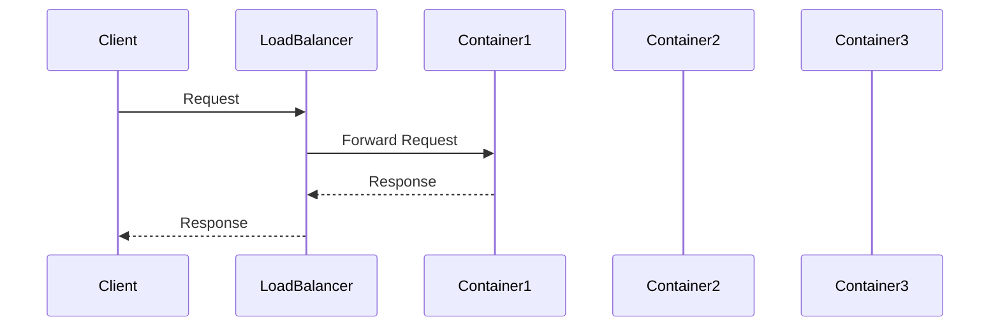

## Introduction

In modern cloud architectures, containerization has become a pivotal strategy in deploying scalable and reliable applications. An essential aspect of managing these applications is efficiently distributing incoming client traffic across multiple container instances. Load Balancing is a pattern that addresses this need, ensuring that no single instance is overwhelmed while maintaining high availability and performance.

## Design Pattern Overview

### Problem Statement

Containerized applications often run in distributed environments where each application consists of multiple container instances. Incoming requests need to be distributed in such a manner that all instances are utilized effectively, avoiding both underutilization and overload. This distribution is critical for ensuring reliability, fault tolerance, and seamless user experiences.

### Solution

The Load Balancing for Containers pattern introduces a mechanism that directs client traffic to the most appropriate container instance. This is achieved through a load balancer, which monitors instance health and assigns requests based on predefined criteria such as round-robin or least-connections.

### Architectural Features

- **Scalability**: Automates traffic distribution allowing applications to scale horizontally by adding or removing container instances as demand fluctuates.
- **High Availability**: By rerouting traffic from failed instances to healthy ones, the system maintains its availability.
- **Resource Optimization**: Balances load efficiently to optimize resource usage, minimizing operational costs.

## Implementation Approaches

### 1. Layer 4 (Transport Layer) Load Balancing

This type operates on data from network and transport layers, making switching decisions based on IP and TCP/UDP headers.

- **Pros**: Generally faster because there's no need to look deeply into packets.
- **Cons**: Provides limited insights and control over traffic distribution based on application-specific parameters.

### 2. Layer 7 (Application Layer) Load Balancing

Works on the application layer, enabling decisions based on more complex data such as HTTP headers and cookies.

- **Pros**: Offers advanced routing capabilities to manage and direct traffic intelligently using application-level information.
- **Cons**: Has higher processing overhead compared to L4 load balancing.

### Example Technologies
- **Nginx**, **HAProxy** for open-source solutions.
- **AWS Elastic Load Balancer (ELB)**, **Google Cloud Load Balancer**, **Azure Load Balancer** for managed cloud services.

## Best Practices

- **Health Checks**: Implement reliable health checks to ensure that traffic is not routed to unhealthy instances.
- **SSL Termination**: Offload SSL termination to the load balancer to relieve backend resources, enhancing performance.
- **Session Persistence**: Use session stickiness or persistence to direct requests from the same client session to the same instance when necessary, preventing user session issues.
- **Autoscaling Integration**: Couple load balancers with autoscaling groups to dynamically adjust capacity based on current load characteristics.

## Example Code

Here is an example of configuring a basic round-robin load balancer using Nginx for containerized services:

```nginx
http {
    upstream backend {
        server backend1.example.com;
        server backend2.example.com;
        server backend3.example.com;
    }

    server {
        listen 80;
        location / {
            proxy_pass http://backend;
        }
    }
}
```

## Diagrams

Below is a simple sequence diagram representing the flow of client requests to container instances via a load balancer.



## Related Patterns

- **Service Mesh**: Offers more sophisticated traffic management and security at the application layer.
- **Circuit Breaker Pattern**: Complements load balancers by improving the resilience of client communication with backend instances.

## Additional Resources

- [Kubernetes Load Balancing Documentation](https://kubernetes.io/docs/concepts/services-networking/service/)
- [HAProxy Configuration Guide](http://www.haproxy.org/download/2.4/doc/configuration.txt)

## Summary

The Load Balancing for Containers pattern is crucial for ensuring that containerized applications in the cloud are both efficient and resilient. By evenly distributing traffic, it optimizes resource utilization, maintains high availability, and supports scalability, dealing effectively with the dynamic nature of modern cloud applications. Employing both L4 and L7 load balancing techniques can cater to varied application requirements, providing both speed and intelligence in handling traffic.
