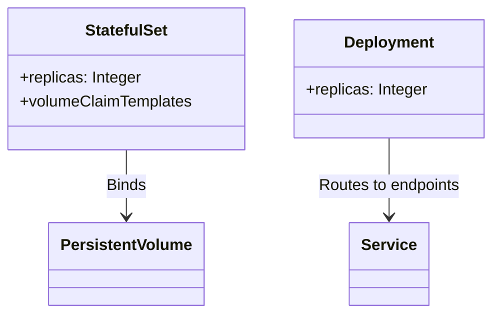

In modern cloud computing, effectively managing and orchestrating containers is critical in sustaining application performance and reliability. A significant consideration in this process is the handling of **stateful** and **stateless** containers, each having distinct characteristics and operational requirements.

## Detailed Explanation

### Stateful Containers

Stateful containers maintain persistent data and state across sessions and restarts. They are often used for applications where data persistence and continuity are critical, such as databases, and those applications that require session consistency.

#### Characteristics
- **Data Persistence**: Bind mount volumes or storage solutions like StatefulSets in Kubernetes are often used to maintain data integrity.
- **Consistent Identity**: Stateful containers often need to maintain a unique identifier for state persistence.
- **Order of Operations**: These often require a specific order when scaling or upgrading to avoid data loss or inconsistency.

#### Best Practices
1. Use **StatefulSets** in Kubernetes to manage stateful workloads with unique network identifiers and stable storage.
2. Regularly back up data and test recovery procedures to handle failures or data corruption.
3. Apply **Database Clustering** and **Replication Strategies** to ensure data availability and redundancy.

### Stateless Containers

Stateless containers do not retain any data between sessions or service restarts. They are used for applications like microservices, which rely on external managed services for data persistence.

#### Characteristics
- **Ephemeral Nature**: Stateless containers can be killed and replaced without data loss concerns.
- **Elastic Scaling**: Easily scale up or down based on demand as they do not manage stored data internally.
- **Interchangeability**: Any instance can handle any request, making load balancing simpler.

#### Best Practices
1. Employ **Horizontal Pod Autoscaling** to adjust the number of running containers based on observed load.
2. Design applications to read/write state information from an external source like a database or a caching service.
3. Implement robust monitoring and logging solutions to trace errors and performance issues across stateless instances.

## Example Code

Below is an example Kubernetes configuration for a StatefulSet and a Deployment that orchestrates stateful and stateless containers, respectively.

### Stateful Example (Kubernetes StatefulSet)

```yaml
apiVersion: apps/v1
kind: StatefulSet
metadata:
  name: postgres
spec:
  serviceName: "postgres"
  replicas: 3
  selector:
    matchLabels:
      app: postgres
  template:
    metadata:
      labels:
        app: postgres
    spec:
      containers:
      - name: postgres
        image: postgres:latest
        ports:
        - containerPort: 5432
        volumeMounts:
        - name: pg-data
          mountPath: /var/lib/postgresql/data
  volumeClaimTemplates:
  - metadata:
      name: pg-data
    spec:
      accessModes: ["ReadWriteOnce"]
      resources:
        requests:
          storage: 1Gi
```

### Stateless Example (Kubernetes Deployment)

```yaml
apiVersion: apps/v1
kind: Deployment
metadata:
  name: nginx
spec:
  replicas: 5
  selector:
    matchLabels:
      app: nginx
  template:
    metadata:
      labels:
        app: nginx
    spec:
      containers:
      - name: nginx
        image: nginx:latest
        ports:
        - containerPort: 80
```

## Diagrams

Here is a high-level diagram showing the setup of stateful and stateless containers in a cloud-native architecture:



## Related Patterns

- **Sidecar Pattern**: Enhancing functionality by deploying a secondary container in the same pod.
- **Gateway Aggregation Pattern**: Using gateways to manage front-end and back-end traffic handling.
- **CQRS (Command Query Responsibility Segregation)**: Differentiating between read and write operations for efficiency in cloud environments.

## Additional Resources

- [Kubernetes Documentation on StatefulSets](https://kubernetes.io/docs/concepts/workloads/controllers/statefulset/)
- [Official Docker Documentation](https://docs.docker.com/)
- [The Twelve-Factor App Methodology for Cloud Native Architectures](https://12factor.net/)

## Summary

Understanding the differences between stateful and stateless containers and their best practices is essential for efficient cloud application management. Stateful containers allow for data persistence and unique identifiers, while stateless containers enable easy scaling and service interchangeability. By applying the right orchestration strategies and infrastructure, you can ensure robust, scalable, and reliable application performance in cloud environments.
