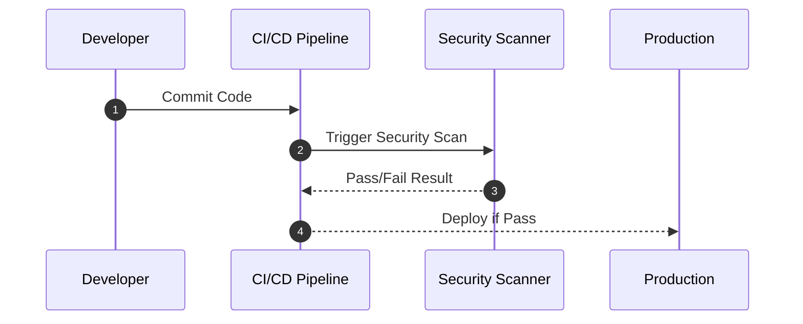

## Introduction

Containers have revolutionized how applications are developed, deployed, and run, providing a lightweight, portable, and efficient means to manage applications. However, with these advantages come new security challenges. Container security practices are critical to ensuring that containerized environments are not exploited by vulnerabilities inherent in their architecture.

## Detailed Explanations of Design Patterns

### 1. **Image Scanning**

Ensure that container images are scanned for vulnerabilities before deployment. This involves:

- **Static Analysis:** Automated tools, such as Clair or Anchore, can be used to scan images for known vulnerabilities.
- **Signing and Verification:** Use digital signatures to verify the integrity and authenticity of container images.

### 2. **Minimal Base Images**

Utilize minimal base images to reduce the potential attack surface. Smaller images have fewer packages and libraries, reducing the risk of vulnerabilities.

### 3. **Least Privilege Principle**

Containers should be run with the least privileges necessary:

- **Rootless Containers:** Encourage running containers without root privileges.
- **Capabilities Dropping:** Remove unnecessary capabilities using Docker's `--cap-drop` flag.

### 4. **Network Segmentation**

Isolate containers through network segmentation to control traffic flow between microservices:

- **Namespace Isolation:** Use Kubernetes Network Policies to define rules for network traffic.
- **Service Meshes:** Employ solutions like Istio to manage and secure microservices' communications.

### 5. **Runtime Threat Detection**

Implement security measures to monitor for threats during runtime:

- **Behavioral Analysis:** Tools like Falco can monitor and detect unusual container activity.
- **Audit Logging:** Logging and monitoring solutions should be employed for intrusion detection and forensic analysis.

## Architectural Approaches

### Securing the CI/CD Pipeline

- **CI/CD Integration:** Incorporate security checks within your CI/CD pipeline to automate image scanning, vulnerability assessment, and compliance checks.
- **Secrets Management:** Manage sensitive information using trusted services such as AWS Secrets Manager, or Kubernetes Secrets.

### Immutable Infrastructure

Use immutable infrastructure principles whereby deployments are replaced rather than updated. This approach reduces configuration drift and patch vulnerability risks.

## Paradigms and Best Practices

- **DevSecOps Mindset:** Shift security left in the development process, integrating security into every stage of the application lifecycle.
- **Regular Patching:** Regularly update both the host operating system and container images to incorporate security patches.
- **Supply Chain Security:** Monitor and secure container supply chains by scanning third-party components for vulnerabilities.

## Example Code

Minimal Dockerfile for a Golang application:

```dockerfile
FROM golang:1.20-alpine

USER nobody

COPY --chown=nobody:nogroup ./app /usr/local/bin/app

ENTRYPOINT ["/usr/local/bin/app"]
```

## Diagrams

### UML Sequence Diagram



## Related Patterns with Descriptions

- **Service Discovery:** Essential for managing dynamic environments typical of microservice architectures.
- **API Gateway Pattern:** Provides an entry point for APIs, handling request authentication, logging, and rate limiting.
- **Sidecar Pattern:** Deploys supplemental functionality to support the parent container, useful in managing service mesh functions.

## Additional Resources

- [Docker Security Best Practices](https://docs.docker.com/engine/security/best-practices/)
- [OWASP Kubernetes Security Best Practices](https://owasp.org/www-project-kubernetes-top-ten/)
- [CNCF Cloud Native Security Whitepapers](https://www.cncf.io)

## Final Summary

Container security is a multi-faceted practice that requires implementing robust security measures from development to production. Leveraging the principles of least privilege, regular scanning, minimalism, and network isolation can significantly reduce vulnerability exposure in containerized environments. Adopting a comprehensive DevSecOps strategy ensures that security is embedded throughout the lifecycle of container applications, paving the way for secure and efficient cloud-native deployments.
