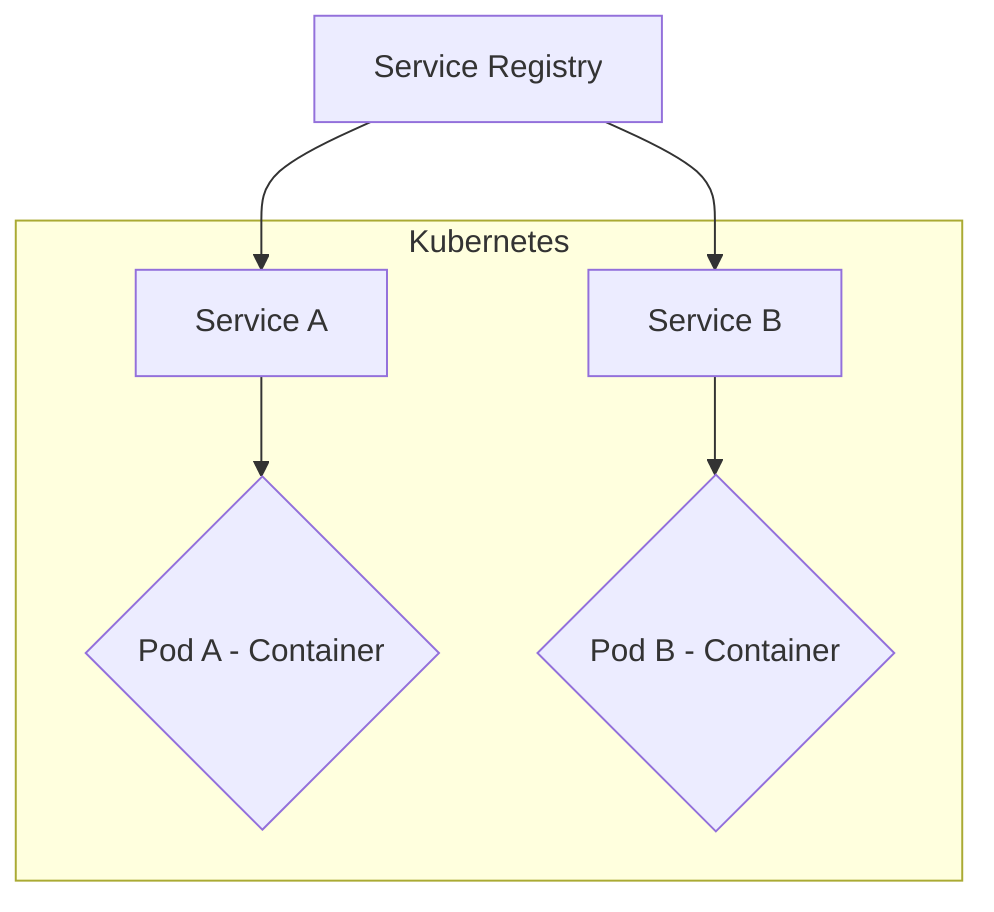
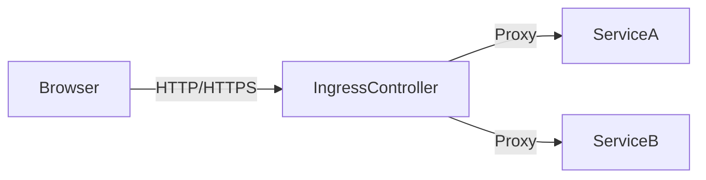

## Introduction

In the rapidly evolving landscape of cloud computing, container orchestration platforms such as Kubernetes, Docker Swarm, and Apache Mesos have become the cornerstone for deploying, managing, and scaling containerized applications. Effective networking plays a critical role in these systems, ensuring that containers can communicate seamlessly, scale efficiently, and operate securely across dynamic cloud environments.

This article delves into the essential networking patterns used in container orchestration, their architectural approaches, and best practices to achieve optimal performance and security.

## Key Networking Patterns

### 1. **Service Discovery**

**Description**: Service discovery automates the detection of services to facilitate seamless container communication across distributed systems. It is essential for enabling containers to find and communicate with each other without manual intervention or hard-coding addresses.

**Implementation**: Tools like `etcd`, Consul, or built-in Kubernetes service discovery using DNS. They track the available services and their endpoints, ensuring resilience to scaling and changes in infrastructure.

**Example Code**:
```yaml
apiVersion: v1
kind: Service
metadata:
  name: example-service
spec:
  selector:
    app: example-application
  ports:
    - protocol: TCP
      port: 80
      targetPort: 8080
```

**Diagram**:



### 2. **Ingress Routing**

**Description**: Ingress allows external HTTP and HTTPS traffic to reach services running within the cluster. It simplifies routing rules and provides mechanisms for SSL termination, load balancing, and accessing multiple services using a single IP.

**Implementation**: Kubernetes Ingress resources and controllers such as Nginx or Traefik.

**Example Code**:
```yaml
apiVersion: networking.k8s.io/v1
kind: Ingress
metadata:
  name: example-ingress
spec:
  rules:
  - host: example.com
    http:
      paths:
      - path: /
        pathType: Prefix
        backend:
          service:
            name: example-service
            port:
              number: 80
```

**Diagram**:



### 3. **Network Policies**

**Description**: Implements security controls by managing how pods communicate within the cluster. It restricts traffic in and out of pods, elevating security in a multi-container and multi-tenant environment.

**Implementation**: Kubernetes Network Policies, often in conjunction with network plugins like Calico or Cilium.

**Example Code**:
```yaml
apiVersion: networking.k8s.io/v1
kind: NetworkPolicy
metadata:
  name: allow-specific
spec:
  podSelector:
    matchLabels:
      role: db
  policyTypes:
  - Ingress
  - Egress
  ingress:
  - from:
    - podSelector:
        matchLabels:
          access: frontend
```

## Architectural Approaches

1. **Microservice Architecture**: Emphasizes developing applications as a suite of small services, each running its process and communicating via lightweight mechanisms.

2. **Service Mesh**: Provides a dedicated infrastructure layer for handling service-to-service communication. Examples include Istio and Linkerd, which manage service discovery, load balancing, failure recovery, and more.

3. **Virtual Private Cloud (VPC) Peering**: Ensures secure and isolated networking environments when connecting workloads across different cloud environments or accounts.

## Best Practices

- **Use Labels and Selectors Smartly**: Facilitate easy service discovery and segregation of network traffic using labels and selectors smartly.
- **Implement Encryption**: Ensure all internal and external communication is encrypted using TLS to protect against data breaches.
- **Regular Network Policy Audits**: Continuously audit network policies to enforce least privilege access controls and prevent unauthorized communication.

## Related Patterns

- **Sidecar Pattern**: Used for service discovery and handling network traffic.
- **Ambassador Pattern**: Focuses on client-side proxies to manage communication transparently.
- **Adapter Pattern**: Facilitates communication between incompatible protocols by converting them at runtime.

## Additional Resources

- [Kubernetes Networking Overview](https://kubernetes.io/docs/concepts/cluster-administration/networking/)
- [Docker Networking Best Practices](https://docs.docker.com/network/)
- [Service Mesh Interface Specification](https://smi-spec.io/)

## Summary

Networking in container orchestration is integral to achieving robust, scalable, and secure cloud solutions. Service discovery automates connectivity, ingress routing manages incoming traffic, and network policies enforce security constraints. Understanding these patterns enables developers and architects to design systems that efficiently leverage cloud infrastructure, ultimately contributing to the resilience and maintainability of modern applications.
