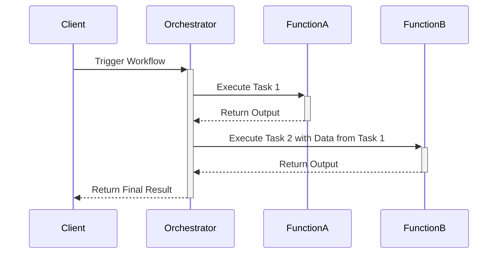

Function Orchestration is a cloud computing design pattern that facilitates the coordination and management of individual functions or microservices to execute complex workflows. Within a serverless architecture, this pattern is instrumental in ensuring that a series of computational tasks, which may be triggered by events, are executed in a precise and controlled manner.

## Detailed Explanation

Function Orchestration is crucial in scenarios where multiple functions need to collaborate to achieve a larger task. Unlike simple event-driven architectures where functions operate independently, orchestration involves managing the sequence and timing of operations, handling retries and errors, and ensuring data is correctly passed between functions.

### Key Components

1. **Orchestrator**: The central entity that manages the execution flow. It controls the state and logic of the workflow and invokes functions as needed.
2. **Tasks**: These are the individual functions or microservices. A task performs a discrete piece of logic and can be independently scalable.
3. **State Management**: Essential for tracking the current status of ongoing workflows and coordinating function execution.
4. **Event Handling**: As workflows may be triggered by events, robust event handling is necessary to process these triggers accurately.

### Architectural Approaches

- **State Machines**: Services like AWS Step Functions use state machines to manage function orchestration, where each state represents a particular task or decision point.
- **Workflow Engines**: Google Cloud Workflows and Azure Durable Functions offer workflow engines that define, monitor, and control orchestrated functions in a declarative manner.
- **Choreography vs. Orchestration**: Understand the difference between these two patterns. While orchestration involves a central controller, choreography is distributed and based on events without centralized control.

### Best Practices

- **Idempotency**: Design tasks to be idempotent, ensuring that repeated executions produce the same result to handle retries seamlessly.
- **Error Handling**: Implement robust error handling and compensation logic to manage failures and retries.
- **Scalability**: Each function should be independently scalable to accommodate varying loads.
- **Security**: Ensure data privacy and security between functions, especially when handling sensitive data.

### Example Code

```typescript
// Example TypeScript code orchestrating functions using AWS Step Functions
import * as stepFunctions from '@aws-cdk/aws-stepfunctions';
import * as lambda from '@aws-cdk/aws-lambda';
import { App, Stack } from '@aws-cdk/core';

const app = new App();
const stack = new Stack(app, 'FunctionOrchestrationStack');

// Define Lambda Functions
const task1 = new lambda.Function(stack, 'Task1Function', { /* ... */ });
const task2 = new lambda.Function(stack, 'Task2Function', { /* ... */ });

// Define Step Function Workflow
const task1State = new stepFunctions.Task(stack, 'Task1State', {
  task: new stepFunctions.InvokeFunction(task1),
});

const task2State = new stepFunctions.Task(stack, 'Task2State', {
  task: new stepFunctions.InvokeFunction(task2),
});

const definition = task1State.next(task2State);

new stepFunctions.StateMachine(stack, 'StateMachine', {
  definition,
});
```

### Diagrams

A sequence diagram of typical function orchestration might look like this:



### Related Patterns and Concepts

- **Event-Driven Architecture**: A pattern often combined with orchestration to handle event sourcing and handling.
- **Choreography**: An architectural approach where each service has control over its part of the workflow.
- **Saga Pattern**: Used in microservices for managing long-running transactions and providing consistency across distributed systems.

### Additional Resources

- [AWS Step Functions Documentation](https://docs.aws.amazon.com/step-functions/latest/dg/welcome.html)
- [Google Cloud Workflows Documentation](https://cloud.google.com/workflows/docs)
- [Azure Durable Functions Documentation](https://docs.microsoft.com/en-us/azure/azure-functions/durable/durable-functions-overview)

## Summary

Function Orchestration in serverless computing offers a powerful mechanism to manage complex workflows by coordinating multiple functions or microservices. By using state machines, workflow engines, and well-defined orchestration protocols, organizations can build scalable, reliable, and efficient cloud applications that handle complex tasks with ease.
