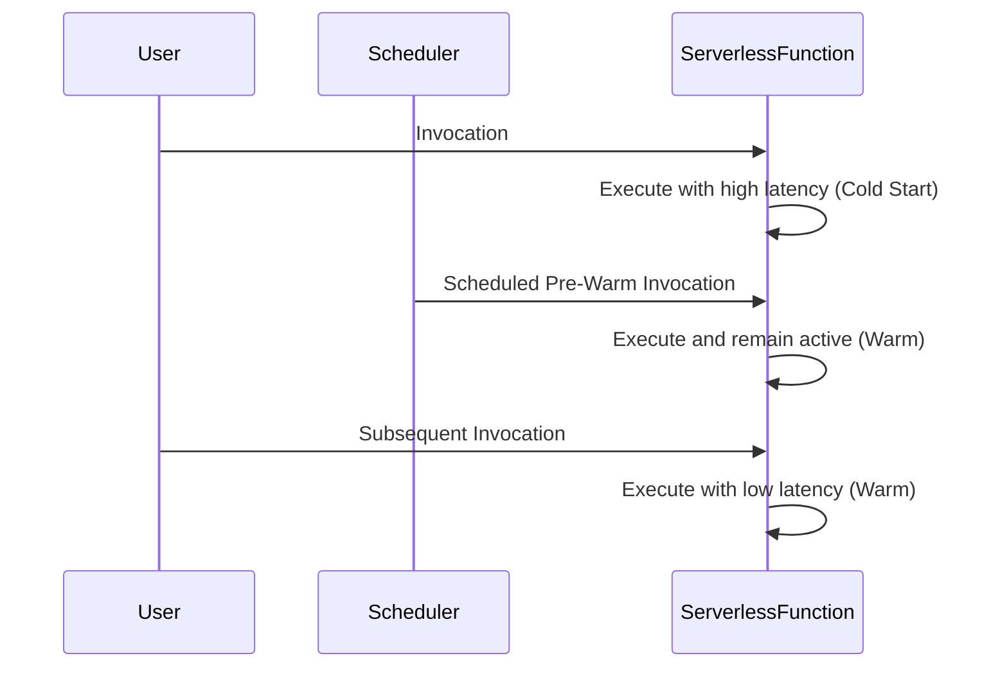

## Introduction

Cold starts are a well-known challenge in serverless computing, where the initial invocation of a function encounters higher latency due to the time taken for initialization. This latency occurs because the serverless platform must provision resources and initialize the execution environment. This delay can be detrimental for applications that require low-latency responses or consistent performance.

## Problem

In a serverless architecture, functions don't always remain active between invocations - they scale down to zero when not in use. When a function is invoked after being idle, it undergoes a cold start, which can result in significantly higher latency compared to subsequent "warm" executions.

Various factors contribute to cold start latency, including:
- Loading and starting the function runtime.
- Initializing libraries and dependencies.
- Establishing network connections and retrieving configuration data.

## Solution

The Cold Start Mitigation pattern addresses this problem by implementing strategies to minimize the latency experienced during function cold starts. Some common approaches include:

1. **Pre-Warming (Keep-Alive Techniques):** Regular invocation of functions to keep them "warm" and avoid cold start latency.
   - Schedule periodic invocations using cloud-native tools like AWS CloudWatch Events or Azure Timer Functions.

2. **Lazy Initialization:** Delay initialization of certain resources or connections until they are needed after the function starts.
  
3. **Resource Optimization:** Reduce the size of the deployment package to speed up loading and initialization.
   - Minimize dependency footprint and use specific libraries tailored for serverless environments.

4. **Provisioned Concurrency:** Specific to platforms like AWS Lambda, this involves provisioning a set number of instances to be always available and avoid cold starts.

## Example Code

Here's an example of lazy initialization in a hypothetical AWS Lambda function using Node.js:

```javascript
let databaseClient;

exports.handler = async (event) => {
    if (!databaseClient) {
        console.log('Initializing database connection...');
        databaseClient = await initializeDatabaseConnection();
    }

    const result = await databaseClient.query("SELECT * FROM users");
    return result;
};

async function initializeDatabaseConnection() {
    // Simulate database connection setup
    return new Promise((resolve) => setTimeout(resolve, 100, { query: async (query) => [{ name: "Alice" }, { name: "Bob" }] }));
}
```

## Diagrams

Below is a sequence diagram illustrating the process of avoiding cold starts by using pre-warming techniques:



## Related Patterns

- **Function-as-a-Service (FaaS):** The architectural pattern that underpins serverless, allowing functions to run without explicit server management.
- **Circuit Breaker Pattern:** Used to detect failures and encapsulate logic in order to prevent continual service failures from affecting the system.

## Additional Resources

- [AWS Lambda Performance Tuning: Cold Start Mitigation](https://aws.amazon.com/blogs/compute/)
- [Azure Functions Best Practices for Cold Start Mitigation](https://learn.microsoft.com/en-us/azure/azure-functions/)
- [Google Cloud Functions: Managing Cold Start Latency](https://cloud.google.com/functions/docs/bestpractices/tips)

## Summary

Cold Start Mitigation is a crucial pattern in serverless computing, aimed at reducing the latency impact of cold starts on application performance. By leveraging techniques like pre-warming, lazy initialization, and using managed features like provisioned concurrency, developers can significantly enhance the responsiveness and reliability of their serverless functions. Embracing these strategies ensures smoother and more predictable application behavior, which is especially important in real-time systems and applications with stringent performance requirements.
