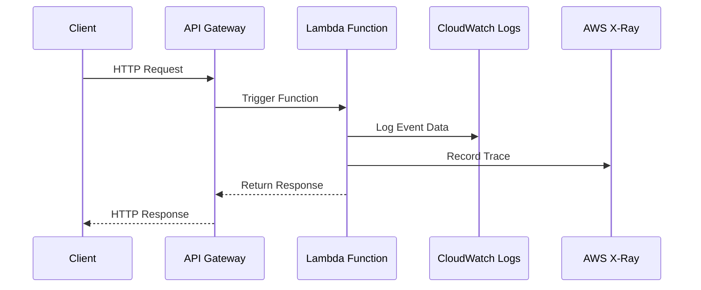

## Introduction

In the realm of serverless computing, where the traditional concerns of server management are abstracted away, achieving effective monitoring and logging remains crucial. Monitoring and logging in serverless architectures allow developers to gain visibility into system operations, ensure application performance, diagnose issues, and maintain SLAs (Service Level Agreements). This article explores methods to establish robust monitoring and logging practices in serverless environments, presenting a comprehensive approach with code snippets, diagrams, and best practices.

## Design Pattern Explanation

### Overview

Monitoring and Logging in Serverless refer to the practices and tools used to collect, analyze, and act upon application data related to performance, operational health, and user interactions. These practices are integral for maintaining the reliability and performance of serverless applications due to the dynamic and often ephemeral nature of functions.

### Key Characteristics

- **Event-Driven Nature**: Serverless functions trigger based on specific events, necessitating logging of event metadata for context.
- **Scalability**: Serverless platforms scale automatically, which requires scalable monitoring solutions.
- **Micro-billing**: Resource usage billing necessitates detailed logging for cost tracking.

### Architectural Approaches

#### Centralized Logging

A common approach is implementing centralized logging, where logs from various serverless functions are aggregated in a centralized location for easier analysis and debugging. This often involves using cloud-native logging solutions like AWS CloudWatch Logs, Azure Monitor Logs, or Google Cloud Logging.

#### Distributed Tracing

Integrating distributed tracing tools, like AWS X-Ray or OpenTelemetry, enables tracking of requests as they traverse different services and serverless functions. This provides insight into latencies, dependencies, and potential bottlenecks.

#### Real-time Monitoring

Utilize real-time monitoring to gain immediate insights into application performance and health. Real-time dashboards can be built using tools like Grafana integrated with data sources like Prometheus or cloud-native solutions.

## Example Code and Implementation

In a serverless application leveraging AWS Lambda and Amazon CloudWatch, the following example demonstrates basic setup and integration:

```yaml

functions:
  hello:
    handler: handler.hello
    events:
      - http:
          path: hello
          method: get

provider:
  name: aws
  runtime: nodejs14.x
  logs:
    httpApi: true

xray: true
```

In this setup, logs from HTTP API events are directed to CloudWatch, and tracing is enabled with AWS X-Ray for end-to-end visibility.

## UML Sequence Diagram

Below is UML sequence diagram illustrating the interaction of serverless components with logging and tracing systems:



## Related Patterns

- **Function as a Service (FaaS)**: The execution model in serverless computing with inherent monitoring needs.
- **Auto-Scaling Applications**: Serverless inherently scales, necessitating robust logging to identify scaling events and related issues.
- **Event Sourcing**: Often used with serverless to log state changes as a sequence of events for comprehensive audit trails.

## Additional Resources

- **AWS Documentation on CloudWatch and X-Ray**: [AWS CloudWatch](https://docs.aws.amazon.com/AmazonCloudWatch/latest/monitoring/WhatIsCloudWatch.html), [AWS X-Ray](https://docs.aws.amazon.com/xray/latest/devguide/aws-xray.html)
- **Azure Monitoring Documentation**: [Azure Monitor](https://docs.microsoft.com/en-us/azure/azure-monitor/)
- **Google Cloud Logging Guide**: [Google Cloud Logging](https://cloud.google.com/logging/docs)

## Conclusion

Monitoring and Logging in Serverless systems are not just about capturing logs and metrics. They encompass a strategic approach to observability that enhances understanding of both user interactions and backend processes. By leveraging cloud-native tools and best practices described, developers can ensure their serverless applications remain robust, performant, and transparent, enhancing overall operational excellence.

By following this pattern, businesses can adopt a proactive posture towards system management and troubleshooting, affording them the agility and insight needed in an increasingly serverless world.
