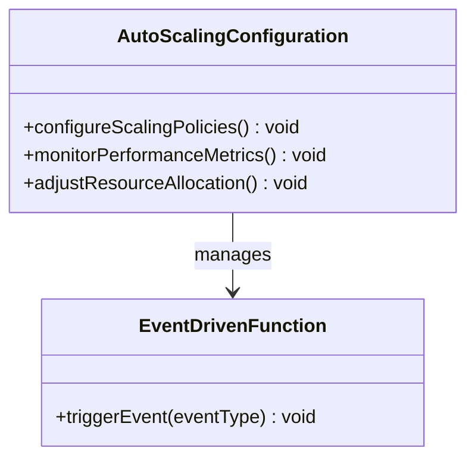
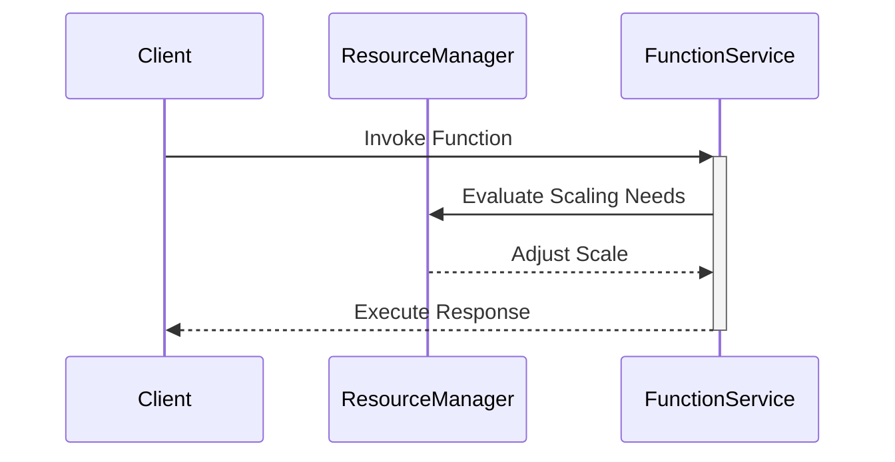

## Introduction

The **Scaling Configurations** pattern in serverless computing is pivotal for managing and scaling computational resources adaptively. This pattern enables applications to handle varying loads efficiently by dynamically allocating resources in response to demand, ultimately reducing costs and improving performance.

## Principles

The core principle of Scaling Configurations is elasticity, which ensures that resources are provisioned just-in-time and de-provisioned when they are no longer needed. The pattern leverages cloud service features to automatically scale the infrastructure both vertically and horizontally, thereby maintaining optimal performance while minimizing resource wastage.

## Architectural Approach

1. **Auto-scaling Services**: Utilize built-in auto-scaling capabilities provided by cloud providers (such as AWS Lambda concurrency settings, Azure Functions scaling policies, or Google Cloud Functions). 

2. **Event-Driven Architecture**: Implement an event-driven model that triggers functions based on specific events within the system, allowing precise scaling in response to incoming requests or data changes.

3. **Resource Allocation Policies**: Define policies for CPU, memory, and concurrency settings to fine-tune how functions are scaled and resources are allocated.

4. **Monitoring and Metrics**: Employ monitoring tools to gather performance metrics and use this data to adjust scaling configurations automatically.

5. **Feedback Loops**: Establish feedback loops to continuously assess performance and adjust configurations for future demand, using tools like AWS CloudWatch, Google Stackdriver, or Azure Monitor.

## Best Practices

- **Define Clear Scaling Policies**: Set up distinct scaling rules based on the nature of workloads. For example, batch processing may have different scaling needs compared to real-time event processing.

- **Optimized Resource Utilization**: Regularly analyze usage patterns to identify under-utilized resources and adjust configurations accordingly.

- **Test Scaling Scenarios**: Simulate various scaling scenarios to ensure the application can handle both surges and dips in demand without degradation in performance.

- **Cost Management**: Be aware of the cost implications of scaling configurations, especially with serverless services where rapid scaling can lead to increased costs.

## Example Code

For an AWS Lambda function, you might configure scaling using the AWS CLI or an Infrastructure as Code tool like AWS CloudFormation:

```yaml
Resources:
  MyLambdaFunction:
    Type: AWS::Lambda::Function
    Properties:
      Code: ...
      Handler: index.handler
      Role: "arn:aws:iam::123456789012:role/execution_role"
      Runtime: nodejs14.x
      MemorySize: 512
      Timeout: 15

  MyAutoScalingPolicy:
    Type: AWS::ApplicationAutoScaling::ScalableTarget
    Properties:
      ScalableDimension: lambda:function:ProvisionedConcurrency
      ResourceId: !Sub "function:${MyLambdaFunction}"
      MinCapacity: 1
      MaxCapacity: 50
```

## Diagrams

### UML Class Diagram



### Sequence Diagram



## Related Patterns

- **Function as a Service (FaaS)**: Often used in conjunction with Scaling Configurations to provide a seamless, event-driven execution model.

- **Load Balancer**: Ensures a balanced distribution of incoming requests across multiple instances, supporting horizontal scaling.

- **Service Oriented Architecture**: Encourages decomposition into smaller, independent services that can be scaled independently.

## Additional Resources

- [AWS Lambda Auto Scaling Guide](https://aws.amazon.com/lambda/)
- [Azure Functions Scaling](https://docs.microsoft.com/en-us/azure/azure-functions/storage-considerations)
- [Google Cloud Functions Scaling](https://cloud.google.com/functions/docs/concepts/exec)

## Summary

The Scaling Configurations pattern is essential in serverless environments to ensure that applications respond effectively to fluctuating demands. By leveraging cloud-native capabilities and best practices, this pattern helps in achieving cost efficiency and optimal performance. As workloads continue to grow in complexity, utilizing dynamic scaling becomes crucial to resource management strategies in modern cloud architectures.
