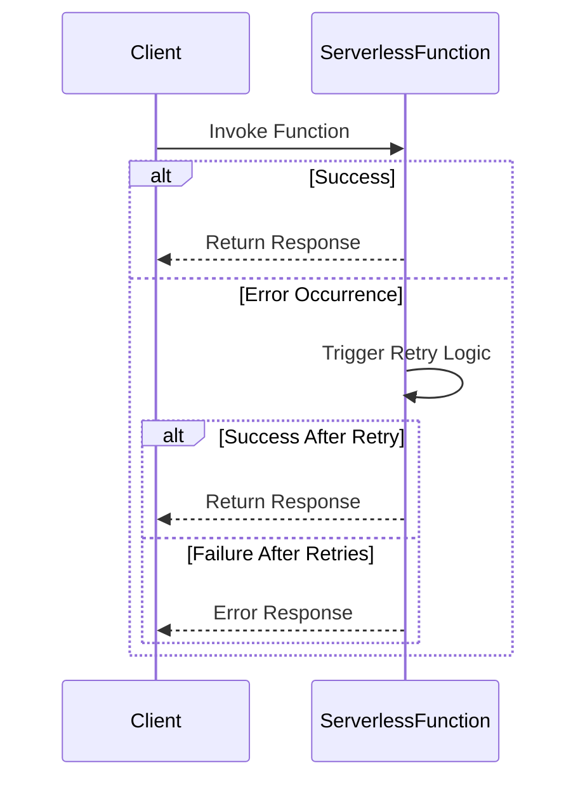

## Introduction

The **Error Handling and Retries** pattern is an essential strategy in serverless computing to address transient errors and enhance the reliability of system operations. This design pattern involves implementing mechanisms for detecting errors and automatically retrying failed operations, thus providing resilience against temporary issues while maintaining optimal performance.

## Key Concepts

### Error Detection

Error detection involves monitoring and identifying failures in process execution. In a serverless context, this can include function failures due to timeouts, network issues, or service unavailability. Effective error detection is foundational to any robust error handling strategy.

### Retry Logic

Retry logic is the core of this pattern, where operations are automatically retried upon failure, ideally with backoff strategies, to handle transient faults without overwhelming the system.

- **Exponential Backoff**: An increase in wait time between retries to prevent spamming the server and to allow time for recovery.
- **Jitter**: Adding randomness to retry intervals to prevent thundering herd problem.

### Idempotence

Ensuring operations are idempotent is critical, meaning that applying the operation multiple times has the same effect as a single execution. This allows for safe retries without undesirable side effects.

## Architectural Approaches

1. **Serverless Framework Support**:
   - AWS Lambda supports native retries for various asynchronous invocation scenarios.
   - Azure Functions provide retry policies through triggers like Azure Service Bus.
   - Google Cloud Functions allow customized retry behaviors via configuration.

2. **Middleware and Libraries**:
   Utilize middleware or third-party libraries that encapsulate retry logic, such as Polly for .NET or Retry4J for Java applications.

## Example Code

Below is a conceptual example implementing a retry mechanism with exponential backoff in a Node.js serverless function:

```javascript
const axios = require('axios');

async function makeRequestWithRetry(url, attempts = 5) {
  let attempt = 0;
  let delay = 1000; // Initial delay of 1 second

  while (attempt < attempts) {
    try {
      const response = await axios.get(url);
      return response.data;
    } catch (error) {
      if (attempt >= attempts - 1) throw error; // Re-throw after final attempt
      attempt++;
      console.log(`Attempt ${attempt} failed, retrying in ${delay}ms...`);
      await new Promise(resolve => setTimeout(resolve, delay));
      delay *= 2; // Exponential backoff
    }
  }
}
```

## Diagrams

### Sequence Diagram of Error Handling and Retries



## Related Patterns

- **Circuit Breaker**: Prevents the continued invocation of failing operations, potentially warming a client to await the system's recovery.
- **Compensating Transaction**: In the event of failure and successful state-changing operations, compensating transactions can rollback effects for consistency.

## Additional Resources

- [AWS: Error Retry and Exponential Backoff in AWS](https://docs.aws.amazon.com/general/latest/gr/api-retries.html)
- [Azure Resiliency Patterns](https://docs.microsoft.com/en-us/azure/architecture/patterns/)
- [Google Cloud: Designing Robust Systems](https://cloud.google.com/blog/products/gcp/architecting-resilient-systems-on-google-cloud-platform)

## Summary

Implementing the **Error Handling and Retries** pattern is crucial for enhancing the reliability and robustness of serverless architectures. By combining error detection, retry logic with exponential backoff, and ensuring idempotency, serverless applications can effectively manage transient failures, maintaining stable operations and improving user experience.
