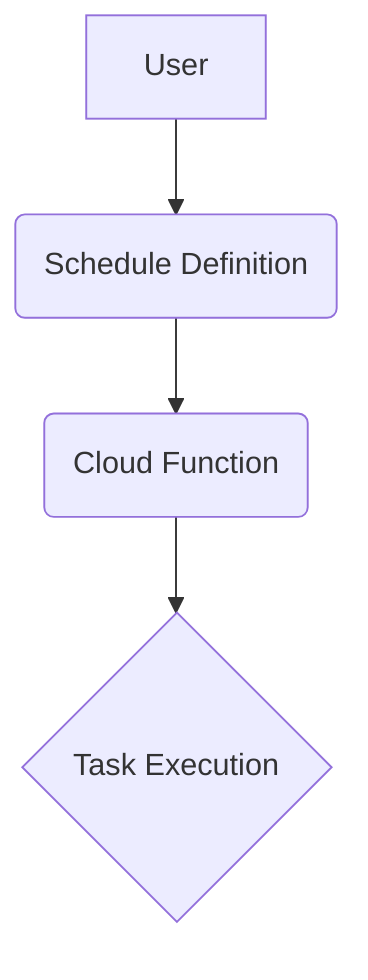

---

linkTitle: "Scheduled Functions"
title: "Scheduled Functions: Automating Tasks and Managing Timed Events"
category: "Serverless Computing"
series: "Cloud Computing: Essential Patterns & Practices"
description: "Scheduled Functions are a design pattern used to automate tasks and handle timed events in serverless computing environments. This pattern is essential for tasks that need to be executed at specific times or intervals without manual intervention, leveraging cloud-native services to ensure scalable and efficient execution."
categories:
- cloud-computing
- serverless-architecture
- automation
tags:
- serverless
- cloud-functions
- cron-jobs
- task-scheduling
- automation-pattern
date: 2024-07-07
type: docs

canonical: "https://softwarepatternslexicon.com/18/9/15"
license: "© 2024 Tokenizer Inc. CC BY-NC-SA 4.0"
---

## Introduction

### Overview of Scheduled Functions

Scheduled Functions are a powerful design pattern within serverless computing, enabling users to execute code in response to timed events. These functions allow for the automation of repetitive tasks, such as data backups, report generation, or triggering workflows, without requiring a dedicated server to manage scheduling.

### Key Concepts

- **Serverless Architecture**: Deploy and run functions without managing servers.
- **Task Scheduling**: Automate execution at predefined times or intervals.
- **Scalability**: Automatically scale based on demand and usage.

## Detailed Explanation

### Architectural Approaches

Scheduled functions use a cron-like scheduling system available in many cloud platforms, such as AWS Lambda with CloudWatch Events, Azure Functions with Timer Triggers, and Google Cloud Functions with Cloud Scheduler. By leveraging these services, you can define precise schedules for executing your code.

#### Basic Architecture



1. **Schedule Definition**: Specify a schedule using cron syntax or similar expressions.
2. **Cloud Function**: Define the function that will be executed.
3. **Task Execution**: Automatically execute the function at predefined intervals.

### Best Practices

- **Error Handling**: Implement robust error handling to manage failures.
- **Idempotency**: Ensure functions are safe to run multiple times without unintended outcomes.
- **Resource Management**: Monitor and manage resources to avoid unnecessary costs.
- **Security**: Apply minimal privilege principles to limit access.
- **Logging and Monitoring**: Implement comprehensive logging for auditing and debugging.

## Example Code

### AWS Lambda Example

Here's an example of a scheduled AWS Lambda function using CloudWatch Events:

```python
import json

def lambda_handler(event, context):
    # Your task logic here
    return {
        'statusCode': 200,
        'body': json.dumps('Function executed successfully!')
    }
```

### Cron Expression for Scheduling

To schedule this function to run every hour, you can use the following cron expression in your CloudWatch Event rule:

```
0 * * * * *
```

## Related Patterns

- **Event Sourcing**: For auditing system state changes over time.
- **Command Query Responsibility Segregation (CQRS)**: Separate read and write models for data processing.
- **Pub/Sub**: Use for asynchronous communication.

## Additional Resources

- [AWS Lambda with CloudWatch Events](https://docs.aws.amazon.com/lambda/latest/dg/services-cloudwatchevents.html)
- [Azure Function Timer Trigger](https://docs.microsoft.com/en-us/azure/azure-functions/functions-bindings-timer)
- [Google Cloud Functions with Cloud Scheduler](https://cloud.google.com/scheduler/docs)

## Summary

Scheduled Functions are an essential pattern within serverless computing, providing a robust framework for automating task execution and handling timed events. By leveraging the cron-like capabilities inherent in cloud platforms, organizations can enhance operational efficiency, reduce overhead costs, and improve scalability. This enables focusing more on functionality and business logic rather than infrastructure management or scheduling complexities.


