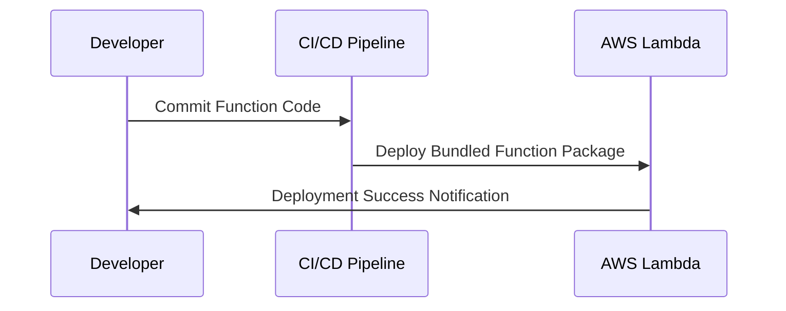

## Function Bundling and Packaging in Serverless Computing

In the domain of serverless computing, the **Function Bundling and Packaging** pattern revolves around strategies for reducing deployment times, minimizing cold start latency, and managing dependencies effectively. This pattern is crucial for optimizing serverless deployments and ensuring scalable, efficient operations.

### Detailed Explanation

#### Key Concepts

1. **Function Bundling**: This involves combining multiple function handlers into a single deployable unit. This approach is beneficial when functions share common dependencies or require access to shared resources—thereby reducing the redundancy in resource loading.

2. **Packaging**: Refers to the method of encapsulating the function code with its dependencies into a single artifact, such as a ZIP file or Docker container, which can be deployed seamlessly to a serverless environment.

3. **Cold Start Performance**: By bundling functions that are frequently triggered together or share context, cold start performance can be significantly improved by reducing the overhead of initializing separate execution environments.

#### Architectural Approaches

- **Monolithic Packaging**: All related functions and dependencies are packaged into a single artifact. Suitable for small-scale applications where functions rarely change or when functions have significant shared dependencies.
  
- **Modular Packaging**: Splitting functions into smaller, logically grouped packages, allowing independent deployment and more granular control over updates and scalability, which is ideal for larger applications.

- **Layered Approach**: This involves utilizing a layered architecture where common dependencies are added as separate layers that multiple functions can share. This is especially relevant in AWS Lambda, which supports Lambda layers for code reuse and efficient updates.

### Best Practices

- **Use Dependency Management Tools**: Tools like npm for Node.js, Maven for Java, or pip for Python can manage dependencies efficiently before packaging.
- **Optimize Package Size**: Minimize function package sizes by excluding unnecessary files (like tests, documentation) and leveraging production-only dependencies.
- **Version Control for Dependencies**: Maintain strict control over dependency versions to ensure stable and reliable deployments.

### Example Code

Below is an example of a simple Node.js Lambda function utilizing bundling and packaging practices:

```javascript
const AWS = require('aws-sdk');

// Shared resources or dependencies
const s3 = new AWS.S3();

exports.handler = async (event) => {
    // Function specific logic
    const params = {
        Bucket: 'example-bucket',
        Key: 'example-key',
    };
    
    try {
        const data = await s3.getObject(params).promise();
        return data.Body.toString('utf-8');
    } catch (error) {
        throw new Error(`Error retrieving object: ${error.message}`);
    }
};
```

### Diagrams



### Related Patterns

- **Cold Start Optimization**: This pattern deals directly with strategies to reduce startup times for serverless functions.
- **Dependency Injection**: Often used in conjunction with function bundling to manage dependencies more effectively in a Python or Java environment.
- **Infrastructure as Code (IaC)**: Enhancing deployments further by managing the deployment of serverless functions through tools like AWS CloudFormation or Terraform.

### Additional Resources

- [AWS Lambda Function Package Dependencies](https://docs.aws.amazon.com/lambda/latest/dg/python-package.html)
- [Azure Functions Deployment Best Practices](https://docs.microsoft.com/en-us/azure/azure-functions/functions-best-practices)

### Summary

The **Function Bundling and Packaging** pattern in serverless computing is a strategic approach to optimize function deployment, improve performance, and ensure efficient resource management. By adopting best practices and related patterns, you can harness the full potential of serverless architectures, resulting in more responsive and cost-effective cloud applications.
