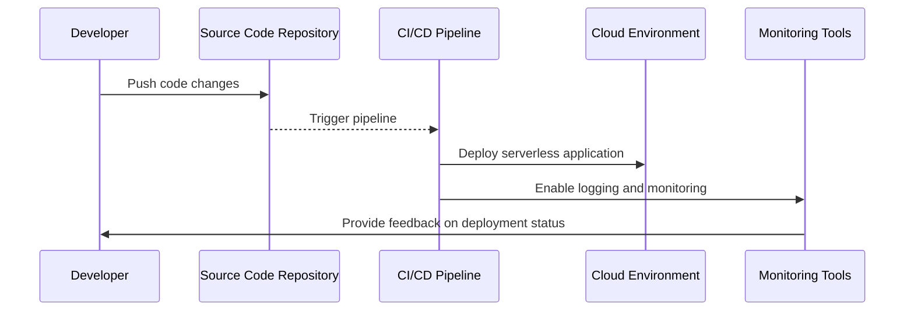

## Introduction

In the rapidly evolving world of cloud computing, serverless architectures are becoming increasingly popular due to their scalability, cost-effectiveness, and reduced operational overhead. One of the critical aspects of managing serverless architectures effectively is deployment automation. Deployment Automation in serverless computing refers to automating the process of deploying applications or services without the need for manual intervention, ensuring consistent, repeatable, and efficient deployments.

## Key Concepts

- **Automation**: Automates the repetitive tasks involved in deployment, such as code integration, testing, and release processes.
- **Continuous Integration/Continuous Deployment (CI/CD)**: Utilizes CI/CD pipelines to automate the stages of code integration, testing, and delivery to production environments.
- **Infrastructure as Code (IaC)**: Manages and provisions infrastructure through code rather than manual processes.
- **Scalability and Flexibility**: Easily scales resources as needed and adjusts to changing requirements without manual intervention.

## Architectural Approach

### Components

1. **Source Code Repository**: Centralized repository for maintaining source code, configuration, and IaC scripts. Common choices include GitHub, GitLab, or Bitbucket.
2. **CI/CD Pipeline**: Automated pipeline that orchestrates the build, test, and deployment stages.
3. **Deployment Tool**: Tools like AWS SAM, Serverless Framework, or Terraform manage the deployment process on cloud providers.
4. **Monitoring and Logging Tools**: Ensure the system's health and performance by integrating tools like AWS CloudWatch, Prometheus, or ELK Stack.

### Process Flow



## Best Practices

- **Version Control**: Use robust version control systems to track changes in code and configuration files.
- **Automated Testing**: Incorporate unit and integration tests into the CI/CD pipeline to ensure code quality.
- **Rollback Capabilities**: Implement rollback strategies to revert to previous stable versions in case of deployment failures.
- **Security Scanning**: Integrate security scans to detect vulnerabilities before deployment.
- **Environment Isolation**: Use separate environments (development, staging, production) to minimize risks during the deployment process.

## Example Code

For deploying an AWS Lambda function using the AWS Serverless Application Model (SAM):

```yaml

AWSTemplateFormatVersion: '2010-09-09'
Transform: 'AWS::Serverless-2016-10-31'
Resources:
  HelloWorldFunction:
    Type: 'AWS::Serverless::Function'
    Properties:
      Handler: src/hello-world.handler
      Runtime: nodejs14.x
      CodeUri: src/
      Description: A simple Hello World lambda function
      MemorySize: 128
      Timeout: 10
```

Deploy using AWS SAM CLI:

```bash
sam build
sam deploy --guided
```

## Related Patterns

- **Infrastructure as Code (IaC)**: Closely related to deployment automation as it allows infrastructure management through code.
- **Immutable Infrastructure**: Ensures applications are deployed on a clean infrastructure instance or containers without lingering state issues.
- **Blue-Green Deployment**: Allows zero downtime deployment by switching traffic between two environments.

## Additional Resources

- AWS Serverless Application Model (SAM) [Documentation](https://docs.aws.amazon.com/serverless-application-model/latest/developerguide/what-is-sam.html)
- Introduction to CI/CD with AWS [Whitepaper](https://d1.awsstatic.com/whitepapers/aws-continuous-integration-and-continuous-delivery.pdf)
- Terraform [Documentation](https://www.terraform.io/docs/index.html)

## Summary

Deployment Automation in serverless computing is a powerful pattern that streamlines the deployment process, ensuring reliability, consistency, and efficiency while reducing human error. By integrating CI/CD pipelines with infrastructure-as-code tools and best practices, organizations can achieve swift deployments, rapid iteration, and enhanced collaboration across development teams, proving essential in the fast-paced world of cloud-native serverless applications.
