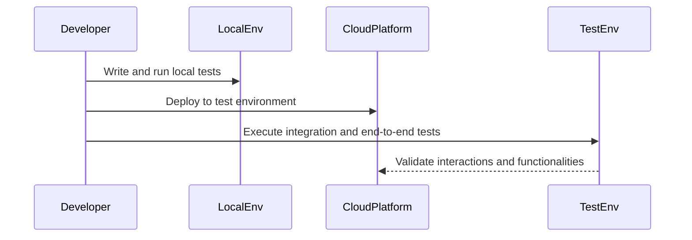

As serverless architecture continues to gain traction, testing has become a critical aspect to ensure the reliability and performance of cloud-based applications. Testing strategies in serverless involve unique challenges due to its highly distributed and ephemeral nature. This article delves into various testing methodologies adapted for serverless environments to guarantee robust and efficient execution of cloud functions.

## Design Patterns and Best Practices

### 1. **Local Emulation and Testing**
   Local emulation of serverless functions can provide a quick feedback loop for developers. Tools such as AWS SAM CLI, GCP Cloud Functions Emulator, and Azure Functions Core Tools allow developers to simulate cloud environments locally. However, it's important to recognize that local tests might not perfectly mimic cloud environments.

#### Best Practices:
- Use language-specific Unit Testing frameworks like JUnit for Java or Mocha for JavaScript.
- Incorporate mocking frameworks such as Mockito to simulate cloud services.

### 2. **Integration Testing**
   Serverless applications often rely on multiple cloud services. Integration testing validates the interactions between these components to ensure they work together as expected.

#### Best Practices:
- Use service-specific testing tools and sandbox environments to execute tests without incurring high costs or impacting production.
- Implement tests that focus on the interaction of the function with databases, message queues, and APIs.

### 3. **End-to-End Testing**
   End-to-end tests encompass the entire workflow of a serverless application, ensuring each part of the application works as expected in real-world scenarios.

#### Best Practices:
- Deploy a complete, replica environment of the production system for comprehensive testing.
- Use tools like Selenium for web-based interfaces integrated with serverless backends.

## Example Code: Unit Testing a Simple AWS Lambda Function

Below is an example of using Jest to unit test an AWS Lambda function written in JavaScript:

```javascript
// lambdaFunction.js

exports.handler = async (event) => {
    const name = event.name || "World";
    return `Hello, ${name}!`;
};

// lambdaFunction.test.js

const { handler } = require('./lambdaFunction');

test('should return a greeting with the provided name', async () => {
    const event = { name: "John" };
    const result = await handler(event);
    expect(result).toBe("Hello, John!");
});

test('should return default greeting when name is not provided', async () => {
    const event = {};
    const result = await handler(event);
    expect(result).toBe("Hello, World!");
});
```

## Diagram: Serverless Testing Workflow



## Related Patterns

- **Microservices Collaboration**: In serverless, each function can be considered a microservice. Ensures effective communication between serverless functions and other cloud services.
- **Fault Tolerance and Resilience**: Implementing retry mechanisms and error handling to ensure serverless functions can handle failures gracefully.

## Additional Resources

- [AWS Serverless Application Model (SAM)](https://aws.amazon.com/serverless/sam/)
- [Google Cloud Functions Testing Guide](https://cloud.google.com/functions/docs/testing)
- [Azure Functions Testing Best Practices](https://docs.microsoft.com/en-us/azure/azure-functions/functions-test-a-function)

## Summary

Testing strategies are integral to the successful deployment and functioning of serverless architectures. While local testing provides an immediate way to validate code changes, integration and end-to-end testing ensure that serverless applications function seamlessly with dependent services. By employing these best practices and leveraging dedicated tools, developers can maintain high reliability and efficiency in serverless deployments.
