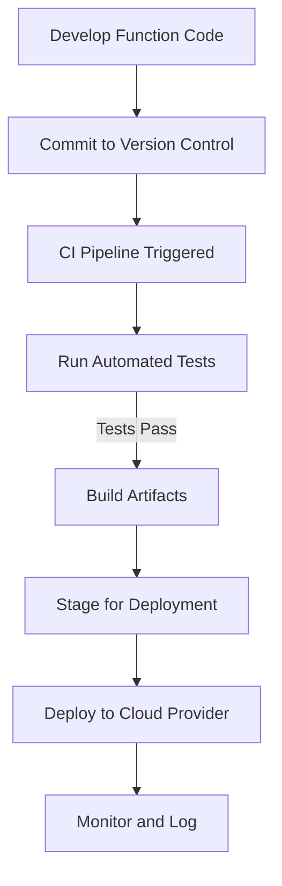

In the growing landscape of serverless computing, where functions-as-a-service (FaaS) enable developers to focus on writing code without managing infrastructure, implementing robust CI/CD pipelines becomes paramount. Continuous Integration (CI) and Continuous Deployment (CD) practices ensure that serverless functions are delivered consistently and reliably with minimal human intervention. This pattern outlines the principles and best practices for adopting CI/CD in serverless environments, enhancing both development speed and operational stability.

## Detailed Explanation

### Design Pattern Description

**CI/CD for Functions** is a pattern focused on automating the build, testing, and deployment process of serverless functions. By leveraging cloud-native CI/CD tools and frameworks, enterprises can ensure that their serverless applications remain agile, adaptable, and production-ready.

### Architectural Approaches

1. **Version Control Integration:**
   - Utilize version control systems (such as Git) to manage serverless application code.
   - Trigger CI pipelines automatically based on code changes through webhooks or polling mechanisms.

2. **Automated Testing:**
   - Implement unit tests, integration tests, and end-to-end tests specifically tailored for serverless functions.
   - Utilize mock services and cloud emulators where possible to simulate the cloud environment.

3. **Build Artifacts:**
   - Package serverless functions along with their dependencies using container images or zip files.
   - Store artifacts in centralized artifact repositories for version tracking and rollback capabilities.

4. **Deployment Strategies:**
   - Adopt blue-green deployments or canary releases to minimize downtime and manage incremental rollouts.
   - Utilize infrastructure-as-code (IaC) tools to automate environment setup and ensure consistency.

### Paradigms and Best Practices

- **Immutable Deployments:** Ensure that each deployment is self-contained and immutable, preventing side effects from external configuration changes.
- **Security and Governance:** Integrate security scans within the CI/CD pipeline to detect vulnerabilities early.
- **Monitoring and Alerts:** Automatically monitor deployed functions and configure alerts for failures or performance drops.

## Example Code

```yaml
name: Serverless CI/CD Pipeline

on:
  push:
    branches: [ main ]

jobs:
  build-and-deploy:
    runs-on: ubuntu-latest
    steps:
    - uses: actions/checkout@v2

    - name: Set up Node.js
      uses: actions/setup-node@v2
      with:
        node-version: '14'

    - name: Install Dependencies
      run: npm install

    - name: Run Tests
      run: npm test

    - name: Deploy Function
      uses: serverless/github-action@v3.0.0
      with:
        args: deploy
      env:
        NODE_ENV: 'production'
        AWS_ACCESS_KEY_ID: ${{ secrets.AWS_ACCESS_KEY_ID }}
        AWS_SECRET_ACCESS_KEY: ${{ secrets.AWS_SECRET_ACCESS_KEY }}
```

## Diagrams



## Related Patterns and Descriptions

- **Event Sourcing:** Captures changes as a sequence of events, facilitating smoother deployments without data inconsistencies.
- **Infrastructure as Code (IaC):** Ensures the entire environment is versioned and deployable via code, facilitating serverless deployment adjustments.
- **Blue-Green Deployment:** Minimizes downtime and risk by running two production environments.

## Additional Resources

- [AWS Lambda CI/CD Best Practices](https://aws.amazon.com/lambda/)
- [Azure Functions Deployment](https://docs.microsoft.com/en-us/azure/azure-functions/)
- [Google Cloud Functions CI/CD](https://cloud.google.com/functions/docs/deploying)
- [Serverless Framework Documentation](https://www.serverless.com/framework/docs/)

## Summary

The **CI/CD for Functions** pattern is essential for businesses adopting serverless architectures, ensuring consistent delivery and integration of function-based applications. By automating testing, packaging, and deploying processes, developers can deliver updates with confidence while maintaining optimal service continuity and quality.
