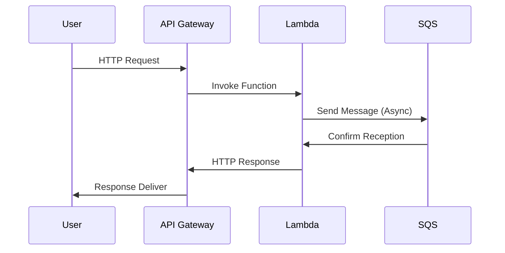

## Overview

In the realm of serverless computing, functions are executed on-demand in stateless containers, abstracting away the complexities of server management. While this model offers significant scalability and flexibility benefits, cost management can become a challenge as execution requests scale. The **Function Cost Optimization** pattern focuses on strategies to minimize the costs associated with such serverless functions by employing architectural design patterns, efficient coding techniques, and intelligent resource management.

## Detailed Explanation

### Architectural Approaches

1. **Function Granularity Optimization**: Designing functions with the appropriate level of granularity is key to balancing execution time and invocation frequency. Functions should be neither too coarse (resulting in idle time and resource inefficiency) nor too fine (leading to excessive invocation overhead).

2. **Asynchronous Execution**: Employ asynchronous processing where possible to prevent blocking calls that consume more execution time. This can be achieved using message queues or event streams to decouple function executions.

3. **Cold Start Mitigation**: Reduce the impact of cold starts by pre-warming functions, either by scheduling regular invocations or using solutions that maintain a minimal number of active instances ready to serve requests.

### Coding Practices

1. **Optimize Code Execution**: Focus on writing efficient code that has reduced computation time. This includes using appropriate data structures, minimizing I/O operations, and optimizing algorithms to improve execution performance.

2. **Resource Management**: Allocate just enough memory and CPU power during function configuration to meet the service-level agreement (SLA) needs while keeping costs in check. Excess allocation leads to unnecessary cost increments.

3. **Reuse Connections**: Instead of establishing new connections for every invocation, employ connection pooling or reuse to reduce setup time and associated costs, particularly in database access scenarios.

### Example Code

Below is a sample AWS Lambda function written in JavaScript that utilizes an asynchronous execution pattern:

```javascript
const AWS = require('aws-sdk');
const sqs = new AWS.SQS();

exports.handler = async (event) => {
    // Process each record from the event source
    const processedRecords = event.Records.map(record => processRecord(record));
    
    // Asynchronous invocation for further processing
    const results = await Promise.all(processedRecords.map(async (record) => {
        return await processAsync(record);
    }));
    
    return results;
};

function processRecord(record) {
    // Implement record processing logic
}

async function processAsync(record) {
    // Implement asynchronous processing
    const params = {
        MessageBody: JSON.stringify(record),
        QueueUrl: 'YOUR_QUEUE_URL'
    };

    return sqs.sendMessage(params).promise();
}
```

### Diagrams

#### Sequence Diagram



### Related Patterns

- **Event-Driven Architecture**: Facilitates the use of event streams and message queues to decouple function invocations, leading to better scalability and cost efficiency.
- **Auto-Scaling Policy Optimization**: Adjusts auto-scaling policies for minimal resource provision based on demand predictions.
- **Circuit Breaker**: Prevents repeated failures from incurring unnecessary costs by capping the resources spent on futile executions.

### Additional Resources

- [AWS Lambda Optimization Guide](https://aws.amazon.com/lambda/)
- [Azure Functions Best Practices](https://learn.microsoft.com/en-us/azure/azure-functions/functions-best-practices)
- [Google Cloud Functions Efficiency Tips](https://cloud.google.com/functions/docs/bestpractices)

## Summary

Function Cost Optimization is essential for maximizing the efficiency and minimizing the costs of serverless computing. By employing strategic architectural designs, code efficiencies, and resource management practices, organizations can balance performance needs with cost considerations, ensuring that their serverless solutions are both effective and economical.
