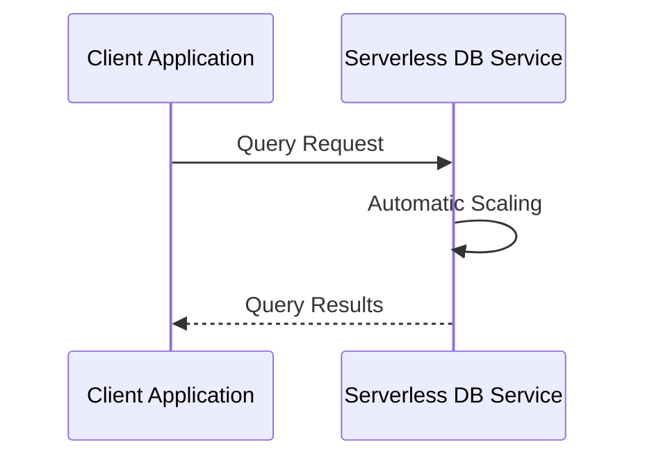

## Introduction

Serverless databases are integral to the serverless computing paradigm, providing automatic scaling, streamlined management, and cost-effective usage. These databases enable developers to focus on application logic while delegating data storage management to cloud service providers.

## Design Pattern Overview

### Definition
Serverless databases are cloud-based database solutions that allow developers to run queries on-demand without the need for managing the underlying infrastructure. These databases automatically scale based on usage and charge users only for the resources they consume.

### Architectural Approach
In a serverless architecture, databases operate independently from the applications that consume their data. This separation facilitates easier scalability, maintenance, and deployment of applications. Serverless databases handle infrastructure management tasks such as provisioning, patching, and scaling.

### Benefits
- **Cost-Effective**: Pay only for what you use, minimizing idle resource costs.
- **Scalability**: Automatically scales horizontal or vertically to handle varying loads.
- **Reduced Operational Complexity**: Eliminates the need for manual scaling and infrastructure maintenance.
- **Streamlined Deployment**: Integrates seamlessly into continuous integration and deployment pipelines.

### Challenges
- Potential cold start penalties during infrequent access.
- Possible security concerns due to shared multi-tenancy.
- Vendor lock-in with specific cloud providers.

## Best Practices

- **Usage Monitoring**: Regularly monitor usage to optimize costs and understand scaling patterns.
- **Security Hardening**: Employ best practices in securing data with encryption and access controls.
- **Testing for Latency**: Test data retrieval and insertion under load to ensure acceptable performance.

## Example Code

Here's a simple example demonstrating how to connect to a serverless MySQL database using Node.js:

```javascript
const mysql = require('mysql2');

const connection = mysql.createConnection({
  host: 'example-serverless-db-host',
  user: 'your-username',
  password: 'your-password',
  database: 'your-database'
});

connection.connect((err) => {
  if (err) {
    return console.error('error connecting: ' + err.stack);
  }
  console.log('connected as id ' + connection.threadId);
});

// Example query
connection.query('SELECT * FROM your_table', (error, results, fields) => {
  if (error) throw error;
  console.log('Data:', results);
});

connection.end();
```

## Diagrams

### UML Sequence Diagram



## Related Patterns

- **Function-as-a-Service (FaaS)**: Complement serverless databases by triggering data-driven events.
- **API Gateway**: Used to manage API requests that interact with serverless databases.

## Additional Resources

- [AWS Aurora Serverless](https://aws.amazon.com/rds/aurora/serverless/)
- [Google Cloud Firestore](https://cloud.google.com/firestore)
- [Azure Cosmos DB](https://azure.microsoft.com/en-us/services/cosmos-db/)

## Summary

Serverless databases represent a revolutionary advancement in cloud computing, offering scalable, cost-effective, and easy-to-manage solutions for modern applications. By abstracting infrastructure concerns away from developers, these databases enable teams to focus more on application functionality and business logic, ultimately driving innovation and efficiency. Understanding the intricacies and best practices of serverless databases can significantly enhance the development and operational excellence of cloud-native applications.
