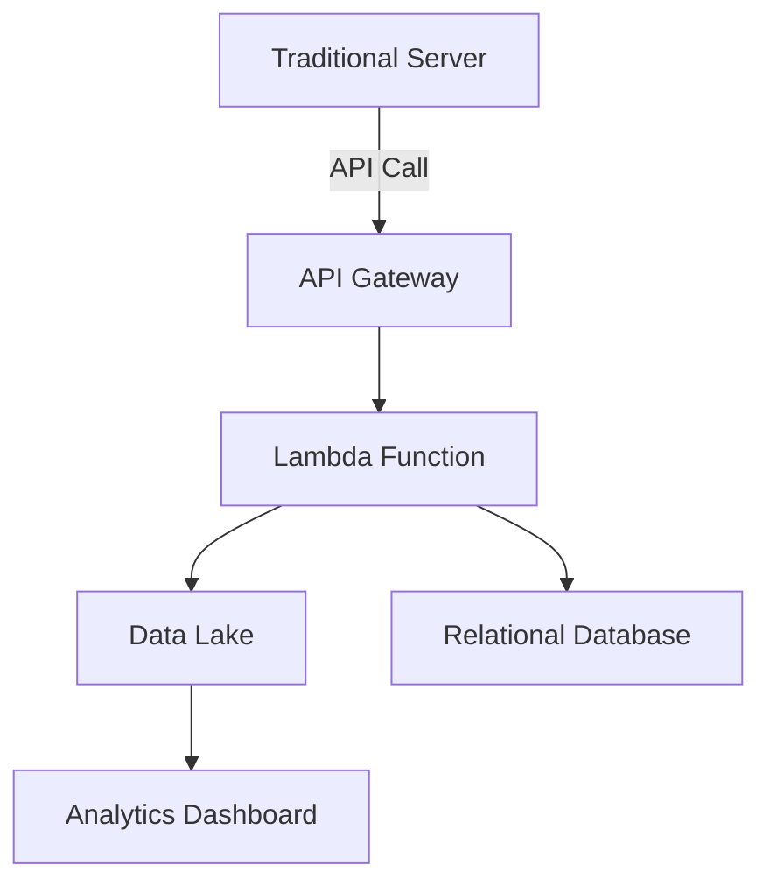

## Overview

**Hybrid Serverless Architectures** are an architectural pattern designed to integrate serverless computing with traditional server-based systems. This approach capitalizes on the scalability and cost-efficiency of serverless models while still retaining control and predictability over certain components via traditional servers. The pattern is particularly useful when transitioning legacy systems to the cloud, modernizing applications, or when specific performance and compliance requirements need controlled environments.

## Detailed Explanation

### Design Principles

- **Modularity:** Both serverless and server-based components are designed to be modular. Each component serves a specific function and can be independently scaled, updated, or replaced.
- **Interoperability:** Components from different environments (serverless and traditional cloud services) are designed to work together seamlessly using APIs and microservices patterns.
- **Scalability:** Serverless components provide automatic scaling based on demand, reducing the need for manual intervention.
- **Cost Efficiency:** Serverless computing relies on a pay-per-use model, which can result in significant savings for sporadically used services.

### Architectural Approaches

1. **Integration through APIs:**
   - Utilize APIs to enable communication between serverless and traditional components. This ensures each component can work independently but collaborate when necessary.

2. **Data Management:**
   - Leverage a hybrid storage strategy combining services like AWS S3 for serverless events and traditional databases for steady, relational data.

3. **Event-Driven Systems:**
   - Serverless functions (like AWS Lambda, Azure Functions) respond to events from an event source (e.g., HTTP requests, database changes), allowing traditional systems to trigger serverless operations smoothly.

4. **Security and Compliance:**
   - Utilize serverless for data analytics and intensive computations while using traditional, secure environments for sensitive data handling.

5. **Performance Optimization:**
   - Offload batch processing and non-latency critical tasks to serverless functions, reserving traditional servers for low-latency and high-performance operations.

### Best Practices

- **Use serverless for uncertain loads:** Handle unpredictable workloads with serverless architecture as it can automatically scale with demand.
- **Optimize Computational Workloads:** Offload intensive computations to serverless environments to free up traditional infrastructure.
- **Monitor Costs Closely:** Analyze the cost against performance benefits regularly to ensure the hybrid approach remains financially viable.
- **Implement robust API management:** Handle authentication, rate limiting, and throttling for APIs bridging serverless and traditional systems.

### Example Code: AWS Lambda with EC2

**Setting Up AWS Lambda to Communicate with an EC2-Hosted API**

```javascript
const axios = require('axios');

exports.handler = async (event) => {
    const apiResponse = await axios.get('http://your-ec2-instance-endpoint/api/path');
    const data = apiResponse.data;

    // Perform operations with the fetched data
    console.log(data);

    return {
        statusCode: 200,
        body: JSON.stringify(data),
    };
};
```

### Diagrams

#### Hybrid Architecture Diagram



### Related Patterns

- **Microservices Architecture:** Breaks down applications into smaller, independent services that can deploy independently, similar in separability to serverless designs.
- **Reactive Systems:** Utilizes event-driven methodologies which easily pair with serverless event invocation.
- **API Gateway Pattern:** Ensures seamless communication between different service types and components.

### Additional Resources

- **[AWS Serverless Applications](https://aws.amazon.com/serverless/):** Solutions and examples on AWS for serverless computing.
- **[Azure Serverless Documentation](https://azure.microsoft.com/en-us/solutions/serverless/):** Microsoft's repository of serverless resources and documentation.
- **[Google Cloud Functions Documentation](https://cloud.google.com/functions/docs):** Google Cloud's serverless solutions.

## Summary

Hybrid Serverless Architectures present a balanced approach to modern application design, bringing together the benefits of serverless computing with the control of traditional server environments. They offer a flexible, efficient, and scalable solution for businesses seeking to modernize their infrastructure while maintaining reliability and cost-effectiveness. By carefully orchestrating these two computing paradigms, organizations can achieve robust and adaptive cloud strategies, keeping pace with dynamic market demands and technological advancements.
