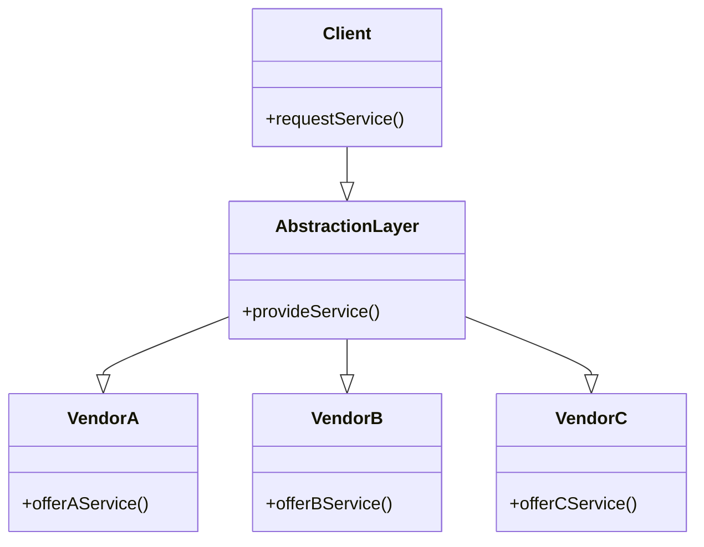

## Introduction

In cloud computing, one of the critical concerns is vendor lock-in, a situation where a customer becomes overly dependent on a single cloud provider, limiting their ability to switch providers or use multiple providers simultaneously. As organizations increasingly move towards serverless architectures, avoiding vendor lock-in becomes even more crucial to ensure flexibility, cost-effectiveness, and agility.

## Design Pattern: Avoiding Vendor Lock-In

### Context

Cloud providers offer various services that streamline development and operations. However, using proprietary features or technologies unique to one provider can lead to vendor lock-in, impeding the flexibility to migrate to or integrate with other cloud environments. This is particularly concerning with serverless architectures, where services like AWS Lambda, Azure Functions, and Google Cloud Functions provide unique functionalities.

### Problem

Vendor lock-in can have several negative impacts:

1. **Cost Implications**: Sticking to a single vendor, especially with non-competitive pricing or unfavorable contract terms, can increase operational costs.
2. **Limited Flexibility**: Organizations might struggle to adopt new technologies or benefits offered by other vendors.
3. **Risk Management**: Relying on a single vendor can pose a risk if they face outages, price hikes, or service deprecation.

### Solution

To mitigate vendor lock-in, consider the following strategies:

1. **Abstracting the Technology Stack**:
   - Use standard, open-source frameworks and libraries instead of vendor-specific ones.
   - Example: Using serverless frameworks like the Serverless Framework or AWS SAM for app development across multiple platforms. 

2. **Service Abstraction Layers**:
   - Build applications atop an abstraction layer, allowing functionality to switch between different vendors easily.
   - Example: Use Terraform or Pulumi to define infrastructure as code, ensuring portability across AWS, Azure, and GCP.

3. **Application Modularization**:
   - Ensure your application is modular, where different components can operate independently and can be hosted by different cloud services without interdependence.
   - Example: Utilize Docker containers to package applications for portability.

4. **Data Portability**:
   - Utilize open data formats and APIs standardized by the tech community.
   - Example: JSON, XML, or Avro for data serialization and APIs like REST or GraphQL.

### Example Code

```javascript
// Example of a serverless function deployment using a provider agnostic framework
module.exports.hello = async (event) => {
  return {
    statusCode: 200,
    body: JSON.stringify({ message: 'Hello from Serverless!' }),
  };
};

// Serverless framework configuration
service: my-service
provider:
  name: aws
  runtime: nodejs14.x
  region: us-east-1
  deploymentBucket: 
    name: my-deployment-bucket
functions:
  hello:
    handler: handler.hello
```

### Diagrams



### Related Patterns and Paradigms

- **Microservices**: Decomposing applications into microservices enhances portability and reduces vendor lock-in by isolating application components.
- **Multi-Cloud Strategy**: Actively using services from multiple cloud providers to ensure no single-point dependency.
- **Decentralized Identity**: Utilizing open standards to prevent lock-in in modern Web 3.0 applications.

### Additional Resources

- [Serverless Framework Documentation](https://www.serverless.com/framework/docs/)
- [Cloud Native Computing Foundation (CNCF)](https://www.cncf.io/)
- [Terraform by HashiCorp: Official Site](https://www.terraform.io/)

## Summary

Avoiding vendor lock-in in cloud computing requires a strategic approach that includes selecting standardized technologies, leveraging infrastructure as code, and utilizing abstraction layers. By following these practices, organizations can maintain flexibility, leverage competitive services from various vendors, and mitigate risks associated with dependency on a single cloud provider. As the industry moves towards more serverless solutions, adopting these patterns becomes increasingly imperative to future-proofing cloud infrastructure and investment.
