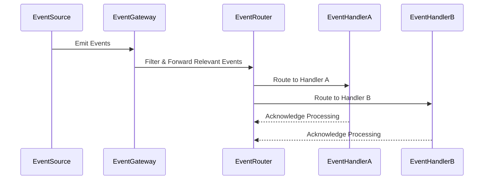

## Overview

The **Event Filtering and Routing** design pattern is crucial for managing events in serverless and event-driven architectures. It allows systems to efficiently handle and process a high volume of events by filtering incoming events and routing them to the appropriate handlers or services based on predefined rules or criteria. This pattern ensures that only relevant events reach specific functions or microservices, optimizing resource usage and reducing unnecessary processing.

## Architectural Components

### Event Source

Events originate from various sources, including user interactions, system notifications, sensors, or other external systems. These sources continuously produce data that need to be processed.

### Event Gateway

An event gateway acts as a central hub that receives all incoming events and applies filtering criteria. Utilizing rules, selectors, or conditional logic, it identifies which events are relevant for further processing and which can be discarded.

### Event Router

Once filtered, events are routed to designated services or functions. The routing decision is usually based on event type, origin, or payload content. It leverages routing tables, switch cases, or pattern matching algorithms to direct the event to its respective handler.

### Event Handlers

These are serverless functions or microservices that execute business logic. Each handler focuses on a specific task, such as processing data, triggering notifications, or invoking dependent services.

## Example Code

To illustrate the Event Filtering and Routing pattern, here's an AWS Lambda-based example using Node.js and AWS EventBridge for filtering and routing events:

```javascript
// Lambda function for filtering events
exports.filterEventsHandler = async (event) => {
    const { Records } = event;
    
    // Apply filtering logic
    const relevantEvents = Records.filter(record => {
        return record.eventType === 'order_placed' && record.priority === 'high';
    });
    
    // Further process relevant events
    for (const relevantEvent of relevantEvents) {
        console.log(`Processing event: ${relevantEvent.id}`);
        await routeEvent(relevantEvent);
    }
};

async function routeEvent(event) {
    // Routing logic 
    switch (event.destination) {
        case 'InventoryUpdate':
            await updateInventory(event);
            break;
        case 'SendNotification':
            await sendNotification(event);
            break;
        default:
            console.error('No route for the event');
    }
}

async function updateInventory(event) {
    // Logic to update inventory
    console.log(`Updating inventory with order id: ${event.id}`);
}

async function sendNotification(event) {
    // Logic to send notification
    console.log(`Sending notification for order id: ${event.id}`);
}
```

## Diagrams

### Event Filtering and Routing Sequence Diagram



## Related Patterns

- **Event-driven Architecture**: This architectural pattern assists in creating loosely-coupled systems where components communicate through events, promoting scalability and resilience.
- **Saga Pattern**: Ensures data consistency in distributed systems using event-based methods, particularly useful when coordinating multiple microservices.
- **Circuit Breaker**: Prevents service failure due to upstream dependencies by cutting off requests when a threshold is reached, especially useful in event-based systems.

## Additional Resources

1. [AWS EventBridge Documentation](https://docs.aws.amazon.com/eventbridge/latest/userguide/what-is-amazon-eventbridge.html)
2. [Serverless Event-Driven Architectures](https://martinfowler.com/articles/serverless.html)
3. [Designing Event-Driven Systems](https://d3.harvard.edu/platform-rctom/public/uploads/assignment/keyword/2714/filtered/)

## Summary

The **Event Filtering and Routing** pattern is fundamental in achieving efficient operations in serverless and event-driven architectures. By applying this pattern, organizations can ensure that their cloud-based applications are responsive and scalable, processing only relevant events while directing them to appropriate components for further handling. This approach minimizes waste, bolsters performance, and enhances the agility of cloud infrastructure deployments.
