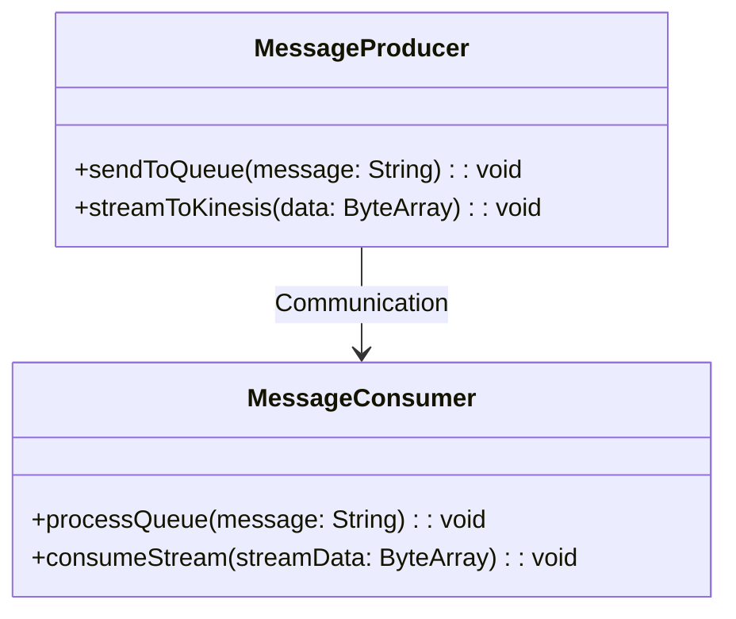
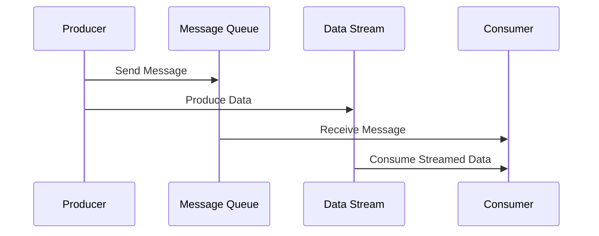

## Introduction to Message Queues and Streams Integration

In modern cloud architectures, particularly serverless computing, the integration of message queues and streams is a pivotal design pattern. It enables asynchronous communication between decoupled components, crucial for building scalable and resilient applications. This pattern leverages message queues for discrete message handling and streams for continuous data flow, providing flexibility and efficiency in processing workloads.

## Design Pattern Overview

### Message Queues
Message queues allow applications to communicate by sending and receiving messages in a queue. They decouple producers and consumers, ensuring smooth operation even under heavy loads or failures. They guarantee message delivery while enabling retries and built-in load balancing.

### Streams
Streams provide a continuous flow of data, often processed in real-time or near-real-time. They support the analysis of trends over a period and are typically used for applications that require real-time analytics, like monitoring and alerting systems.

### Integration Strategy
The integration of message queues and streams involves using both to handle different workloads effectively. Queues handle the transactional operations, whereas streams process data analytics or continuous event processing.

## Architectural Approaches

1. **Decoupling Services**: Use message queues to decouple service interactions, enabling microservices to communicate without direct dependencies.

2. **Data Ingestion and Processing**: Employ streams to ingest large volumes of data for real-time processing, supporting dynamic scaling based on incoming data rates.

3. **Backpressure Management**: Implement backpressure strategies to handle variations in message load, ensuring system stability.

4. **Fault Tolerance and Recovery**: Use the intrinsic features of queues and streams for fault tolerance, such as message retention, replay capabilities, and guaranteed delivery semantics.

## Best Practices

- **Choose the Right Tool**: Select appropriate technologies based on use case, e.g., Apache Kafka, RabbitMQ for queues, and Kafka Streams or AWS Kinesis for streaming.
- **Optimize for Scale**: Design queue and stream interactions for horizontal scalability.
- **Ensure Idempotency**: Design consumers to handle duplicate messages gracefully.
- **Monitor Effectively**: Implement comprehensive monitoring and alerting to detect anomalies in message or stream processing.
- **Security and Compliance**: Secure data in transit with encryption and ensure compliance with relevant data protection regulations.

## Example Code

### Using AWS SQS (Message Queues) and Kinesis (Streams) - Java Example

```java
import com.amazonaws.services.kinesis.AmazonKinesis;
import com.amazonaws.services.kinesis.AmazonKinesisClientBuilder;
import com.amazonaws.services.sqs.AmazonSQS;
import com.amazonaws.services.sqs.AmazonSQSClientBuilder;

public class MessageQueueStreamIntegration {

    public static void main(String[] args) {
        AmazonSQS sqs = AmazonSQSClientBuilder.defaultClient();
        AmazonKinesis kinesis = AmazonKinesisClientBuilder.defaultClient();

        // Send message to SQS
        String messageBody = "Transaction Data";
        sqs.sendMessage("QUEUE_URL", messageBody);

        // Produce data to Kinesis Stream
        kinesis.putRecord("STREAM_NAME", messageBody.getBytes(), "partitionKey");
    }
}
```

## Diagrams

### UML Class Diagram



### Sequence Diagram



## Related Patterns

- **Event Sourcing**: Captures all state changes as a sequence of events, which can be replayed for auditing or reprocessing.
  
- **Circuit Breaker**: A fault-tolerant pattern that stops the flow of requests to a failing service, allowing queues and streams to handle retries if needed.

## Additional Resources

- [AWS SQS Documentation](https://docs.aws.amazon.com/sqs/index.html)
- [Apache Kafka](https://kafka.apache.org/documentation/)
- [Cloud Data Integration Best Practices](https://cloud.google.com/solutions/datainterop)

## Summary

Integrating message queues and streams optimizes the flow and processing of data in cloud-native architectures. This design pattern enhances the decoupling of services, enables responsive and scalable applications, and increases system resilience. By understanding the core principles and best practices, cloud architects can effectively design systems that meet the demands of modern applications.
