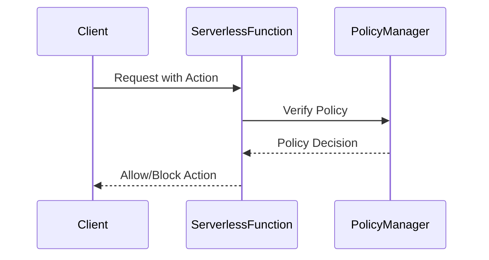

## Introduction

With the rise of serverless computing, applications often involve multiple services interacting seamlessly. Each of these services could be owned by different teams and governed by distinct rules. It becomes critical to ensure that access, permissions, and execution adhere to predefined policies to safeguard data and maintain compliance. **Policy Enforcement** in serverless computing is crucial for scaling secure and compliant systems.

## Design Pattern Overview

Policy Enforcement is about embedding policies directly into your serverless applications to control who can access which services and what actions they are permitted to perform. This pattern ensures all operations comply with organizational, legal, and security requirements.

### Key Aspects

1. **Authorization**: Centralize the authorization logic across serverless functions. This often involves integrating IAM (Identity and Access Management) for setting detailed permissions.
   
2. **Monitoring and Auditing**: Implement mechanisms to capture and log access attempts, both successful and unsuccessful, to facilitate compliance auditing and anomaly detection.

3. **Policy Definition**: Use a policy definition language compatible with various serverless platforms (AWS IAM Policies, Azure Role-based Access Control, etc.) to define access roles and permissions.

4. **Dynamic Policy Enforcement**: Ability to adapt policies in real-time based on context, such as user actions or request origins.

## Architectural Approaches

- **Centralized Policy Manager**: Utilize a centralized policy manager that interfaces with your serverless functions. This component validates requests against policies before execution.
  
- **Distributed Policy Enforcement Points (PEP)**: Embed policy enforcement logic within each serverless function. This reduces latency and bottlenecks by decentralizing the policy checks.

- **Policy Decision Point (PDP)**: Utilize a decision point (e.g., AWS IAM, Google IAM) to decouple the decision logic from the application logic, allowing you to modify policies without touching the application code.

## Example Implementation

```java
// Example in a Lambda Function with AWS
import com.amazonaws.services.lambda.runtime.Context;
import com.amazonaws.services.lambda.runtime.RequestHandler;

public class Handler implements RequestHandler<Map<String, String>, String> {

    @Override
    public String handleRequest(Map<String, String> input, Context context) {
        // Example of policy enforcement
        if (!hasPermission(input.get("userId"), "actionName")) {
            throw new SecurityException("Unauthorized access");
        }
        return "Operation performed successfully!";
    }

    private boolean hasPermission(String userId, String action) {
        // Simulated policy enforcement logic
        // In practice, call to IAM/PDP with userId and action
        return "allowedUserId".equals(userId) && "allowedAction".equals(action);
    }
}
```

## Diagram



## Related Patterns

- **Authentication and Authorization**: Implement strong authentication mechanisms to ensure that only verified users can interact with your functions.
  
- **API Gateway**: Use API gateways as the initial point of contact to enforce security policies and protect the backend functions.

- **Event-Driven Security**: Employ an event-driven architecture to react to security events in real time, adapting policies based on detected threats.

## Additional Resources

- [AWS IAM Policy Examples](https://docs.aws.amazon.com/IAM/latest/UserGuide/access_policies_examples.html)
- [Azure Role-based Access Control](https://docs.microsoft.com/en-us/azure/role-based-access-control/)
- [Google Cloud IAM](https://cloud.google.com/iam)

## Summary

Policy Enforcement in serverless environments is a robust design pattern to ensure security, legal compliance, and best practices within cloud-native applications. By defining and dynamically enforcing policies, you significantly mitigate risks associated with unauthorized access and non-compliance. Combining a centralized policy manager with distributed enforcement points enhances flexibility and responsiveness in managing access control, making it a pivotal component of serverless security architectures.
