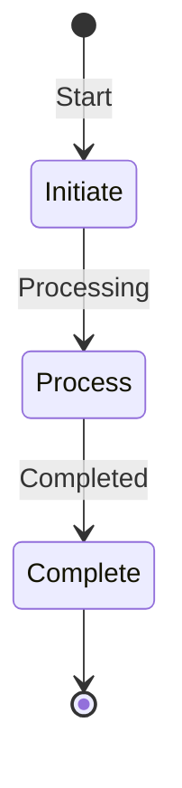

In serverless computing, managing state effectively is crucial for ensuring that applications remain functional, scalable, and maintain high performance. Without a traditional server to hold state across requests, alternative strategies must be employed. This article covers key design patterns and best practices for state management in serverless architectures.

## Design Patterns

### Stateless Functions

Stateless functions are the essence of serverless design. The concept is simple: each invocation of a function is independent of others. This approach inherently supports scaling as the cloud provider can handle multiple instances of functions independently. However, to handle state when necessary, consider patterns like:

1. **Pass State via Event/Message**: Use events or messages that carry the required state for processing. For example, an event can include user details needed for a transaction.

2. **Externalize State Storage**: Use external storage systems like databases, file systems, or distributed caches. Examples include AWS DynamoDB, Azure Cosmos DB, or Redis for transient state storage.

### State Machines

Serverless architectures often use state machines for orchestrating complex processes:

- **AWS Step Functions**: Manages execution state using a workflow model. It allows defining states, transitions, and parallel execution in a human-readable format.
  
- **Azure Durable Functions**: Implements state machines to coordinate workflows and track execution state across multiple function calls.

### Callback Patterns

For long-running processes or activities that require asynchronous completion handling, use callback patterns:

- **Callback URLs**: Allow external systems to invoke a URL upon completion.
  
- **Queue Messages**: Push completion messages to a queue for further processing by other serverless functions.

## Best Practices

- **Decouple State and Compute**: Keep state separate from compute to mitigate against shared state problems and enhance scalability.

- **Employ Idempotent Operations**: Ensure operations can be safely repeated without unintended side effects, especially when using event-driven patterns.

- **Optimize State Sessions**: When needing to maintain session data (e.g., in customer personalization scenarios), use cookies, tokens, or client-side storage to minimize state storage load.

- **Use Transactional State Systems**: For operations requiring consistent state, use database transactions or sophisticated systems like FaunaDB, which are built for serverless applications.

## Example Code

Below is an example demonstrating the use of AWS Step Functions with AWS Lambda to manage a workflow:

```javascript
const AWS = require('aws-sdk');
const stepFunctions = new AWS.StepFunctions();

exports.handler = async (event) => {
  const params = {
    stateMachineArn: 'arn:aws:states:us-east-1:123456789012:stateMachine:MyStateMachine',
    input: JSON.stringify(event)
  };

  try {
    const data = await stepFunctions.startExecution(params).promise();
    console.log(`Execution started: ${data.executionArn}`);
    return data;
  } catch (error) {
    console.error(`Execution failed: ${error.message}`);
    throw error;
  }
};
```

## Diagrams

Using Mermaid for illustrating a simple state transition in a serverless state machine:



## Related Patterns

- **Event-Driven Architecture**: Designs where state changes trigger functions or workflows.
  
- **CQRS (Command Query Responsibility Segregation)**: Pattern that separates reading/writing data to better handle state.

- **Saga Pattern**: Manages state and ensures consistency in distributed transactions using a series of compensating transactions.

## Additional Resources

- [AWS Step Functions Documentation](https://docs.aws.amazon.com/step-functions/index.html)
- [Azure Durable Functions Documentation](https://docs.microsoft.com/en-us/azure/azure-functions/durable/durable-functions-overview)
- [State Management in Serverless Architectures](https://www.serverless.com)
- [Idempotency in Cloud Computing](https://cloud.google.com/docs/durable-functions-overview)

## Summary

State management in serverless architectures requires thoughtful design to overcome the constraints of traditional server-based applications. By leveraging patterns like stateless functions, state machines, and callback mechanisms, developers can build robust, scalable, and efficient serverless applications. Keeping state decoupled from compute ensures these applications are resilient and adaptable to changing demands.
