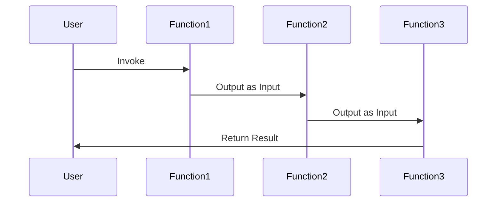

## Introduction

Function Chaining is a serverless computing pattern used to orchestrate a sequence of function executions in a cloud environment. This pattern ensures that each function is triggered in a specific order, passing outputs as inputs to the subsequent function. It's a crucial design pattern for implementing workflows that require precise ordering and inter-function communication.

### Context

In serverless architectures, functions are stateless and ephemeral, ideal for event-driven, short-lived processes. However, many applications require a combination of these functions to perform complex, coordinated tasks. Traditional monolithic applications handle this internally, but in a microservices world, we need robust orchestrators for managing the order, execution, and data handling across multiple serverless functions.

### Problem

The challenge in cloud-native applications is managing state and communication between functions to perform complex workflows. Without a systematic approach, developers might face issues such as:

- Manual handling of function execution leads to errors and tedious processes.
- Failure to manage state effectively could result in data loss or unexpected behavior.
- Inefficiency in scaling when workflows become more complex.

To meet these challenges, we adopt the **Function Chaining** pattern, which harmonizes function executions, enabling data serialization and deserialization, error handling, and retries.

### Solution

Function Chaining addresses these challenges by providing an architecture where outputs from one function feed directly into the next. This integration can be achieved in several cloud environments through different orchestrators like AWS Step Functions, Azure Durable Functions, and Google Cloud Workflows. These services can sequence function calls and manage state efficiently.

```typescript
// Example using AWS Step Functions with AWS Lambda
const AWS = require('aws-sdk');
const stepfunctions = new AWS.StepFunctions();

exports.handler = async (event) => {
    const params = {
        stateMachineArn: 'arn:aws:states:region:account-id:stateMachine:StateMachineName',
        input: JSON.stringify(event)
    };

    const result = await stepfunctions.startExecution(params).promise();
    return result;
};
```

### Diagram

Below is a simple sequence diagram representing a function chaining flow:



### Related Patterns

- **Event Sourcing**: Ensures that each state change in a system is captured as an immutable event.
- **Saga Pattern**: Manages long-lived transactions and workflows by using a series of compensating transactions.
- **CQRS (Command Query Responsibility Segregation)**: Segregates the paths for writing data and reading data to optimize performance, scalability, and security.

### Additional Resources

- [AWS Step Functions Documentation](https://aws.amazon.com/step-functions/)
- [Azure Durable Functions Documentation](https://docs.microsoft.com/en-us/azure/azure-functions/durable/durable-functions-overview)
- [Google Cloud Workflows Documentation](https://cloud.google.com/workflows/docs/overview)

## Summary

The Function Chaining pattern is critical in orchestrating serverless workflows, allowing seamless execution sequence and data handling. This promotes scalable and reliable serverless applications. By leveraging cloud-provided services like AWS Step Functions, Azure Durable Functions, and Google Cloud Workflows, developers can efficiently design intricate workflows with minimal manual overhead. Implementing this pattern helps to manage state, handle errors gracefully, and maintain a clean architecture in a robust serverless environment.
