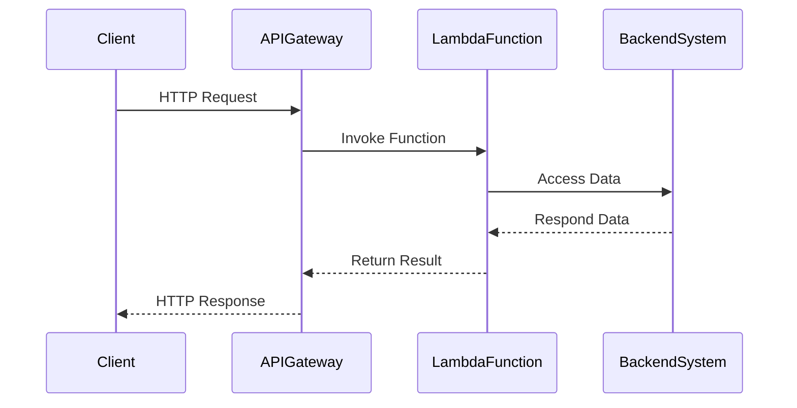

## Overview

The Backend Integration pattern in serverless computing refers to the strategies and methods of linking serverless functions (microservices) with underlying backend systems. This pattern is crucial for enabling full applications, leveraging serverless functions for stateless tasks, and ensuring effective interaction with databases, legacy systems, and third-party services.

## Detailed Explanation

In a serverless environment, functions respond to events and execute small units of work without managing infrastructure. However, serverless functions often require access to backend systems to fetch data, perform transactions, or trigger additional processing tasks. The Backend Integration pattern addresses these needs by providing structured ways to bridge the front-end and backend components.

### Key Considerations

1. **Communication Protocols**:
   - **HTTP/HTTPS**: Using RESTful APIs to simplify interaction and ensure stateless communication.
   - **Message Queues**: Utilize messaging services like AWS SQS, Azure Service Bus for decoupling and managing backpressure.
   - **WebSockets**: For real-time communication applications.

2. **Event-Driven Integration**:
   - Leverage cloud-native event sources such as AWS EventBridge, Azure Event Grid to trigger serverless functions.
   - Use published-subscribe models to broadcast events to multiple services.

3. **Security and Governance**:
   - Implement API Gateways for secure API exposure and request handling.
   - Establish identity and access management to control permissions and authenticate requests.

4. **Scalability & Resiliency**:
   - Design for horizontal scaling to handle variable loads.
   - Implement retry logic and circuit breakers to manage transient failures.

## Architectural Approaches

- **API Gateway Pattern**: Acts as a facade to establish a single entry point for all client requests into the system.
- **Microservices Pattern**: Supports modular and independently deployable services.
- **Backend-for-Frontend (BFF)**: Tailors the integration specific to a client type, improving communication efficiency.

## Best Practices

- **Minimize Function Execution Time**: Ensure functions do not incur high latencies due to backend operations.
- **Use Managed Services**: Leverage cloud-managed databases and storage to reduce operational overhead.
- **Monitoring and Logging**: Implement end-to-end tracing for debugging and performance optimization.

## Example Code

Below is a simplified example using an AWS Lambda function integrated with DynamoDB and exposed via API Gateway using AWS SDK for JavaScript:

```javascript
const AWS = require('aws-sdk');
const dynamoDb = new AWS.DynamoDB.DocumentClient();

exports.handler = async (event) => {
  const params = {
    TableName: 'MyTable',
    Key: {
      'PrimaryKey': event.pathParameters.id,
    },
  };

  try {
    const data = await dynamoDb.get(params).promise();
    return {
      statusCode: 200,
      body: JSON.stringify(data.Item),
    };
  } catch (error) {
    return {
      statusCode: 500,
      body: JSON.stringify({ error: 'Could not fetch item' }),
    };
  }
};
```

## Diagrams

Here's a simple diagram to illustrate the Backend Integration in a serverless architecture using Mermaid:



## Related Patterns

- **Request-Response Pattern**: Supports synchronous communication between services.
- **Event Sourcing Pattern**: Manages changes and state updates through a sequence of events.
- **CQRS (Command Query Responsibility Segregation)**: Separates read and write operations for optimized data handling.

## Additional Resources

- [Building Serverless Applications](https://aws.amazon.com/serverless/)
- [Microservices and Serverless Computing](https://developers.google.com/architecture/microservices-serverless)
- [Azure Serverless Technologies](https://azure.microsoft.com/en-us/solutions/serverless/)

## Summary

The Backend Integration pattern is pivotal for creating efficient, scalable serverless applications that require interaction with backend systems. By leveraging cloud-native services, adhering to best practices, and utilizing suitable architectural patterns, developers can construct robust solutions that harness the full power of serverless computing.
