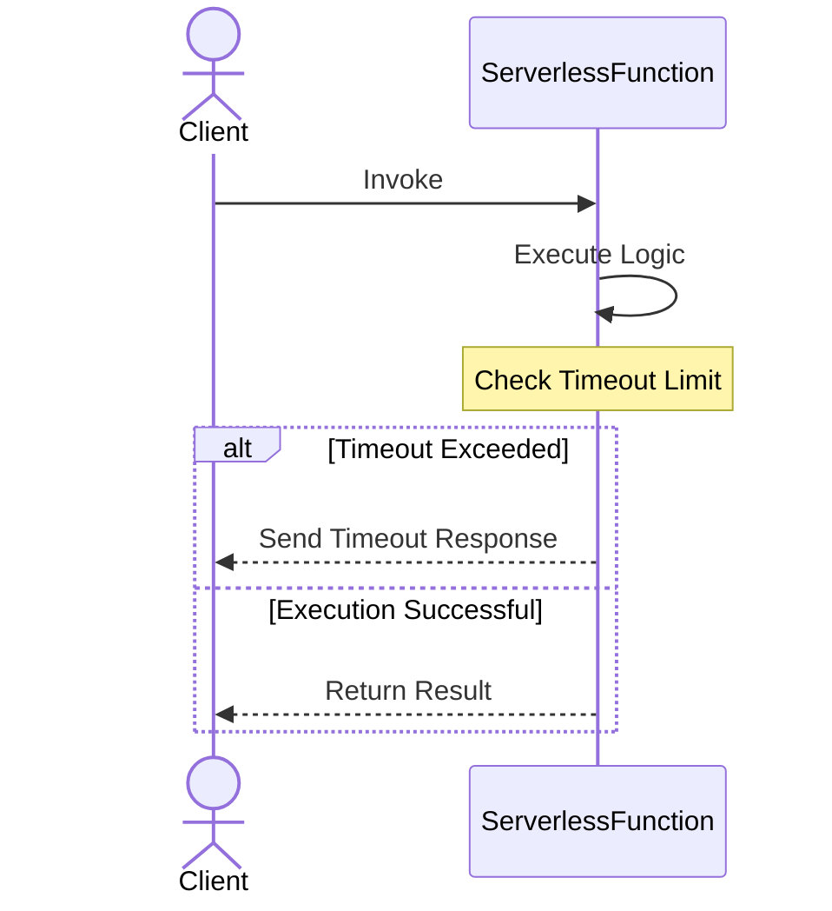

## Overview

**Function Timeout Management** in serverless computing is a crucial design pattern that ensures serverless functions do not exceed their expected execution time, which can lead to increased costs and decreased system reliability. This pattern helps manage and configure timeout settings effectively to optimize resource usage and improve application performance.

## Detailed Explanation

In a cloud computing environment, especially with serverless architectures such as AWS Lambda, Azure Functions, and Google Cloud Functions, you pay for what you use. Each function execution is billed based on the memory allocation and duration of execution. Thus, functions that run longer than expected can increase costs and impact overall system functionality. To mitigate such risks, the Function Timeout Management pattern is employed:

### Key Components:

1. **Timeout Configuration**: Setting an appropriate timeout value for each function. This should be based on historical data and expected execution times.
2. **Graceful Termination**: Implementing mechanisms within functions to ensure proper resource cleanup and state maintenance before the termination occurs.
3. **Monitoring and Logging**: Use logging and monitoring tools to gain insights into execution times and identify when functions are approaching their timeout limits.
4. **Retries**: Configure retry policies to handle timeout exceptions gracefully and ensure the completion of important tasks.
5. **Fallback Mechanisms**: Implement alternative workflows or functions that can be used when primary functions time out.

## Example Code

Here is an example of setting a timeout in an AWS Lambda function using AWS SDK for Java:

```java
import com.amazonaws.services.lambda.AWSLambda;
import com.amazonaws.services.lambda.AWSLambdaClientBuilder;
import com.amazonaws.services.lambda.model.UpdateFunctionConfigurationRequest;

public class LambdaConfiguration {
    public static void main(String[] args) {
        AWSLambda lambdaClient = AWSLambdaClientBuilder.defaultClient();
        UpdateFunctionConfigurationRequest request = new UpdateFunctionConfigurationRequest()
            .withFunctionName("YourFunctionName")
            .withTimeout(30); // Specified in seconds

        lambdaClient.updateFunctionConfiguration(request);
        System.out.println("Function timeout updated successfully.");
    }
}
```

## Architectural Diagram



## Best Practices

- **Understand Function Behavior**: Use historical data to set realistic timeout values based on average and max execution durations.
- **Resource Cleanup**: Always ensure that any resources (e.g., database connections, file handles) are properly closed or released on timeout.
- **Implement Exponential Backoff**: For retrying failed executions due to timeouts, use a strategy like exponential backoff to prevent overwhelming the system.
- **Use Alerts and Alarms**: Configure alerts to notify operations teams when functions frequently hit their timeout limits, indicating potential issues.

## Related Patterns

- **Circuit Breaker Pattern**: Prevents a system from continuously attempting an operation destined to fail, useful in managing timeout retries.
- **Retry Pattern**: Automatically retries failed operations on timeout, often used in conjunction with exponential backoff.
- **Fallback Pattern**: Provides alternate logic paths when facing execution failure due to timeouts.

## Additional Resources

- [AWS Lambda Timeout](https://docs.aws.amazon.com/lambda/latest/dg/invocation-options.html)
- [Azure Functions Timeout](https://learn.microsoft.com/en-us/azure/azure-functions/functions-bindings-http-webhook-trigger)

## Summary

Function Timeout Management is pivotal in serverless architectures to maintain cost-effectiveness and system reliability. By properly configuring timeout values, monitoring performance, and implementing best practices like retries and fallback mechanisms, you can enhance the resilience and efficiency of your cloud applications.
